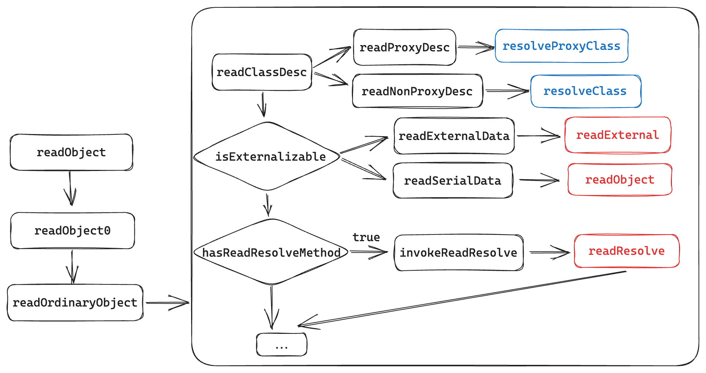
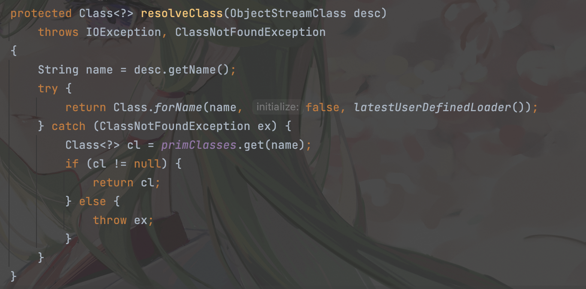
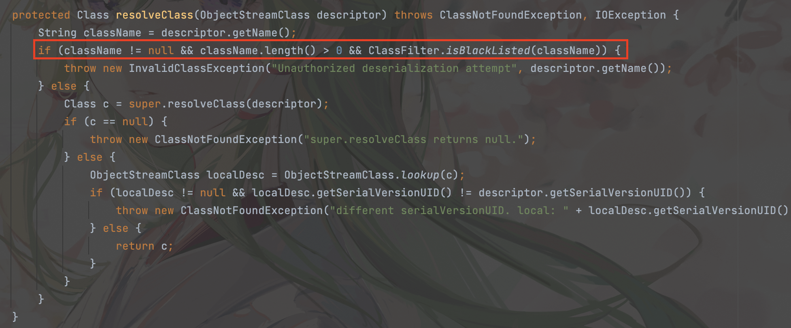
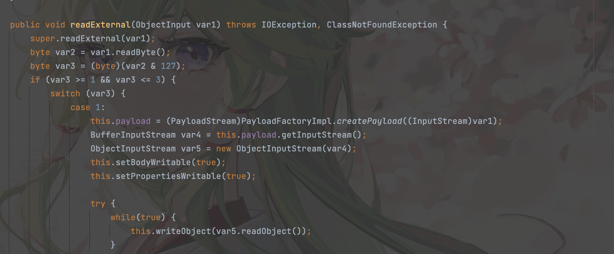
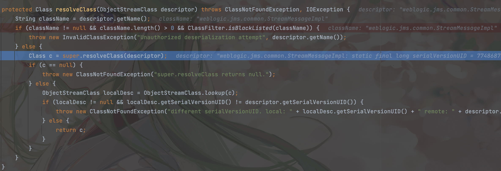

## 引言

这个漏洞是对于CVE-2015-4852的绕过，在了解具体防御措施之前我们先学习一下Java原生类反序列化的内部调用



对于CVE-2015-4852漏洞，官方的做法是在`resolveClass`处添加了黑名单，`resolveClass`方法的作用是将类的序列化描述符加工成该类的Class对象。



如果在`resolveClass`中增加一个检查，检查一下该类的序列化描述符中记录的类名是否在黑名单上，如果在黑名单上，直接抛出错误，不允许获取恶意的类的Class对象。这样一来，恶意类无法生成Class，从而能够一定程度上防御反序列化攻击。

## 环境搭建

首先下载补丁：https://pan.baidu.com/s/1hrGJNNI

CVE-2015-4852的修复补丁为`p21984589_1036_Generic`。这使用`p20780171_1036_Generic`和`p22248372_1036012_Generic`这两个补丁包，`p21984589_1036_Generic`是前面这两个补丁包的集成。

之后将补丁部署到weblogic server并重启服务，将打完补丁后到代码复制到宿主机开始分析。

```bash
命令集合：
docker cp p20780171_1036_Generic  weblogic1036jdk7u21:/p20780171_1036_Generic
docker cp p22248372_1036012_Generic  weblogic1036jdk7u21:/p22248372_1036012_Generic
docker exec -it weblogic1036jdk7u21 /bin/bash
cd /u01/app/oracle/middleware/utils/bsu
mkdir cache_dir
vi bsu.sh   编辑MEM_ARGS参数为 -Xms512m -Xmx1024m
cp /p20780171_1036_Generic/* cache_dir/
./bsu.sh -install -patch_download_dir=/u01/app/oracle/middleware/utils/bsu/cache_dir/ -patchlist=EJUW -prod_dir=/u01/app/oracle/middleware/wlserver/
cp /p22248372_1036012_Generic/* cache_dir/
./bsu.sh -install -patch_download_dir=/u01/app/oracle/middleware/utils/bsu/cache_dir/ -patchlist=ZLNA  -prod_dir=/u01/app/oracle/middleware/wlserver/ –verbose
/u01/app/oracle/Domains/ExampleSilentWTDomain/bin/startWebLogic.sh
```

## 补丁分析

该漏洞的补丁主要作用在

```
weblogic.rjvm.InboundMsgAbbrev.class :: ServerChannelInputStream
weblogic.rjvm.MsgAbbrevInputStream.class
weblogic.iiop.Utils.class
```

可以发现多了一步判断`ClassFilter.isBlackListed`



黑名单如下

```java
private static final String DEFAULT_BLACK_LIST = "+org.apache.commons.collections.functors,+com.sun.org.apache.xalan.internal.xsltc.trax,+javassist,+org.codehaus.groovy.runtime.ConvertedClosure,+org.codehaus.groovy.runtime.ConversionHandler,+org.codehaus.groovy.runtime.MethodClosure";
```

## 漏洞分析

想要绕过补丁，我们需要找一个黑名单之外的类，可以其`readObject`中创建自己的`InputStream`的对象，然后调用该`readObject` 方法进行反序列化，这样就可以执行含有恶意代码的序列化代码。

对于该漏洞我们利用的是：`weblogic.jms.common.StreamMessageImpl#readExternal()`



> `StreamMessageImpl`类中的`readExternal`方法可以接收序列化数据作为参数，而当`StreamMessageImpl`类的`readExternal`执行时，会反序列化传入的参数并调用该参数反序列化后对应类的这个`readObject`方法。也就是说我们先用`StreamMessageImpl`类包装反序列化数据，这样在weblogic进行反序列化时接收的是`StreamMessageImpl`对象，绕过了黑名单的检测。而由上图的Java原生类反序列化的内部调用可知，在`readObject`的底层还会调用类对象中的`readObject、readResolve、readExternal`等方法。

我这里参照网上师傅的payload改了一个小工具：https://github.com/Snakinya/Weblogic_Attack

打一个断点调试流程：

`weblogic.rjvm.InboundMsgAbbrev#resolveClass`



可以发现resolveClass传入的参数是StreamMessageImpl对象，不在黑名单之内，接下来跟踪`StreamMessageImpl`类中的`readExternal`方法


可以发现由于`StreamMessageImpl`类是实现了 `Externalizable`接口的所以会调用`readExternal`方法。同时在该方法内部会调用readObject从而完成反序列化攻击。


参考：

http://moonflower.fun/index.php/2022/01/30/251/

https://xz.aliyun.com/t/10365

https://github.com/gobysec/Weblogic/tree/main

https://github.com/vulhub/vulhub/tree/master/weblogic

https://fe1w0.github.io/2021/03/14/Weblogic/

https://xz.aliyun.com/t/12397

https://xz.aliyun.com/t/10563

https://y4er.com/posts/weblogic-cve-2016-0638/

https://www.cnblogs.com/nice0e3/p/14201884.html

https://xz.aliyun.com/t/8443