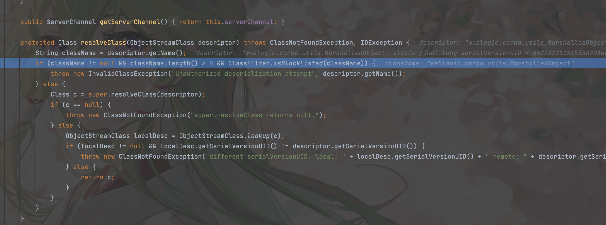
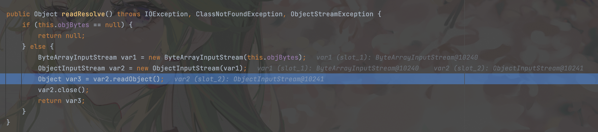

## 引言

该漏洞是对CVE-2015-4852的另一种绕过方式， 使用`weblogic.corba.utils.MarshalledObject`，其中的 `readResolve` 会读取 objBytes 的值赋给新 new 的 ois，然后将其进行反序列化。也就是说先将恶意对象封装到`weblogic.corba.utils.MarshalledObject`之后再对该对象进行序列化生成payload，于是在反序列化过程中可以绕过黑名单进行恶意利用。

## 漏洞分析

同样先在resolveClass下断点



可以发现此时传入的是`MarshalledObject`对象，可以绕过黑名单，接下来在`weblogic.corba.utils.MarshalledObject#readResolve`断点



可以发现在`readResolve`内部new了一个`ObjectInputStream`对象并对其进行反序列化，完成后续利用链

完整的调用栈：

```
transform:123, InvokerTransformer (org.apache.commons.collections.functors)
transform:122, ChainedTransformer (org.apache.commons.collections.functors)
get:157, LazyMap (org.apache.commons.collections.map)
invoke:69, AnnotationInvocationHandler (sun.reflect.annotation)
entrySet:-1, $Proxy57 (com.sun.proxy)
readObject:346, AnnotationInvocationHandler (sun.reflect.annotation)
invoke0:-1, NativeMethodAccessorImpl (sun.reflect)
invoke:57, NativeMethodAccessorImpl (sun.reflect)
invoke:43, DelegatingMethodAccessorImpl (sun.reflect)
invoke:601, Method (java.lang.reflect)
invokeReadObject:1004, ObjectStreamClass (java.io)
readSerialData:1891, ObjectInputStream (java.io)
readOrdinaryObject:1796, ObjectInputStream (java.io)
readObject0:1348, ObjectInputStream (java.io)
readObject:370, ObjectInputStream (java.io)
readResolve:58, MarshalledObject (weblogic.corba.utils)
invoke0:-1, NativeMethodAccessorImpl (sun.reflect)
invoke:57, NativeMethodAccessorImpl (sun.reflect)
invoke:43, DelegatingMethodAccessorImpl (sun.reflect)
invoke:601, Method (java.lang.reflect)
invokeReadResolve:1091, ObjectStreamClass (java.io)
readOrdinaryObject:1805, ObjectInputStream (java.io)
readObject0:1348, ObjectInputStream (java.io)
readObject:370, ObjectInputStream (java.io)
readObject:69, InboundMsgAbbrev (weblogic.rjvm)
read:41, InboundMsgAbbrev (weblogic.rjvm)
readMsgAbbrevs:283, MsgAbbrevJVMConnection (weblogic.rjvm)
init:215, MsgAbbrevInputStream (weblogic.rjvm)
dispatch:498, MsgAbbrevJVMConnection (weblogic.rjvm)
dispatch:330, MuxableSocketT3 (weblogic.rjvm.t3)
dispatch:394, BaseAbstractMuxableSocket (weblogic.socket)
readReadySocketOnce:960, SocketMuxer (weblogic.socket)
readReadySocket:897, SocketMuxer (weblogic.socket)
processSockets:130, PosixSocketMuxer (weblogic.socket)
run:29, SocketReaderRequest (weblogic.socket)
execute:42, SocketReaderRequest (weblogic.socket)
execute:145, ExecuteThread (weblogic.kernel)
run:117, ExecuteThread (weblogic.kernel)
```

攻击工具：

https://github.com/Snakinya/Weblogic_Attack
