## 描述

Spring Kafka 是 Spring Framework 生态系统中的一个模块，用于简化在 Spring 应用程序中集成 Apache Kafka 的过程，记录(record)指 Kafka 消息中的一条记录。

受影响版本中默认未对记录配置 ErrorHandlingDeserializer，当用户将容器属性 checkDeserExWhenKeyNull 或 checkDeserExWhenValueNull 设置为 true(默认为false)，并且允许不受信任的源发布到 Kafka 主题中时，攻击者可将恶意 payload 注入到 Kafka 主题中，当反序列化记录头时远程执行任意代码。

## 受影响的 Spring 产品和版本

- Apache Kafka 的 Spring
  - 2.8.1至2.9.10
  - 3.0.0 至 3.0.9

## Spring-Kafka模型

在此之前，先了解一下spring-kafka的生产者和消费者模型

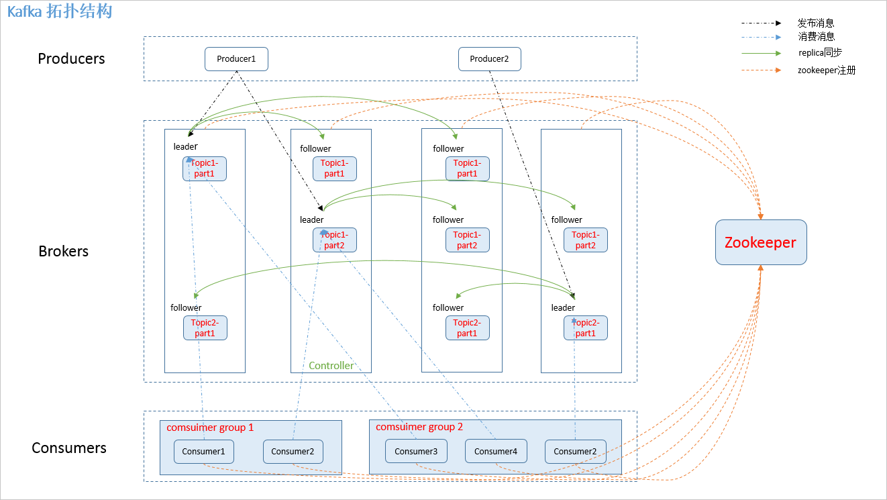

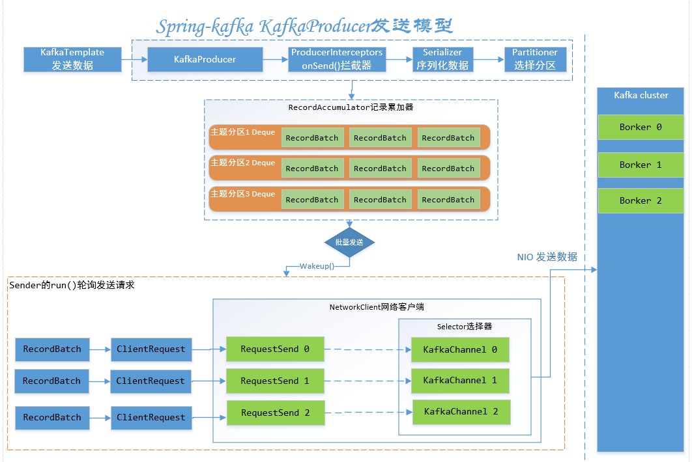

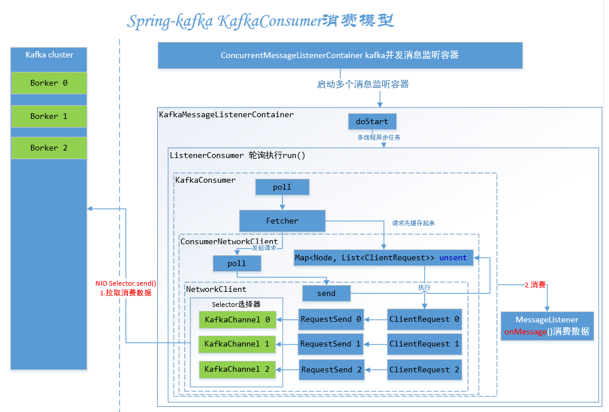


## 漏洞分析

根据CVE描述，我们可以知道漏洞与两个属性有关：

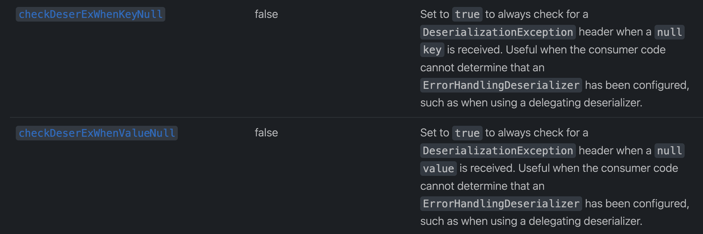

这两个属性的作用分别是：

- 如果设置为true，当接收到的key为null时检查`DeserializationException` header 
- 如果设置为true，当接收到的value为null时检查`DeserializationException` header 

这一部分的源码在`KafkaMessageListenerContainer`：

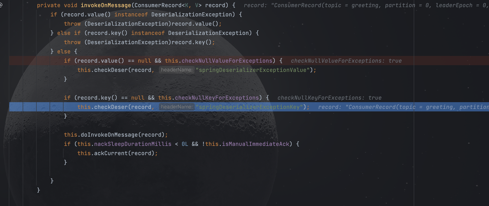

跟进`checkDeser`

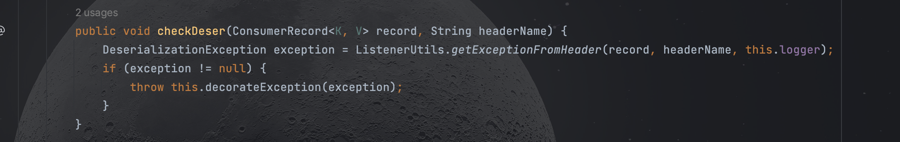

跟进`getExceptionFromHeader`

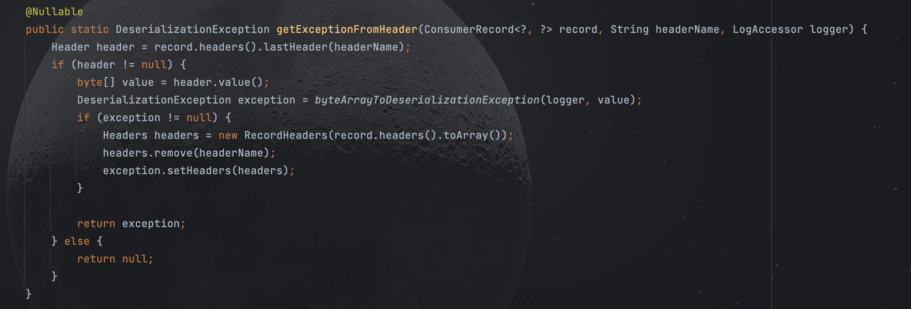

漏洞点在`byteArrayToDeserializationException`

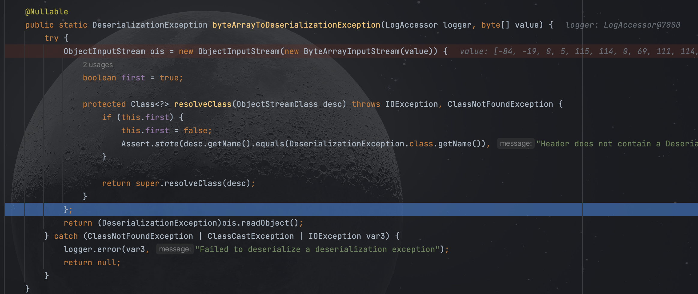

该方法首先将传入的value数组作为输入流创建一个`ObjectInputStream`对象，之后重写了`resolveClass`方法验证传入数据的类名是否为`DeserializationException`，最后通过调用`ois.readObject()`执行反序列化

## payload构造

这里使用漏洞报送者的POC：https://github.com/Contrast-Security-OSS/Spring-Kafka-POC-CVE-2023-34040

创建消费者，配置好参数后进行监听

```
spring.kafka.consumer.checkDeserExWhenKeyNull=true
spring.kafka.consumer.checkDeserExWhenValueNull=true
```

之后创建一个生产者发布消息，在将header替换为我们的恶意payload并包装为`DeserializationException`以绕过`resolveClass`的检测

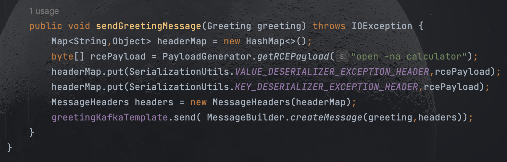

最终发送消息，完成反序列化

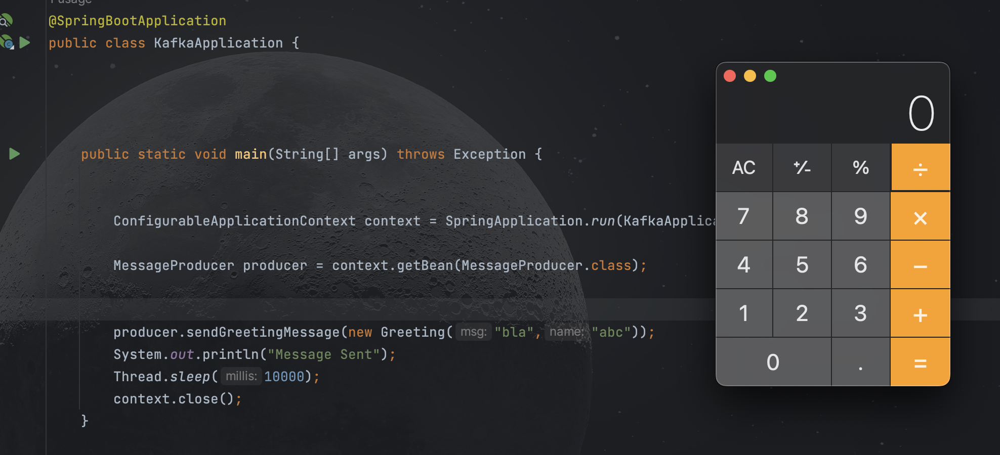

消费者完整调用栈如下：

```
byteArrayToDeserializationException:129, ListenerUtils (org.springframework.kafka.listener)
getExceptionFromHeader:107, ListenerUtils (org.springframework.kafka.listener)
checkDeser:2766, KafkaMessageListenerContainer$ListenerConsumer (org.springframework.kafka.listener)
invokeOnMessage:2648, KafkaMessageListenerContainer$ListenerConsumer (org.springframework.kafka.listener)
doInvokeRecordListener:2577, KafkaMessageListenerContainer$ListenerConsumer (org.springframework.kafka.listener)
doInvokeWithRecords:2457, KafkaMessageListenerContainer$ListenerConsumer (org.springframework.kafka.listener)
invokeRecordListener:2335, KafkaMessageListenerContainer$ListenerConsumer (org.springframework.kafka.listener)
invokeListener:2006, KafkaMessageListenerContainer$ListenerConsumer (org.springframework.kafka.listener)
invokeIfHaveRecords:1375, KafkaMessageListenerContainer$ListenerConsumer (org.springframework.kafka.listener)
pollAndInvoke:1366, KafkaMessageListenerContainer$ListenerConsumer (org.springframework.kafka.listener)
run:1257, KafkaMessageListenerContainer$ListenerConsumer (org.springframework.kafka.listener)
call:515, Executors$RunnableAdapter (java.util.concurrent)
run$$$capture:264, FutureTask (java.util.concurrent)
run:-1, FutureTask (java.util.concurrent)
 - Async stack trace
<init>:151, FutureTask (java.util.concurrent)
<init>:55, ListenableFutureTask (org.springframework.util.concurrent)
submitListenable:225, SimpleAsyncTaskExecutor (org.springframework.core.task)
doStart:356, KafkaMessageListenerContainer (org.springframework.kafka.listener)
start:461, AbstractMessageListenerContainer (org.springframework.kafka.listener)
doStart:226, ConcurrentMessageListenerContainer (org.springframework.kafka.listener)
start:461, AbstractMessageListenerContainer (org.springframework.kafka.listener)
startIfNecessary:363, KafkaListenerEndpointRegistry (org.springframework.kafka.config)
start:308, KafkaListenerEndpointRegistry (org.springframework.kafka.config)
doStart:179, DefaultLifecycleProcessor (org.springframework.context.support)
access$200:54, DefaultLifecycleProcessor (org.springframework.context.support)
start:357, DefaultLifecycleProcessor$LifecycleGroup (org.springframework.context.support)
forEach:75, Iterable (java.lang)
startBeans:156, DefaultLifecycleProcessor (org.springframework.context.support)
onRefresh:124, DefaultLifecycleProcessor (org.springframework.context.support)
finishRefresh:938, AbstractApplicationContext (org.springframework.context.support)
refresh:586, AbstractApplicationContext (org.springframework.context.support)
refresh:147, ServletWebServerApplicationContext (org.springframework.boot.web.servlet.context)
refresh:731, SpringApplication (org.springframework.boot)
refreshContext:408, SpringApplication (org.springframework.boot)
run:307, SpringApplication (org.springframework.boot)
run:1303, SpringApplication (org.springframework.boot)
run:1292, SpringApplication (org.springframework.boot)
main:21, KafkaApplication (com.contrast.spring.kafka)
```

## 补丁

https://github.com/spring-projects/spring-kafka/pull/2770/files

https://github.com/spring-projects/spring-kafka/commit/e9564134733e81ba530d83193b68c0c34cb7a556

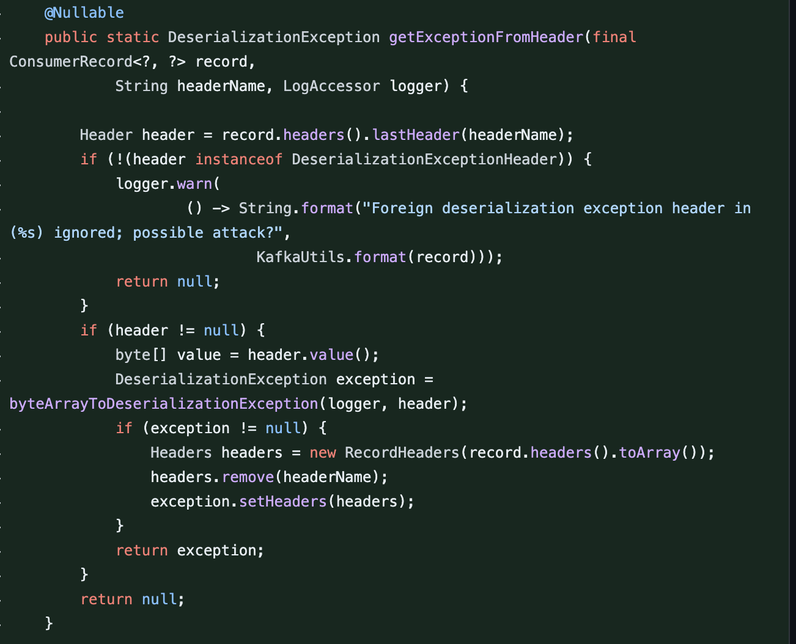

简单来说就是使用库中的私有标头来处理反序列化异常，并且在`getExceptionFromHeader`，`byteArrayToDeserializationException`函数中对外部的header进行了检测。


参考：

https://www.cnblogs.com/dennyzhangdd/p/7759869.html

https://github.com/Contrast-Security-OSS/Spring-Kafka-POC-CVE-2023-34040