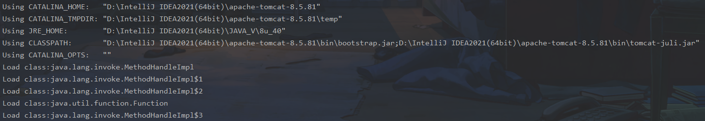
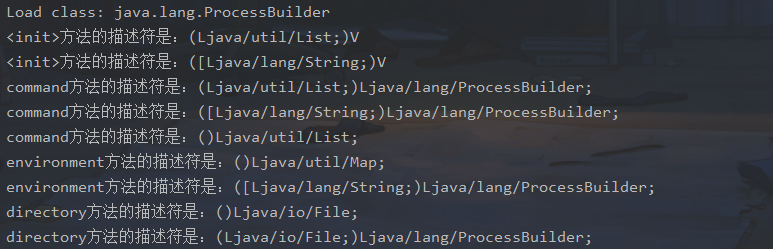
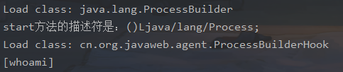

# Java RASP技术

运行时应用程序自我保护（`Runtime application self-protection`，简称`RASP`）使用Java Agent技术在应用程序运行时候动态编辑类字节码，将自身防御逻辑注入到Java底层API和Web应用程序当中，从而与应用程序融为一体，能实时分析和检测Web攻击，使应用程序具备自我保护能力。

RASP技术作为新兴的WEB防御方案，不但能够有效的防御传统WAF无法实现的攻击类型，更能够大幅提升对攻击者攻击行为的检测精准度。RASP是传统WAF的坚实后盾，能够弥补WAF无法获取Web应用`运行时`环境的缺陷，同时也是传统Web应用服务最重要的不可或缺的一道安全防线。

RASP通过注入自身到开发语言底层API中，从而完全的融入于Web服务中，拥有了得天独厚的漏洞检测和防御条件，RASP技术相较于传统的WAF拥有了更加精准、深层次的防御。RASP采用`基于攻击行为分析`的`主动防御`机制，严防`文件读写`、`数据访问`、`命令执行`等Web应用系统命脉，为Web应用安全筑建出“万丈高墙”。

## RASP技术原理

`JDK1.5`开始，`Java`新增了`Instrumentation（Java Agent API）`和`JVMTI（JVM Tool Interface）`功能，允许`JVM`在加载某个`class文件`之前对其字节码进行修改，同时也支持对已加载的`class（类字节码）`进行重新加载（`Retransform`）。

利用`Java Agent`这一特性衍生出了`APM（Application Performance Management，应用性能管理）`、`RASP（Runtime application self-protection，运行时应用自我保护）`、`IAST（Interactive Application Security Testing，交互式应用程序安全测试）`等相关产品，它们都无一例外的使用了`Instrumentation/JVMTI`的`API`来实现动态修改`Java类字节码`并插入监控或检测代码。

RASP防御的核心就是在Web应用程序执行关键的Java API之前插入防御逻辑，从而控制原类方法执行的业务逻辑。如果没有RASP的防御，攻击者可以利用Web容器/应用的漏洞攻击应用服务器。

## 项目地址

https://github.com/iiiusky/java_rasp_example

## 实现一个简易的RASP

### 创建入口类

在`cn.org.javaweb.agent`包下新建一个类。

```java
package cn.org.javaweb.agent;

import java.lang.instrument.Instrumentation;

public class Agent {

    public static void premain(String agentArgs, Instrumentation inst) {
        inst.addTransformer(new AgentTransform());
    }
}
```

### 创建Transform

然后我们再新建一个`AgentTransform`类，该类需要实现`ClassFileTransformer`的方法，内容如下:

```java
package cn.org.javaweb.agent;

import java.lang.instrument.ClassFileTransformer;
import java.lang.instrument.IllegalClassFormatException;
import java.security.ProtectionDomain;

public class AgentTransform implements ClassFileTransformer {

    /**
     * @param loader
     * @param className
     * @param classBeingRedefined
     * @param protectionDomain
     * @param classfileBuffer
     * @return
     * @throws IllegalClassFormatException
     */
    @Override
    public byte[] transform(ClassLoader loader, String className,
                            Class<?> classBeingRedefined, ProtectionDomain protectionDomain,
                            byte[] classfileBuffer) throws IllegalClassFormatException {

        className = className.replace("/", ".");

        System.out.println("Load class:" + className);
        return classfileBuffer;
    }
}
```

### build Agent配置

点击右上角的`agent[clean,intall]`进行build。包的位置为：

```
 E:\CTF\JAVA_SEC\Learning_Project\RASP\snakin_rasp1\agent\target\agent.jar
```

接下来配置tomcat：

```
-Dfile.encoding=UTF-8
-noverify
-Xbootclasspath/p:E:\CTF\JAVA_SEC\Learning_Project\RASP\snakin_rasp1\agent\target\agent.jar
-javaagent:E:\CTF\JAVA_SEC\Learning_Project\RASP\snakin_rasp1\agent\target\agent.jar
```

之后启动：



我们在`AgentTransform`中写的打印包名已经生效了，同时web端也正常启动

### 创建ClassVisitor类

接下来新建一个TestClassVisitor类，需要继承ClassVisitor类并且实现Opcodes类，代码如下

```java
package cn.org.javaweb.agent;

import org.objectweb.asm.ClassVisitor;
import org.objectweb.asm.MethodVisitor;
import org.objectweb.asm.Opcodes;


public class TestClassVisitor extends ClassVisitor implements Opcodes {

    public TestClassVisitor(ClassVisitor cv) {
        super(Opcodes.ASM5, cv);
    }

    @Override
    public MethodVisitor visitMethod(int access, String name, String desc, String signature, String[] exceptions) {
        MethodVisitor mv = super.visitMethod(access, name, desc, signature, exceptions);

        System.out.println(name + "方法的描述符是：" + desc);
        return mv;
    }
}
```

### 对ProcessBuilder（命令执行）类进行hook用户执行的命令

#### 使用transform对类名进行过滤

然后回到`AgentTransform`中，对`transform`方法的内容进行修改，transform方法代码如下：

```java
public byte[] transform(ClassLoader loader, String className,
                            Class<?> classBeingRedefined, ProtectionDomain protectionDomain,
                            byte[] classfileBuffer) throws IllegalClassFormatException {

        className = className.replace("/", ".");

        try {
            if (className.contains("ProcessBuilder")) {
                System.out.println("Load class: " + className);

                ClassReader  classReader  = new ClassReader(classfileBuffer);
                ClassWriter  classWriter  = new ClassWriter(classReader, ClassWriter.COMPUTE_MAXS);
                ClassVisitor classVisitor = new TestClassVisitor(classWriter);

                classReader.accept(classVisitor, ClassReader.EXPAND_FRAMES);

                classfileBuffer = classWriter.toByteArray();
            }
        } catch (Exception e) {
            e.printStackTrace();
        }
        return classfileBuffer;
    }
```

首先判断类名是否包含`ProcessBuilder`,如果包含则使用`ClassReader`对字节码进行读取，然后新建一个`ClassWriter`进行对`ClassReader`读取的字节码进行拼接，然后在新建一个我们自定义的`ClassVisitor`对类的触发事件进行hook，在然后调用`classReader`的`accept`方法,最后给`classfileBuffer`重新赋值修改后的字节码。

ASM是一种通用Java字节码操作和分析框架，它可以直接以二进制形式修改一个现有的类或动态生成类文件。ASM的版本更新快（`ASM 9.0`已经支持`JDK 16`）、[性能高](https://asm.ow2.io/performance.html)、功能全，学习成本也相对较高，ASM官方用户手册：[ASM 4.0 A Java bytecode engineering library](https://asm.ow2.io/asm4-guide.pdf)。

ASM提供了三个基于`ClassVisitor API`的核心API，用于生成和转换类：

1. `ClassReader`类用于解析class文件或二进制流；
2. `ClassWriter`类是`ClassVisitor`的子类，用于生成类二进制；
3. `ClassVisitor`是一个抽象类，自定义`ClassVisitor`重写`visitXXX`方法，可获取捕获ASM类结构访问的所有事件；

#### 创建测试环境

我们在tomcat中新建一个jsp，用来调用命令执行，代码如下：

```java
<%@ page import="java.io.InputStream" %>
<%@ page contentType="text/html;charset=UTF-8" language="java" %>
<pre>
<%
    Process process = Runtime.getRuntime().exec(request.getParameter("cmd"));
    InputStream in = process.getInputStream();
    int a = 0;
    byte[] b = new byte[1024];

    while ((a = in.read(b)) != -1) {
        out.println(new String(b, 0, a));
    }

    in.close();
%>
</pre>
```

接下来重新生成agent.jar并启动tomcat，访问

```
http://localhost:8080/cmd.jsp?cmd=whoami
```

输出命令执行的调用链



#### 拿到用户所执行的命令

接下来我们看看尝试一下能否拿到所执行的命令

新建一个名为`ProcessBuilderHook`的类，然后在类中新建一个名字为`start`的静态方法，完整代码如下：

```java
package cn.org.javaweb.agent;

import java.util.Arrays;
import java.util.List;


public class ProcessBuilderHook {

    public static void start(List<String> commands) {
        String[] commandArr = commands.toArray(new String[commands.size()]);
        System.out.println(Arrays.toString(commandArr));
    }
}
```

#### 复写visitMethod方法

打开`TestClassVisitor`，对`visitMethod`方法进行更改。具体代码如下：

```java
@Override
    public MethodVisitor visitMethod(int access, String name, String desc, String signature, String[] exceptions) {
        MethodVisitor mv = super.visitMethod(access, name, desc, signature, exceptions);

        if ("start".equals(name) && "()Ljava/lang/Process;".equals(desc)) {
            System.out.println(name + "方法的描述符是：" + desc);

            return new AdviceAdapter(Opcodes.ASM5, mv, access, name, desc) {
                @Override
                public void visitCode() {

                    mv.visitVarInsn(ALOAD, 0);
                    mv.visitFieldInsn(GETFIELD, "java/lang/ProcessBuilder", "command", "Ljava/util/List;");
                    mv.visitMethodInsn(INVOKESTATIC, "cn/org/javaweb/agent/ProcessBuilderHook", "start", "(Ljava/util/List;)V", false);

                    super.visitCode();
                }
            };
        }
        return mv;
    }
```

先补充一点基础：

```java
visitFieldInsn ： 访问某个成员变量的指令，支持GETSTATIC, PUTSTATIC, GETFIELD or PUTFIELD.
visitFrame ：访问当前局部变量表和操作数栈中元素的状态，参数就是局部变量表和操作数栈的内容
visitIincInsn ： 访问自增指令
visitVarInsn ：访问局部变量指令，就是取局部变量变的值放入操作数栈
visitMethodInsn ：访问方法指令，就是调用某个方法，支持INVOKEVIRTUAL, INVOKESPECIAL, INVOKESTATIC or INVOKEINTERFACE.
visitInsn ： 访问无操作数的指令，例如nop，duo等等
```

首先判断传入进来的方法名是否为`start`以及方法描述符是否为`()Ljava/lang/Process;`,如果是的话就新建一个`AdviceAdapter`方法，并且复写`visitCode`方法，对其字节码进行修改，拿到栈顶上的`this`，这里取0

```java
mv.visitVarInsn(ALOAD, 0);
```

拿到`this`里面的`command`

```java
mv.visitFieldInsn(GETFIELD, "java/lang/ProcessBuilder", "command", "Ljava/util/List;");
```

调用我们上面新建的`ProcessBuilderHook`类中的`start`方法,将上面拿到的`this.command`压入我们方法。

```java
mv.visitMethodInsn(INVOKESTATIC, "cn/org/javaweb/agent/ProcessBuilderHook", "start", "(Ljava/util/List;)V", false);
```

我们再次编译一下，然后启动tomcat，访问`cmd.jsp`看.

#### 测试hook用户执行的命令参数是否拿到

访问

```
http://localhost:8080/cmd.jsp?cmd=whoami
```

控制台：



成功获取到执行的命令，可以进行下一步操作，根据需要拦截还是替换还是告警。当然，如果要实现拦截功能，还需要注意要获取当前请求中的的response，不然无法对response进行复写，也无法对其进行拦截。这边给大家提供一个思路，对应拦截功能，大家可以去hook请求相关的类，然后在危险hook点结合http请求上下文进行拦截请求。

### 防御方式

#### 简单粗暴 - 抛出异常

`ProcessBuilderHook.java`

```java
public static void log(List<String> commands) {
        System.out.println("Malicious code!");
        throw new RuntimeException("RASP");
    }
```

`TestClassVisitor.java`

```java
mv.visitMethodInsn(INVOKESTATIC, "cn/org/javaweb/agent/ProcessBuilderHook", "log", "(Ljava/util/List;)V", false);
```


参考：

https://mp.weixin.qq.com/s/vu9JsVMzFSPUXUmD4JRe0Q


