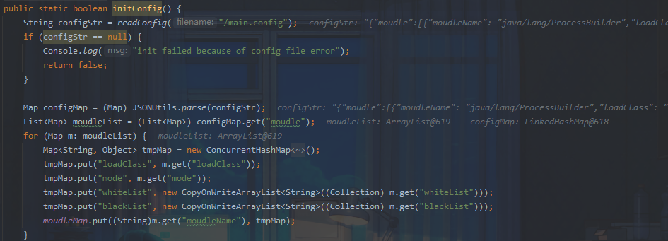
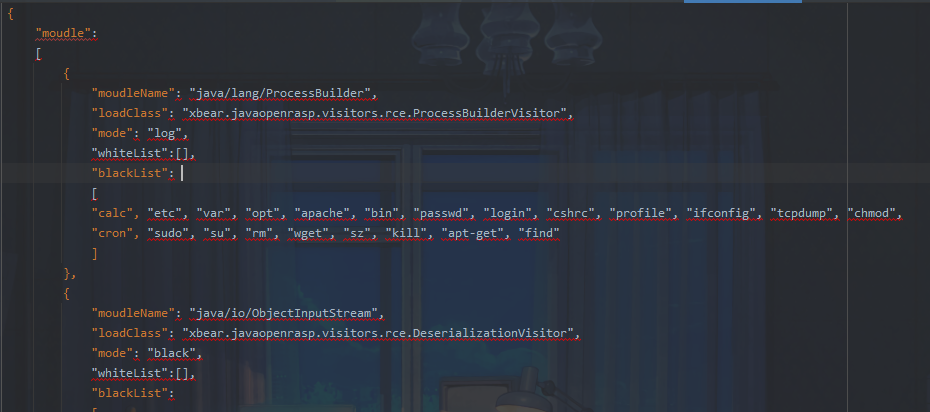

## 项目地址

https://github.com/xbeark/javaopenrasp

## 简介

该rasp相比于上一篇文章的项目复杂许多，这次希望能够更深入了解rasp的实现思路

该项目实现的保护点：

RCE

1. 反序列化漏洞
2. Ognl表达式执行
3. ProcessBuilder log

SQL注入

1. MySql注入保护
2. SQLServer注入保护

## 代码浅析

首先看到入口`xbear/javaopenrasp/Agent.java`，该类实现了premain函数也就是运行前加载的方式

```java
public class Agent {

    public static void premain(String agentArgs, Instrumentation inst)
            throws ClassNotFoundException, UnmodifiableClassException {
        Console.log("init");
        init();
        inst.addTransformer(new ClassTransformer());
    }

    private static boolean init() {
        Config.initConfig();
        return true;
    }
} 
```

这里跟进`Config.initConfig()`，进行配置初始化



函数从`main.config`中读入配置并将其存入tmpMap

配置文件为json格式



文件中的参数含义：

```
"moudleName": 顾名思义，需要监控的类名
"loadClass": 加载的classvisitor，用以拦截或日志记录
"mode": 拦截模式，log,black,block,check
"whiteList":白名单
"blackList": 黑名单
```

读取配置后进入`ClassTransformer`

```java
 ClassReader reader = new ClassReader(classfileBuffer);
                ClassWriter writer = new ClassWriter(ClassWriter.COMPUTE_MAXS);
                ClassVisitor visitor = Reflections.createVisitorIns((String) Config.moudleMap.get(className).get("loadClass"), writer, className);
                reader.accept(visitor, ClassReader.EXPAND_FRAMES);
                transformeredByteCode = writer.toByteArray();
```

判断当前加载的类是否为我们需要hook的类，根据不同的类名对应到不同的classvisitor方法

我们以ProcessBuilderVistor为例

```java
@Override
    public MethodVisitor visitMethod(int access, String name, String desc,
                                     String signature, String[] exceptions) {
        MethodVisitor mv = super.visitMethod(access, name, desc, signature, exceptions);
        if ("start".equals(name) && "()Ljava/lang/Process;".equals(desc)) {
            mv = new ProcessBuilderVisitorAdapter(mv, access, name, desc);
        }
        return mv;
    }
```

它重写了`visitMethod`方法，选择Processbuilder的start作为hook点，因为只要执行命令，都将走到该类的start方法，在这里就能拿到具体要执行的命令。当通过判断后进入`ProcessBuilderVisitorAdapter`

```java
@Override
    protected void onMethodEnter() {
        mv.visitTypeInsn(NEW,
                "xbear/javaopenrasp/filters/rce/PrcessBuilderFilter"); //new一个命令执行过滤的对象压入栈
        mv.visitInsn(DUP); //再次压入该对象
        mv.visitMethodInsn(INVOKESPECIAL, 
                "xbear/javaopenrasp/filters/rce/PrcessBuilderFilter", "<init>", "()V", false); //弹出对象进行初始化，此时栈中大小为2-1=1
        mv.visitVarInsn(ASTORE, 1); //弹出存储该对象到局部变量表1处，此时栈的大小为1-1=0
        mv.visitVarInsn(ALOAD, 1);  //加载局部变量表1处的对象压入栈，此时栈的大小为0+1=1
        mv.visitVarInsn(ALOAD, 0); //加载this压入栈,此时栈大小为1+1=2
        mv.visitFieldInsn(GETFIELD, 
                "java/lang/ProcessBuilder", "command", "Ljava/util/List;"); //取this.command的值压入栈，栈大小为2
        mv.visitMethodInsn(INVOKEVIRTUAL,
                "xbear/javaopenrasp/filters/rce/PrcessBuilderFilter", "filter", //调用filer方法，弹出的值的数量为filter的方法参数大小1+1=2，栈顶的this.command的值作为参数，并将filter方法的处理结果压入栈中，filter返回一个Boolean值，此时栈中大小为1
                "(Ljava/lang/Object;)Z", false);

        Label l92 = new Label();  //new一个label用来跳转
        mv.visitJumpInsn(IFNE, l92); //此时弹出filter处理的结果和0进行比较，如果不等与0，则跳到192lable，说明执行的当前的命令可以执行，则正常执行start方法，否则执行下一条指令，栈大小为0
        mv.visitTypeInsn(NEW, "java/io/IOException"); //new 一个io异常对象
        mv.visitInsn(DUP); //再次压入该对象，栈大小2
        mv.visitLdcInsn("invalid character in command because of security"); //压入该字符串，栈大小3
        mv.visitMethodInsn(INVOKESPECIAL,
                "java/io/IOException", "<init>", "(Ljava/lang/String;)V", false); //弹出1+1=2个值，初始化该异常对象，栈顶元素作为io异常的初始化参数，此时栈大小为1
        mv.visitInsn(ATHROW); //抛出该异常
        mv.visitLabel(l92);

    }
```

看代码逻辑，先实例化 PrcessBuilderFilter 类，将 ProcessBuilder 的 command 变量传入作为 filter 方法的参数，可以看到对于命令执行这个rasp的默认配置只是记录了执行的命令以及一些调用栈的信息并没有做拦截，这里同样可以看到其他模式比如block直接拦截，white白名单模式，black黑名单模式，log日志记录。

```java
@Override
    public boolean filter(Object forCheck) {
        String moudleName = "java/lang/ProcessBuilder";
        List<String> commandList = (List<String>) forCheck;
        String command = StringUtils.join(commandList, " ").trim().toLowerCase();
        Console.log("prepare to exec command:" + command);
        String mode = (String) Config.moudleMap.get(moudleName).get("mode");
        switch (mode) {
            case "block":
                Console.log("block" + command);
                return false;
            case "white":
                if (Config.isWhite(moudleName, command)) {
                    Console.log("exec command:" + command);
                    return true;
                }
                Console.log("block" + command);
                return false;
            case "black":
                if (Config.isBlack(moudleName, command)) {
                    Console.log("block command exec" + command);
                    return false;
                }
                Console.log("exec command:" + command);
                return true;
            case "log":
            default:
                Console.log("exc commond" + command);
                Console.log("log stack trace:\r\n" + StackTrace.getStackTrace());
                return true;
        }
    }
```

其他模块的原理相似这里不做过多介绍，在这个过程中我也发现利用asm去hook函数需要对字节码操作有较强理解，本次分析之后应该会去补一补相关知识。


参考：

https://zhuanlan.zhihu.com/p/138911654

https://www.cnblogs.com/tr1ple/p/12709504.html#ndsWNnRa

https://t.zsxq.com/0boOLJ6rO