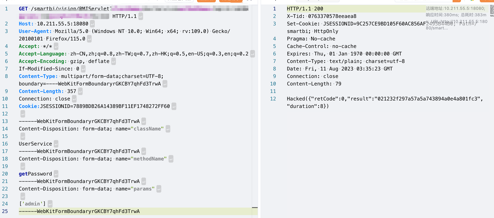

## 简介

去年护网时期审出来的漏洞，最近看到学长说补丁发布了就公布出来供大家参考。

## 前台权限绕过

众所周知SmartBi盛产权限绕过漏洞，最新的V11版也不例外。这次的问题还是出在`CheckIsLoggedFilter`和`RMIServlet`的参数获取上，先看看`CheckIsLoggedFilter`

这是smartbi对于RMIServlet的防护，先获取 className、methodName、params，再判断上述参数是否在**白名单**内

那么该部分对于参数的获取分为四种：

- 通过 request.getParameter 进行解析
- 通过 windowUnloading 进行解析
- 通过 encode 参数解析
- 通过 request body 解析

四种解析依次进行，一旦解析到参数就会进行下一个阶段

那么我们再看看`RMIServlet`是怎么解析参数的

他有两个处理，分别针对get和post请求

- doget判断是否含有jsonpCallback参数，如果有且不为空就会调用dopost方法
- dopost有三种获取参数的方法
  - 通过 request.getAttribute 解析
  - 通过文件上传的格式去解析
  - 通过 request.getParameter 解析

这两者结合很容易想到我们可以先利用getParameter和jsonpCallback来绕过第一层的检测（通过getParameter获得的参数并未setAttribute），而由于RMIServlet没有获取到属性，于是会从表单中获取参数，由此绕过。

将以上带入执行流程做个简单梳理：

—–Filter——

1. 请求方法为GET、获取参数className(白名单)\methodName(白名单)\params([])\jsonpCallback(不为空)
2. 通过`request.getParameter`获取参数，并没有`setAttribute`
3. 判断类与方法名在白名单中，Filter校验通过

—–Servlet——

1. dogGet判断含有jsonpCallback参数且不为空，调用doPost
2. 通过`request.getAttribute`未获取到类、方法以及参数
3. 判断Header的Content-Type头存在`multipart/form-data;`

4. 解析Body，获取到真实执行的类、方法以及参数，最终完成调用

