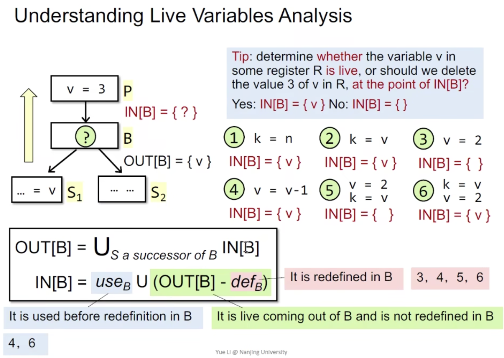
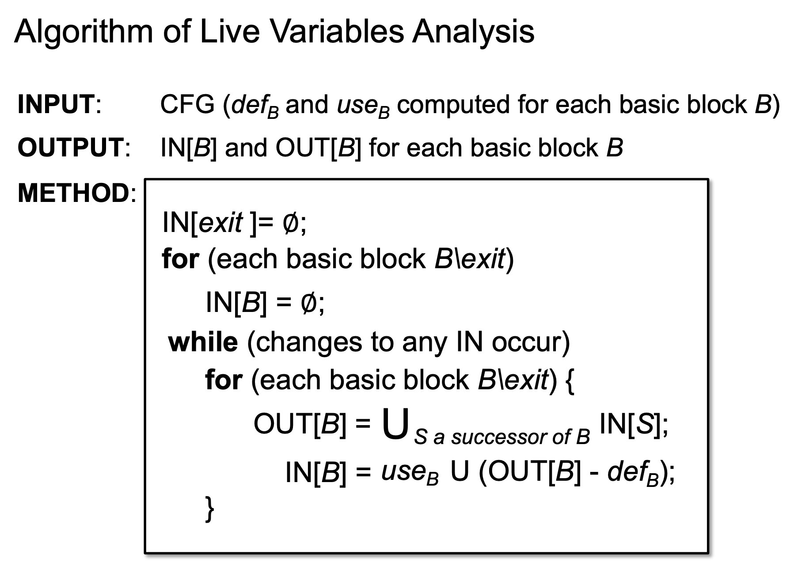
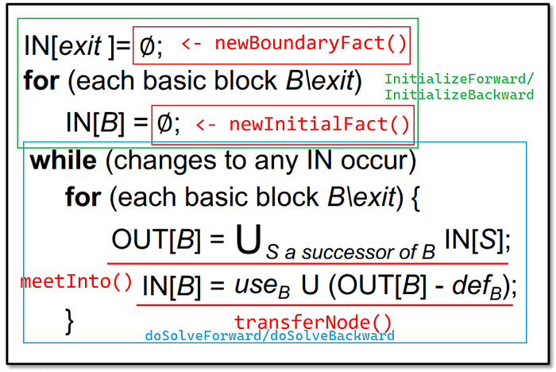

## 活跃变量分析与迭代求解器

在此之前我们先回顾理解一下概念



也就是说，判断一个变量是否存活，我们关注两个点：

- 变量在OUT[B]已经存活，并且在B中没有被重定义
- 变量在OUT[B]已经存活，在B中被重定义之前使用

由于算法是backward分析，可能不太好理解。我们转换思维，如果正向来看，我们的目标是判断`v=3`中的变量3是否还会在后续被使用，那么前面所提到的两个点就很好理解了。



## 实现



Solver.java

```java
protected void initializeBackward(CFG<Node> cfg, DataflowResult<Node, Fact> result) {
        // 初始化EXIT节点
        result.setInFact(cfg.getExit(), analysis.newBoundaryFact(cfg));
        // 遍历节点，初始化INFACT和OUTFACT
        for (Node node : cfg) {
            if (!node.equals(cfg.getExit())) {
                result.setInFact(node, analysis.newInitialFact());
                result.setOutFact(node, analysis.newInitialFact());
            }
        }
    }
```

IterativeSolver.java

```java
    protected void doSolveBackward(CFG<Node> cfg, DataflowResult<Node, Fact> result) {
        boolean N0change = true;
        while (N0change) {
            N0change = false;
            for (Node node : cfg) {
                if (!node.equals(cfg.getExit())) {
                    // 将node的每个后继节点的INFACT并入node的OUTFACT
                    for (Node successor : cfg.getSuccsOf(node)) {
                        analysis.meetInto(result.getInFact(successor), result.getOutFact(node));
                    }
                    // 通过按位或来判断是否停止
                    N0change |= analysis.transferNode(node, result.getInFact(node), result.getOutFact(node));

                }
            }
        }

    }
```

LiveVariableAnalysis.java

```java
public SetFact<Var> newBoundaryFact(CFG<Stmt> cfg) {
  return new SetFact<>();
}


public SetFact<Var> newInitialFact() {
  return new SetFact<>();
}


public void meetInto(SetFact<Var> fact, SetFact<Var> target) {
  target.union(fact);
}


public boolean transferNode(Stmt stmt, SetFact<Var> in, SetFact<Var> out) {
  SetFact<Var> tempFact = out.copy();
  // OUT - def
  Optional<LValue> lValue = stmt.getDef();
  if (lValue.isPresent() && lValue.get() instanceof Var) {
    tempFact.remove((Var) lValue.get());
  }

  // (OUT - def) ∪ use
  for (RValue rValue : stmt.getUses()) {
    if (rValue instanceof Var) {
      tempFact.add((Var) rValue);
    }
  }
  // check if changes occur
  if (tempFact.equals(in)) {
    return false;
  }
  in.union(tempFact);
  return true;

}
}
```

