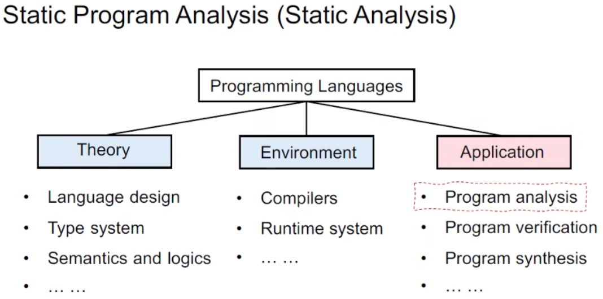
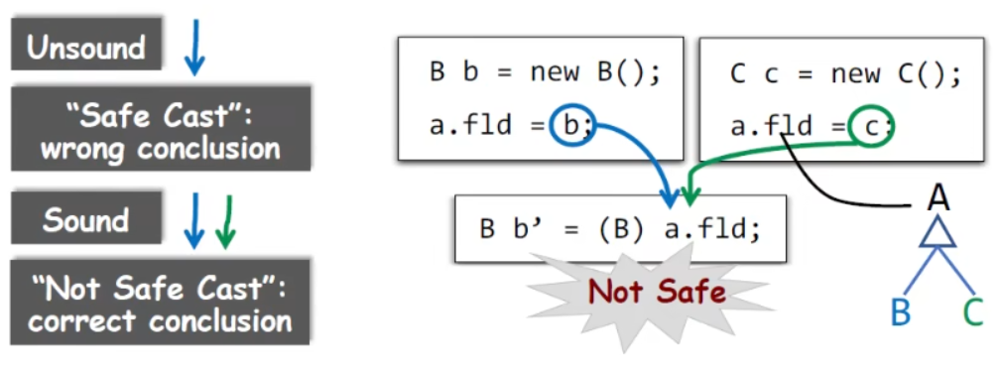
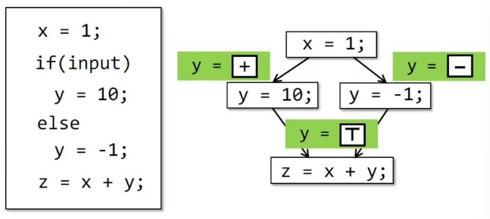
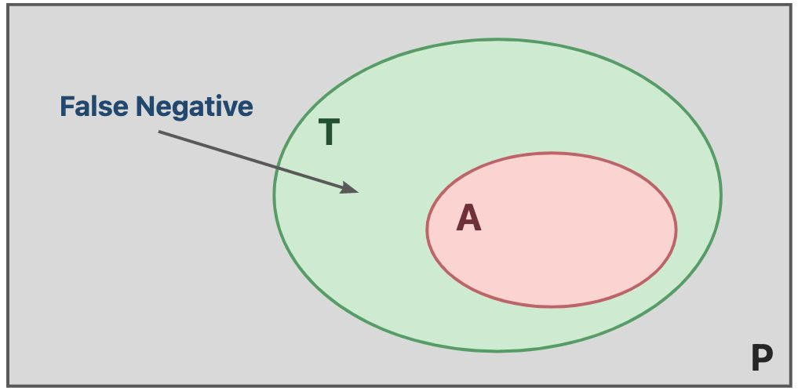
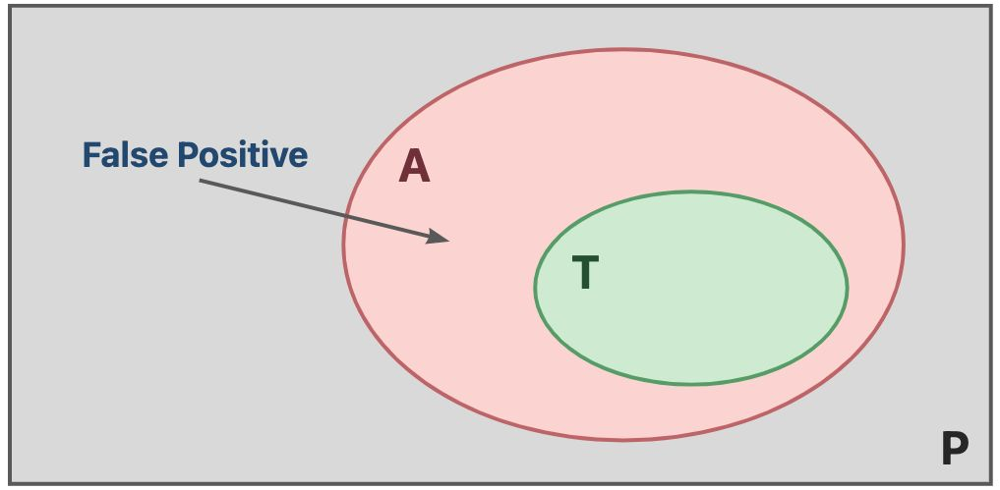

## Introduction

### Why we need static analysis

- reliability
- security
- compiler optimization(编译优化)
- program understanding

### Static Analysis

Static analysis analyzes a program P to reason about its behaviors and determines whether it satisfies some properties before runnning P.

ps.静态+运行前分析

### Useful static analysis

mostly compromising completensee:Sound(overapproximate) but not fully-precise static analysis.

保证全面性而可以损失精度

- Soundness(全面) is critical to a collection of important(static-analysis) applications such as compiler optimization and program verification.

  

- Soundness is also preferable to other(static-analysis) applications for which soundness is not demanded,e.g.,bug detection,as better soundness implies more bugs could be found.

Static analysis:ensure(or get close to)soundness,while making good trade-offs between analysis precision and analysis speed.在确保全面的情况下，在精度和速度之间平衡

### Conclude static analysis

- abstraction 抽象
  
  - 将程序从原始的、高维的源代码空间，映射到一个抽象的、低维的符号空间。符号化后，后续的优化、分析、处理都会更加方便。
  
- over-approximation 过近似 -> be sound

  - transfer funtions 转换函数

    - in static analysis,transfer functions define how to evaluate different program statements on abstract values.
    - transfer functions are defined according to "analysis problem" and the "semantics" of different statements.

  - control flows 控制流

    

    As it's impossible to enumerate all paths in practice,flow merging (as a way of over-approximation) is taken for granted in most static analyses. 分支流合并，提升soundness，降低completeness，导致误报

### Self test

- what the differences between static analysis and dynamic testing?

  区别为分析时程序所处的状态，静态分析是程序运行前针对代码本身的分析，动态测试为程序运行时针对功能点的测试

- understand soundness ,completeness,false negatives,false positives

  soundness 完全性 completeness 正确性

  false negatives（保证正确性，损失完整性，造成漏报）

  

  false positives(保证完整性，损失正确性，造成误报)

  

- why soundness is usually required by static analysis

  生产环境下对于完全性需求是首要的，因为要保证业务功能都被覆盖,是不"允许"漏报的

- how to understand abstraction and over-approximation

  abstraction 抽象

  over-approximation 转化函数+控制流

  