## Intermediate Representation（IR）

### Compliers and static analyzers

编译过程:

```
source code
↓↓↓
scanner(lexical analysis 词法分析)--->regular expression
↓↓↓ --->Tokens
Parser(Syntax Analysis 语法分析)--->context-free grammar上下文不敏感语法
↓↓↓ --->AST 抽象语法树
Type Checker 类型检查(Semantic Analysis 语义分析)--->attribute grammar 
↓↓↓ ---> Decorated AST
Translator
↓↓↓ --->IR --->Static Analysis
Code Generator
↓↓↓
machine code
```

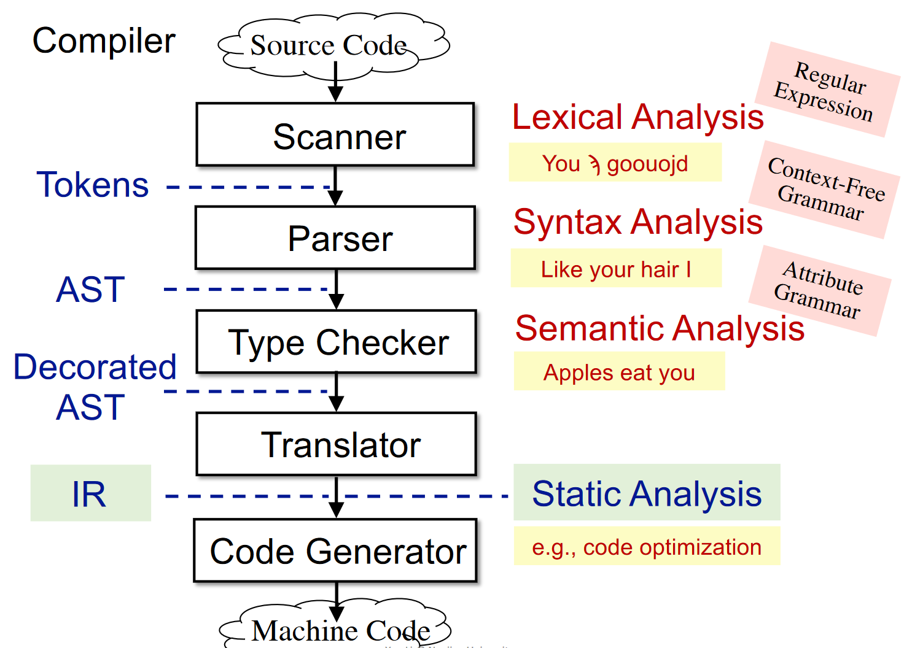

编译器将源代码（Source code） 转换为机器代码（Machine Code）。其中的流程框架是：

- 词法分析器（Scanner），结合正则表达式，通过词法分析（Lexical Analysis）将 source code 翻译为 token。
- 语法分析器（Parser），结合上下文无关文法（Context-Free Grammar），通过语法分析（Syntax Analysis），将 token 解析为抽象语法树（Abstract Syntax Tree, AST）
- 语义分析器（Type Checker），结合属性文法（Attribute Grammar），通过语义分析（Semantic Analysis），将 AST 解析为 decorated AST
- Translator，将 decorated AST 翻译为生成三地址码这样的中间表示形式（Intermediate Representation, IR），并**基于 IR 做静态分析**（例如代码优化这样的工作）。
- Code Generator，将 IR 转换为机器代码。

### AST vs. IR

AST

- high-level and closed to grammar structure
- usually language dependent （取决于不同语言）
- suitable for fast type checking
- lack of contorl flow information

IR

- low-level and closed to machine code
- usually language independent
- compact and uniform
- contains control flow information
- **usually considerd as the basis for static analysis**

对比：

| AST                        | IR                                                           |
| -------------------------- | ------------------------------------------------------------ |
| 层次更高，和语法结构更接近 | 低层次，和机器代码相接近                                     |
| 通常是依赖于具体的语言类的 | 通常和具体的语言无关，主要和运行语言的机器（物理机或虚拟机）有关 |
| 适合快速的类型检查         | 简单通用                                                     |
| 缺少和程序控制流相关的信息 | 包含程序的控制流信息                                         |
|                            | 通常作为静态分析的基础                                       |

IR冗余信息更少，包含控制流的表达，更利于静态分析

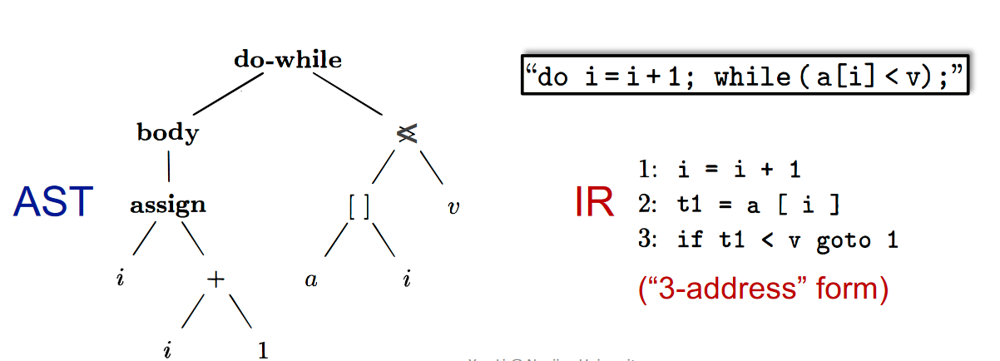

### IR：Three-Address Code(3AC)

#### Three-Address Code(3AC)

- There is at most one operator on the right side of an instruction

  ```
  a+b+3 --> t1 = a+b
  		  t2 = t1+3
  ```

#### why called 3-address

- adress can be one of the following:

  - Name: a,b
  - Constant: 3
  - Compiler-generated temporary(编译器生成的临时量): t1,t2

  each type of instructions has its own 3AC form

#### Some common 3AC forms

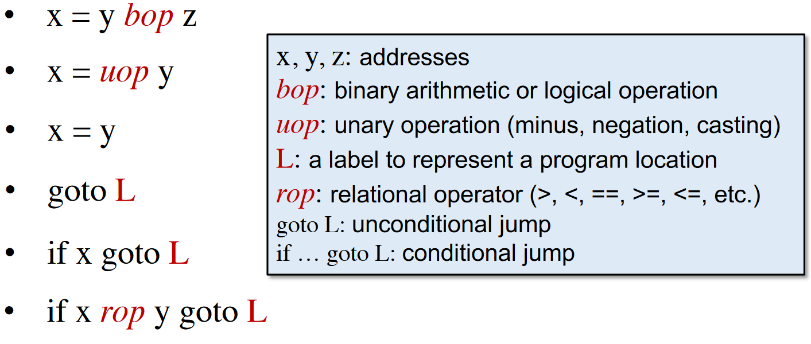

### 3AC in real static analyzers:Soot

#### Soot

- Most popular static analysis framework for Java
- Soot's IR is Jimple: typed(类型的) 3-address code

#### examples

For loop:

`ForLoop3AC.class`

```java
package sa.examples;

public class ForLoop3AC {
    public static void main(String[] args) {
        int x = 0;
        for(int i = 0; i<10; i++){
            x = x + 1;
        }
    }
}
```

生成`ForLoop3AC.jimple`：

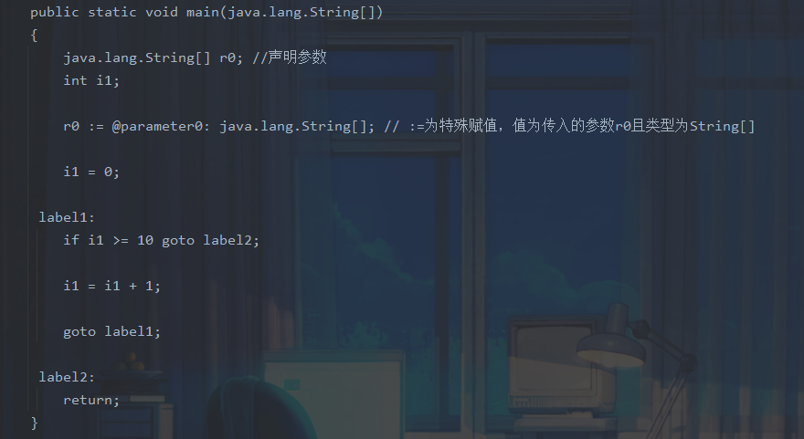

(x在之前步骤被优化掉，属于不合理优化，需要查看soot的实现)

Do-while loop:

`DoWhileLoop3AC.class`

```java
package sa.examples;

public class DoWhileLoop3AC{
    public static void main(String[] args){
        int[] arr = new int[10];
        int i = 0;
        do {
            i = i + 1;
        } while(arr[i] == 10);
    }
}
```

生成jimple：

```java
public static void main(java.lang.String[])
    {
        int[] r0;
        int $i0, i1;
        java.lang.String[] r1;

        r1 := @parameter0: java.lang.String[];

        r0 = newarray (int)[10];

        i1 = 0;

     label1:
        i1 = i1 + 1;

        $i0 = r0[i1];

        if $i0 == 10 goto label1;

        return;
    }
```

Method call:

`MethodCall.class`

```java
public class MethodCall {

    String foo(String para1, String para2) {
        return  para1 + " " + para2;
    }

    public static void main(String[] args) {
        MethodCall mc = new MethodCall();
        String result = mc.foo("hello", "world");
    }
}
```

生成：

```java
java.lang.String foo(java.lang.String, java.lang.String)
    {
        java.lang.StringBuilder $r0, $r2, $r3, $r5;
        java.lang.String r1, r4, $r6;
        MethodCall r7;

        r7 := @this: MethodCall;

        r1 := @parameter0: java.lang.String;

        r4 := @parameter1: java.lang.String;

        $r0 = new java.lang.StringBuilder;

        specialinvoke $r0.<java.lang.StringBuilder: void <init>()>();

        $r2 = virtualinvoke $r0.<java.lang.StringBuilder: java.lang.StringBuilder append(java.lang.String)>(r1);

        $r3 = virtualinvoke $r2.<java.lang.StringBuilder: java.lang.StringBuilder append(java.lang.String)>(" ");

        $r5 = virtualinvoke $r3.<java.lang.StringBuilder: java.lang.StringBuilder append(java.lang.String)>(r4);

        $r6 = virtualinvoke $r5.<java.lang.StringBuilder: java.lang.String toString()>();

        return $r6;
    }
```

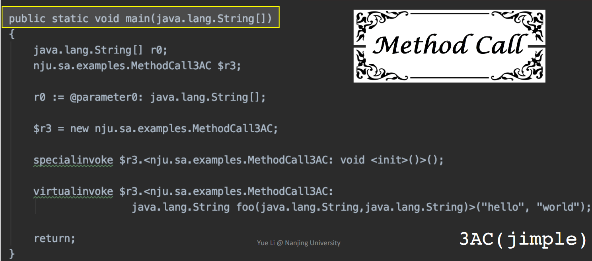

补充：

```java
invokespecial：call constructor, call superclass methods, call private methods
invokevirtual: instance methods call (virtual dispatch)
invokeinterface: cannot optimization, checking interface implementation
invokestation:call static methods

Java 7: invokedynamic -> Java static typing, dynamic language runs on JVM
    
尖括号中的内容：
method signature: class name, return type, method name(parameter1 type, parameter2 type)
```

class:

`Class3AC.class`

```java
package sa.examples;


public class Class3AC {

    public static final double pi = 3.14;

    public static void main(String[] args) {

    }
}
```

生成：

```java
public class Class3AC extends java.lang.Object
{
    public static final double pi;

    public void <init>()
    {
        Class3AC r0;

        r0 := @this: Class3AC;

        specialinvoke r0.<java.lang.Object: void <init>()>();

        return;
    }

    public static void main(java.lang.String[])
    {
        java.lang.String[] r0;

        r0 := @parameter0: java.lang.String[];

        return;
    }

    public static void <clinit>()
    {
        <Class3AC: double pi> = 3.14;

        return;
    }
}
```

clinit：class类构造器对静态变量，静态代码块进行初始化，在jvm进行类**加载—–验证—-解析—–初始化**，中的初始化阶段jvm会调用clinit方法

### Static single assignment(SSA) --optional

每次对变量x赋值都重新使用一个新的变量xi，并在后续使用中选择最新的变量

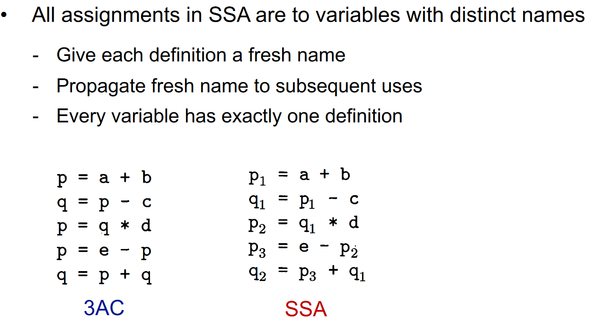

但是这样一来，肯定会因为不同控制流汇入到一个块，导致多个变量备选的问题：

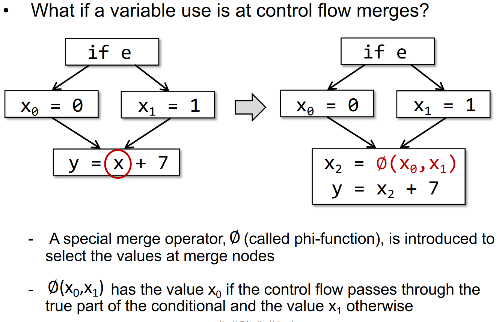

why SSA?

- Flow information is indirectly incorporated into the unique variable names 控制流信息间接地集成到了独特变量名中

  > May help deliver some simpler analyses, e.g., flow-insensitive analysis gains partial precision of flow-sensitive analysis via SSA

- Define-and-Use pairs are explicit 定义与使用是显式的

  > Enable more effective data facts storage and propagation in some on-demand tasks
  > Some optimization tasks perform better on SSA (e.g.,conditional constant propagation, global value numbering)

Why not SSA?

- SSA may introduce too many variables and phi-functions
- May introduce inefficiency problem when translating to machine code (due to copy operations)
  

### Basic Blocks (BB)

#### Control flow analysis

控制流分析（Control Flow Analysis）通常指的是构建控制流图（Control Flow Graph, CFG），并以 CFG 作为基础结构进行静态分析的过程。

- usually refer to building Control Flow Graphs (CFG) 
- CFG serves as the basic structure for static analysis
- The node in CFG can be an individual 3-address instruction,or (usually) a Basic Block(BB)

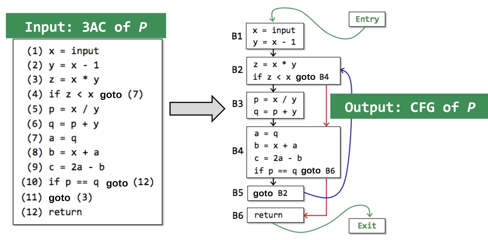

#### Basic Blocks (BB)

- Basic blocks(BB) are maximal sequences of consecutive three-address instructions with the properties that
  - It can be entered only at the beginning,i.e.,the first instruction in the block
  - It can be exited only at the end,i.e.,the last instruction in the block

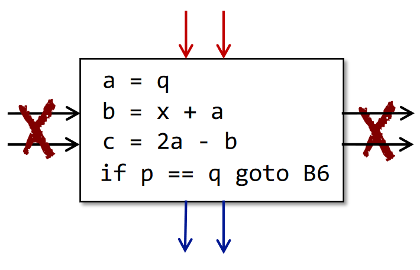

> 所谓基本块，就是满足以下性质的连续 3AC：
>
> - 只能从块的第一条指令进入。
> - 只能从块的最后一条指令离开。

#### Build BBs

- input: a sequence of three-address instructions of P

- output: a list of basic blocks of P

- method:

  - determine the leaders in P
    - the first instruction in P is a leader
    - any target instruction of a conditional or unconditional jump is a leader
    - any instruction that immediately follows a conditional or unconditional jump is a leader

  - build BBs for P
    - a BB consists of a leader and all its subsequent instructions until the next leader

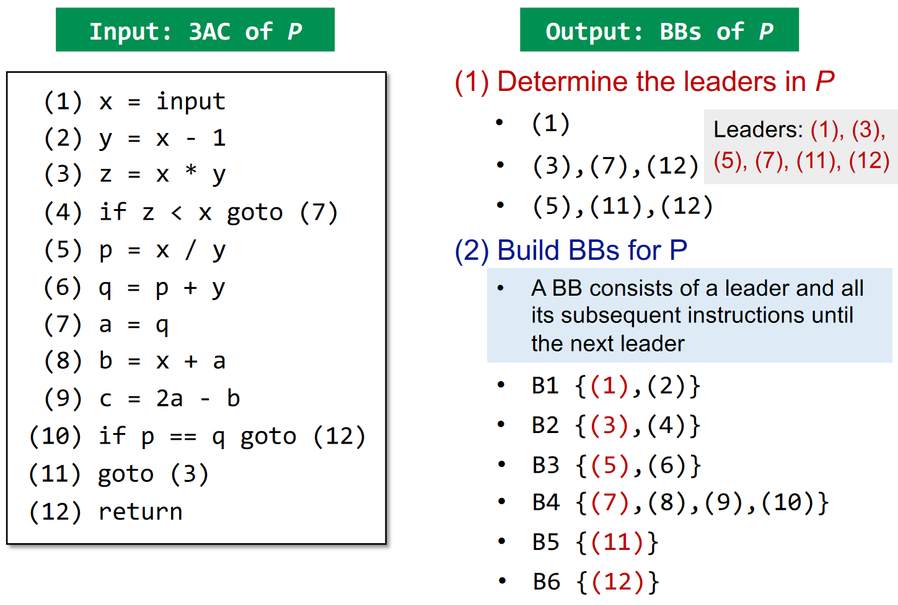

### Control Flow Graphs (CFG)

- The nodes of CFG are basic blocks
- There is an edge from block A to block B and only if
  - There is a conditional or unconditional jump from the end of A to the beginning of B
  - B immediately follows A in the original order of instructions and A does not in an unconditional jump

- It is normal to replace the jumps to instruction labels by jumps to basic blocks

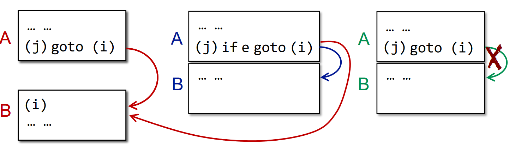

example:

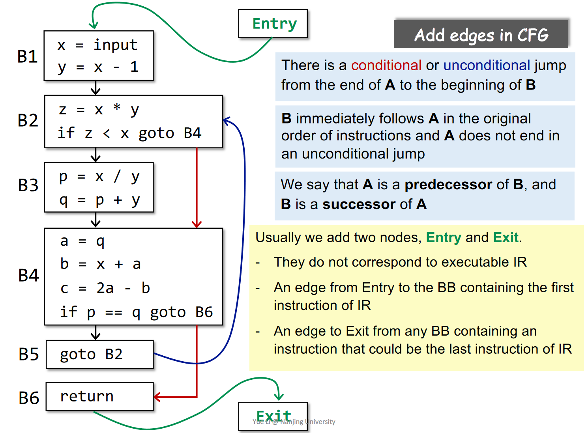

- 若 A -> B，则我们说 A 是 B 的前驱（predecessor），B 是 A 的后继（successor）
- 除了构建好的基本块，我们还会额外添加两个结点，「入口（Entry）」和「出口（Exit）」
  - 这两个结点不对应任何 IR
  - 入口有一条边指向 IR 中的第一条指令
  - 如果一个基本块的最后一条指令会让程序离开这段 IR，那么这个基本块就会有一条边指向出口。

### Self test

- The relation between compilers and static analyzers

  静态分析器基于编译器处理好的IR进行分析

- Understand 3AC and its common forms

  三地址码，在每个指令的右边至多有一个操作符。

  常见形式：

  - x = y bop z：双目运算并赋值，bop = binary operator
  - x = uop z：单目运算并赋值，uop = unary operator
  - x = y：直接赋值
  - goto L：无条件跳转，L = label
  - if x goto L：条件跳转
  - if x rop y goto L：包含了关系运算的条件跳转，rop = relational operator

- How to build basic blocks on top of IR

  - 输入：程序 P 的一系列 3AC
  - 输出：程序 P 的基本块
  - 方法
    1. 决定 P 的 leaders
       - P 的第一条指令就是一个 leader
       - 跳转的目标指令是一个 leader
       - 跳转指令的后一条指令，也是一个 leader
    2. 构建 P 的基本块
       - 一个基本块就是一个 leader 及其后续直到下一个 leader 前的所有指令。

- How to construct control flow graphs on top of BBs?

  - 加边，块 A 和块 B 之间有一条边，当且仅当：
    - A 的末尾有一条指向了 B 开头的跳转指令。
    - A 的末尾紧接着 B 的开头，且 A 的末尾不是一条无条件跳转指令。

  - 添加入口和出口

### Conclusion

本节课学习了IR的定义以及CFG的构建，即

```
AST-->IR(3AC)-->BBs-->CFG
```

之后我们基于CFG进行进一步的静态分析