## Data Flow Analysis I

### Overview of Data Flow Analysis

核心：how data flows on CFG?
展开：
how **application-specific data** --> abstraction
**flows** through the -->safe approximation
**nodes**(BBs/statements) and -->transfer function
**edges**(control flows) of -->control-flow handling
**CFG**(a program)?
对于大多数静态分析来讲都是may analysis：
may analysis:

- outputs information that may be true(over-approximation)

must analysis:

- outputs information that must be true(under-approximation)

Over-and under-approximations are **both for safety of analysis**
about safe approximation ：
may analysis：safe = over
must analysis: safe = under
不同的数据流分析，有着不同的data abstraction, flow safe-approximation策略，transfer functions&control-flow handlings。

### Preliminareis of Data Flow Analysis

#### input and output states

- each execution of an IR statement transforms an input state to a new output state
- the input(output) state is associated with the program point before(after) the statement

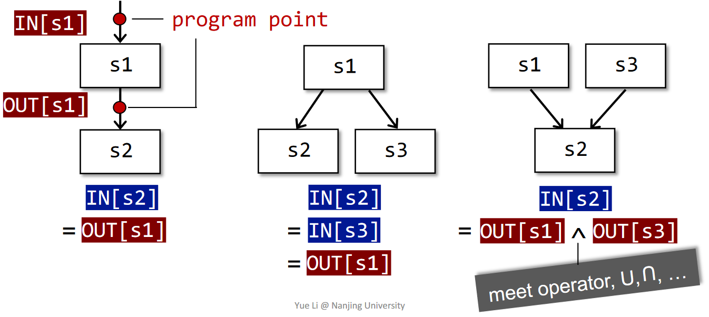
In each data-flow analysis application, we associate with every program point **a data-flow value** that represents **an abstraction** of the set of all possible **program states** that can be observed for that point
**在数据流分析中，我们会把每一个PP关联一个数据流值，代表在该点中可观察到的抽象的程序状态。**
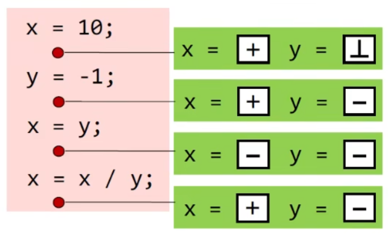
**data-flow analysis is to find a solution to a set of safe-approximation-directed constraints(约束规则) on the IN[s]'s and OUT[s]'s,for all statements s.**

- constraints based on semantics of statements(transfer functions)
- constraints based on the flows of control

#### Notations for transfer function's constraints

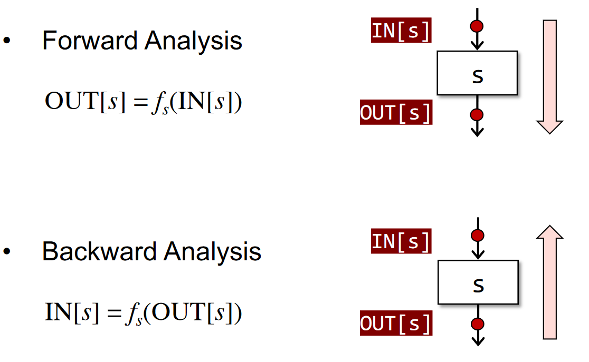

#### Notations for control flow's constraints(控制流约束)

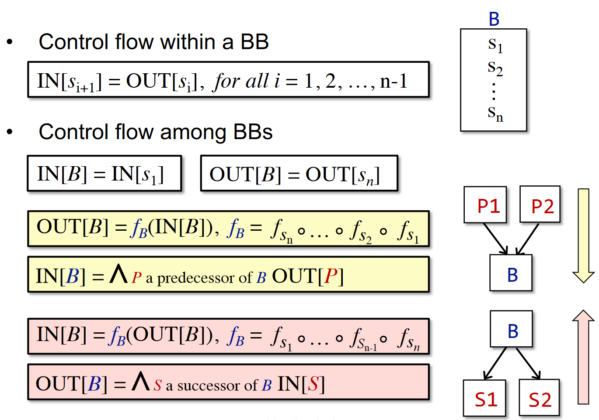
The meet operator ^ is used to summarize the contributions from different paths at the confluence of those paths

#### 不会涉及到的概念

- 函数调用 Method Calls 
  - 我们将分析的是过程本身中的事情，即 Intra-procedural。而过程之间的分析，将在 Inter-procedural Analysis 中介绍
- 变量别名 Aliases 
  - 变量不能有别名。有关问题将在指针分析中介绍。

### Reaching Definitions Analysis（定义可达性分析）

A definition d at program point p reaches a point q if there is a path from p to q such that d is not “killed” along that path

- A definition of a variable v is a statement that assigns a value to v
- Translated as: definition of variable v at program point p reaches point q if there is a path from p to q such that no new definition of v appears on that path

程序中变量 v 的一个 **定义（Definition）** 是指一条给 v 赋值的语句，我们称在程序点 p 处的一个定义 d **到达（Reach）** 了程序点 q ，如果存在一条从 p 到 q 的“路径”（控制流），在这条路径上，定义 d 未被 **覆盖（Kill）** 。称分析每个程序点处能够到达的定义的过程为 **定义可达性分析（Reaching Definition Analysis）** 。
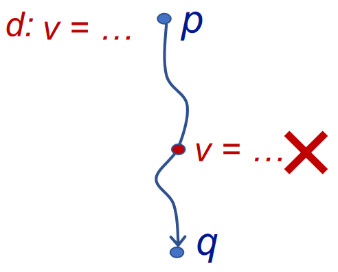
Reaching definitions can be used to detect possible undefined variables. e.g., introduce a dummy definition for each variable v at the entry of CFG, and if the dummy definition of v reaches a point p where v is used, then v may be used before definition (as undefined reaches v)
到达定值可以用来分析未定义的变量。例如，我们在程序入口为各变量引入一个 dummy 定值。当程序出口的某变量定值依然为 dummy，则我们可以认为该变量未被定义。

#### understanding reaching definitions

- data flow values/facts 到达定值中的数据流值
  - the definations of all the variables in a program
  - can be represented by bit vectors
  - 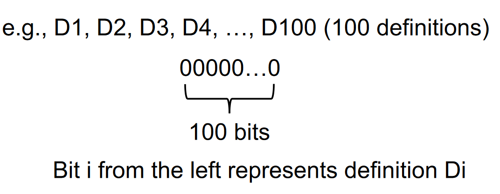
- D: v = x op ythis statement "generates" a definition D of variable v and "kills" all the other definitions in the program that define variable v,while leaving the remaining incoming definitions unaffected.
  - transfer function
  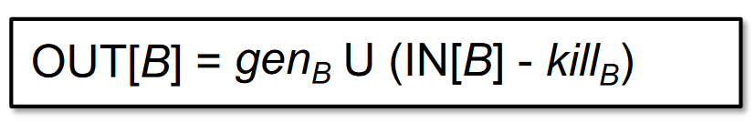
    - 从入口状态删除 kill 掉的定值，并加入新生成的定值。
    - v = x op y，gen v, kill 其它所有的 v
  - control flow
  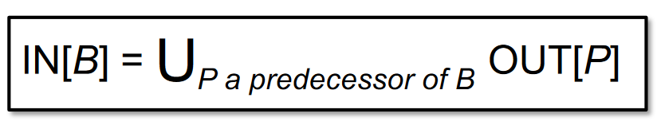A definition reaches a program point as long as there exists at least one path along which the definition reaches.任何一个前驱的变量定值都表明，该变量得到了定义。

#### Algorithm of Reaching Definitions Analysis

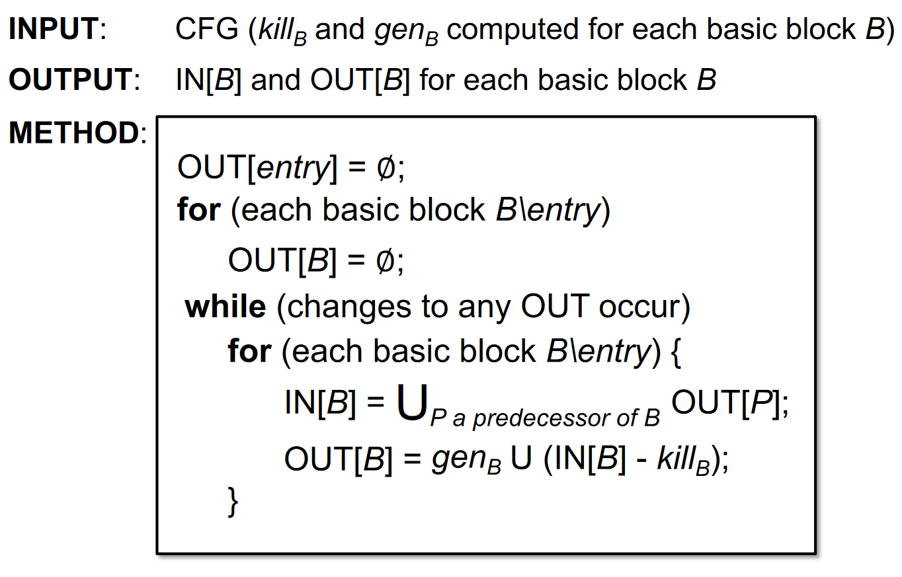
这是一个经典的迭代算法。

- 首先让所有BB和入口的OUT为空。因为你不知道 BB 中有哪些定值被生成。
- 当任意 OUT 发生变化，则分析出的定值可能需要继续往下流动，所需要修改各 BB 的 IN 和 OUT。
- 先处理 IN，然后再根据转移完成更新 OUT。

**为什么程序能够停止？**
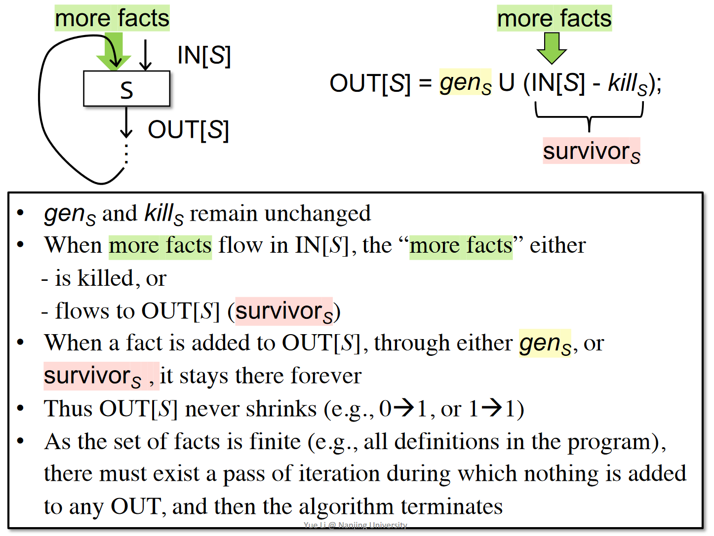

- 一个程序中，gen和kill是固定的。在 gen U (IN - kill) 中，kill 与 gen 相关的 bit 不会因为 IN 的改变而发生改变。
- OUT不会减少。其它 bit 又是通过对前驱 OUT 取并得到的，因此其它 bit 不会发生 1 -> 0 的情况。所以，OUT 是不断增长的，而且有上界，因此算法最后必然会停止。
- 因为 OUT 没有变化，不会导致任何的 IN 发生变化，因此 OUT 不变可以作为终止条件。我们称之为程序到达了不动点（Fixed Point）

#### An example

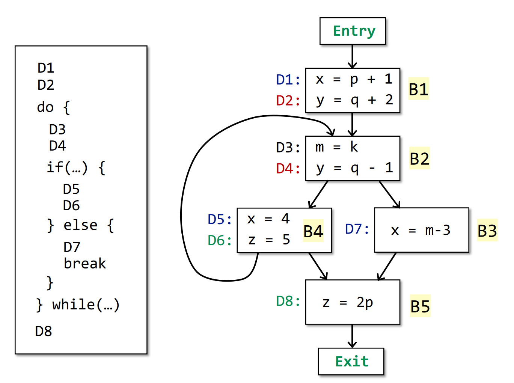
定义可达分析的结果：
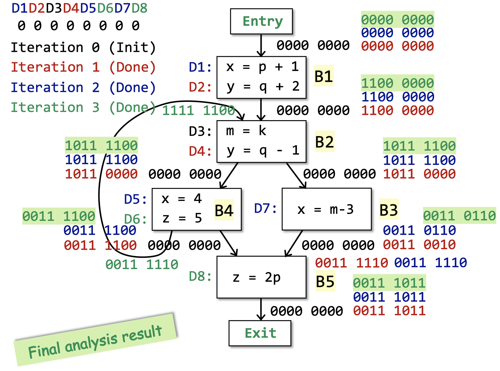

### Live Variables Analysis

Live variables analysis tells whether the value of variable v at program point p could be used along some path in CFG starting at p.If so,v is live at p;otherwise,v is dead at p.

- 变量 x 在程序点 p 上的值是否会在某条从 p 出发的路径中使用
- 变量 x 在 p 上活跃，当 且仅存在一条从 p 开始的路径，该路径的末端使用了 x，且路径上没有对 x进行覆盖。
- 隐藏了这样一个含义：在被使用前，v 没有被重新定义过，即没有被 kill 过。

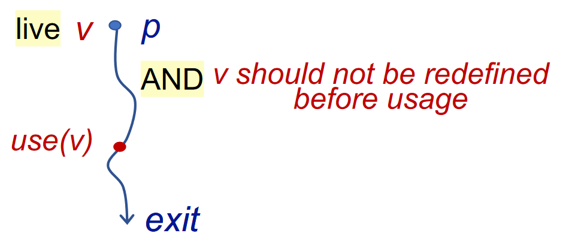
这个算法可以用于寄存器分配，当一个变量不会再被使用，那么此变量就可以从寄存器中腾空，用于新值的存储。
注意这是一个 may analysis

#### 活跃变量中的数据流值(数据抽象)

- 程序中的所有变量
- 依然可以用 bit vector 来表示，每个 bit 代表一个变量

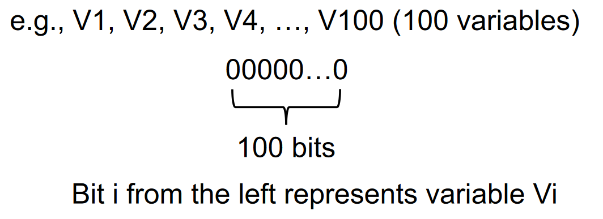

#### Backward analysis

更直观，发现利用-->向前传播

#### Transfer function

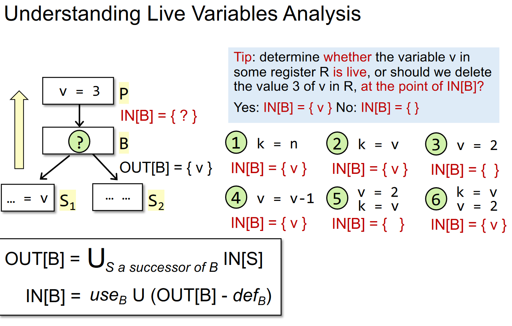

- 一个基本块内，若 v = exp, 则 def v。若 exp = exp op v，那么 use v。一个变量要么是 use，要么是 def，根据 def 和 use 的先后顺序来决定。
- 考虑基本块 B 及其后继 S。若 S 中，变量 v 被使用，那么我们就把 v 放到 S 的 IN 中，交给 B 来分析。
- 因此对于活跃变量分析，其控制流处理是 OUT[B] = IN[S]。
- 在一个块中，若变量 v 被使用，那么我们需要添加到我们的 IN 里。而如果 v 被定义，那么在其之上的语句中，v 都是一个非活跃变量，因为没有语句再需要使用它。
- 因此对于转移方程，IN 是从 OUT 中删去重新定值的变量，然后并上使用过的变量。需要注意，如果同一个块中，变量 v 的 def 先于 use ，那么实际上效果和没有 use 是一样的。

#### Algorithm

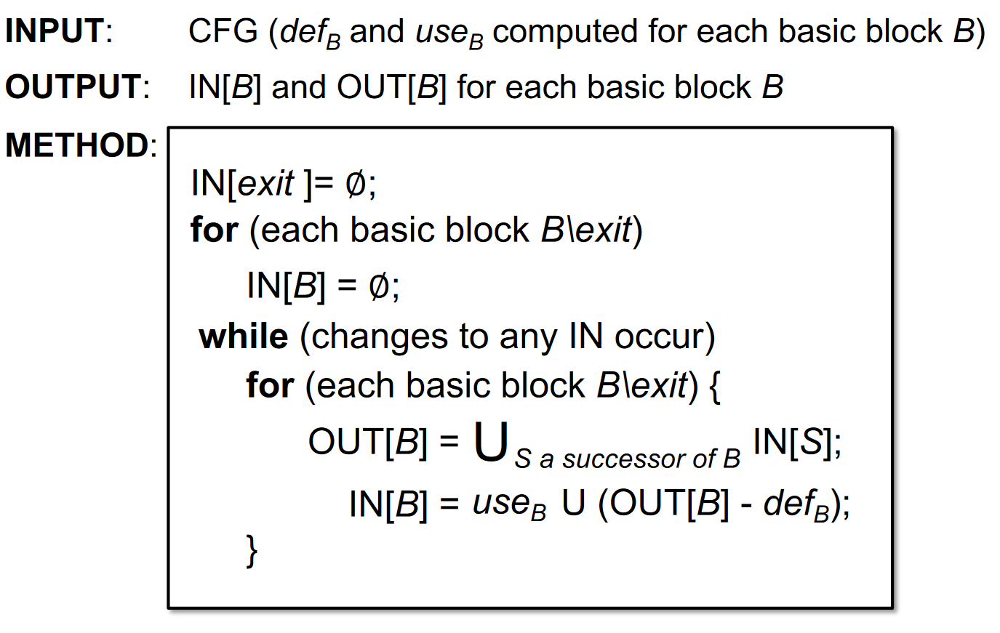

- 我们不知道块中有哪些活跃变量，而且我们的目标是知道在一个块开始时哪些变量活跃，因此把 IN 初始化为空。
- 初始化的判断技巧：may analysis 是空，must analysis 是 top。

关键点：已知out去求in，先use后define

### Avaliable Expressions Analysis

可用表达式分析 must analysis

#### 基本概念

- x + y 在 p 点可用的条件：从流图入口结点到达 p 的每条路径都对 x + y 求了值，且在最后一次求值之后再没有对 x 或 y 赋值

可用表达式可以用于全局公共子表达式的计算。也就是说，如果一个表达式上次计算的值到这次仍然可用，我们就能直接利用其中值，而不用进行再次的计算。
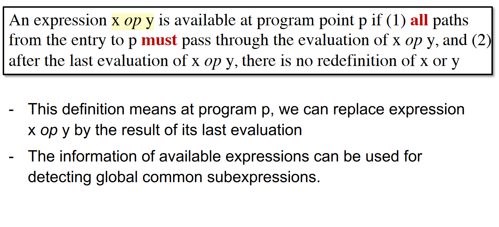

#### 可用表达式分析中的数据流值

- 程序中的所有表达式
- bit vector 中，一个 bit 就是一个表达式

#### Algorithm

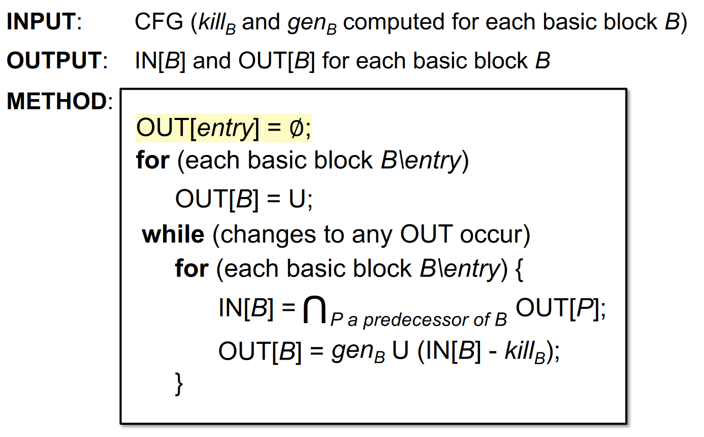

- 注意此时的初始化：一开始确实无任何表达式可用，因此OUT[entry]被初始化为空集是自然的。但是，其它基本块的 OUT 被初始化为全集，这是因为当 CFG 存在环时，一个空的初始化值，会让取交集阶段直接把第一次迭代的 IN 设置成 0，无法进行正确的判定了。
- 如果一个表达式从来都不可用，那么OUT[entry]的全 0 值会通过交操作将其置为 0，因此不用担心初始化为全 1 会否导致算法不正确。

#### 举例

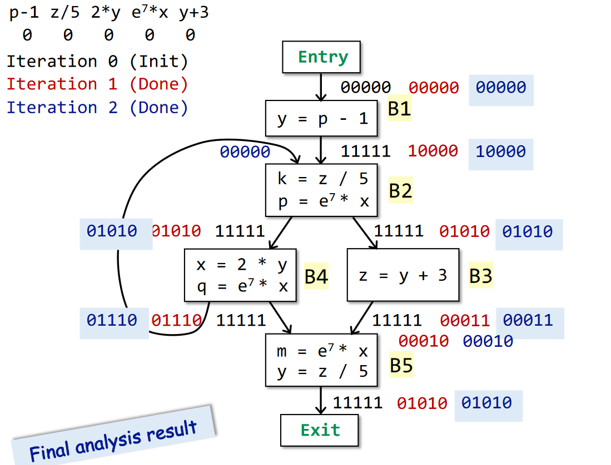

### Conlusion

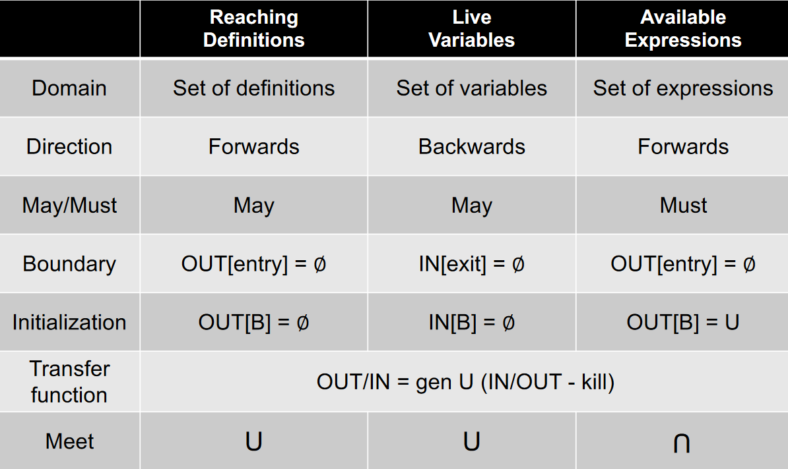

### 划重点

- 三种数据流分析 
  - 到达定值
  - 活跃变量
  - 可用表达式
- 三种数据流分析的区别和联系
- 知道迭代算法，以及算法能停机的原因