# 00 摘要

DNS-over-HTTPS (DoH)是保护 DNS 机密性和完整性的主要措施之一，已被大多数流行的浏览器部署。然而，这种措施可能会受到降级攻击的影响，该攻击会将 DNS 通信的内容暴露给攻击者。具体来说，作者使用了4个与攻击模型相关的攻击向量来检测了6个浏览器，发现了所有能够导致成功攻击的组合。其根本原因是，所有浏览器默认启用Opportunistic Privacy profile，当DoH不可用时，允许DoH退回到 DNS 时，然而，当发生这种变化时，没有一个浏览器会通知用户，而一些浏览器需要很长时间才能恢复到 DoH。在本文的最后，作者提出了一些对策，并呼吁互联网社区进行讨论，重新审视有关 DoH 和使用配置文件的标准和实现。

# 01 背景介绍

### Domain name system (DNS)

DNS将域名转换为相应的IP地址。更具体地说，客户端软件存根解析器收集用户应用程序请求的域名。然后将DNS查询发送给递归解析器( RR )。RR在DNS解析中充当代理。如果查询域不在其缓存中，它将递归地向权威域服务器发送查询。RR收到响应后，会将响应发回客户端。到目前为止，大部分的DNS查询和响应都是以明文的形式进行传输的，这使得DNS容易被篡改。存根解析器和递归解析器之间的DNS数据包是攻击者的主要攻击目标，已有研究表明用户的DNS查询可以用来追踪或者审查。

### DNS-over-HTTPS (DoH)

为了缓解DNS的隐私问题，DoH被提出来保护终端用户和递归解析器之间的连接。它使用HTTPS加密DNS查询。DoH与普通HTTPS一样，运行在TCP端口443上。DNS请求以URI模板(例如, `https://dns.google/dns-query {?dns}`是Google公共DNS)的格式发送。URI中的域名不仅用于查找DoH解析器(通过明文DNS解析)的IP地址，还用于验证其身份(通过SSL证书验证)。DoH常作为一个集成模块由浏览器提供。因此，DoH通信对操作系统是不透明的。

### Process of DoH Communication

通常来讲，该过程分为两个阶段，第一阶段发生在DoH连接之前，浏览器向DNS服务器发送报文查询DoH服务器的ip，该过程与传统DNS解析相同，这意味着任何能够嗅探网络流量的攻击者都可以查看DNS数据包中的纯文本内容并对其进行篡改。

第二阶段则是浏览器通过TLS协议与DoH服务器建立安全连接。之后通过该传输隧道传输DNS报文，能够破坏此阶段的攻击者可以强制浏览器回退到明文 DNS。

此外，对于 Chrome 等浏览器，在 Phase 1 之前，使用映射表将操作系统中配置的 DNS 解析器转换为其等效的 DoH 解析器 URI，称之为 Phase 0。Phase 0 通常硬编码在浏览器软件中，因此作者不认为这个阶段会受到攻击。

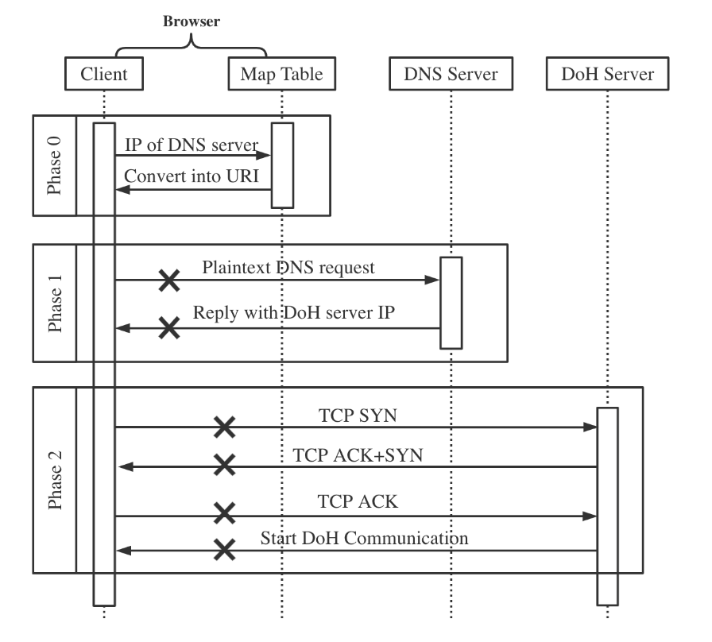

# 02 威胁模型

攻击者的目标是强制加密的 DoH 退回到明文。在本文中，作者根据攻击者操纵网络数据包的能力假设了两种类型的威胁模型。

### In-path Attackers

他们可以检查受害者的流量，并有能力修改来自和发往受害者的所有数据包。一个例子是网络网关，它通常由公司的网络管理员或公共 WiFi 的所有者控制。另一个例子是本地网络中的攻击者，他们可以执行 ARP 缓存中毒攻击 以将受害者流量重定向到攻击者的机器并充当恶意中间人。

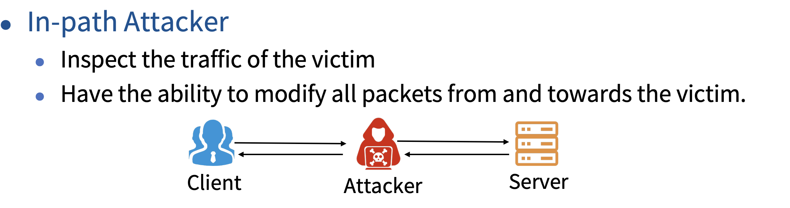

### On-path Attackers

他们可以检查受害者的流量并注入新数据包。但与路径内攻击者不同的是，他们无法拦截或修改通过的数据包。

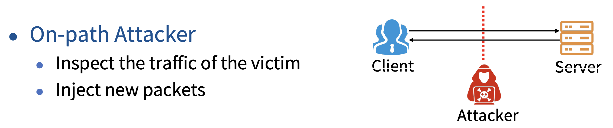

综合两种威胁模型，都需要攻击者能够从客户端嗅探 DoH 流量。In-path attackers需要拦截受害者数据包的能力，而On-path attackers只需要注入新数据包的能力。

# 03 攻击方式

作者提出4中攻击方式，攻击者可以针对DoH解析的不同阶段进行利用。

### DNS Traffic Interception

`
In-path attackers target Phase 1
`

如果攻击者能够修改通过他自己设备的网络数据包，那么攻击者可以通过阻止受害者发送的特定 DNS 流量来获取 DoH 服务器的 IP 地址来攻击DoH的URI解析阶段。这些特定的流量可以通过DNS请求中的URI来进行过滤。下表是一些DoH服务器的域名：

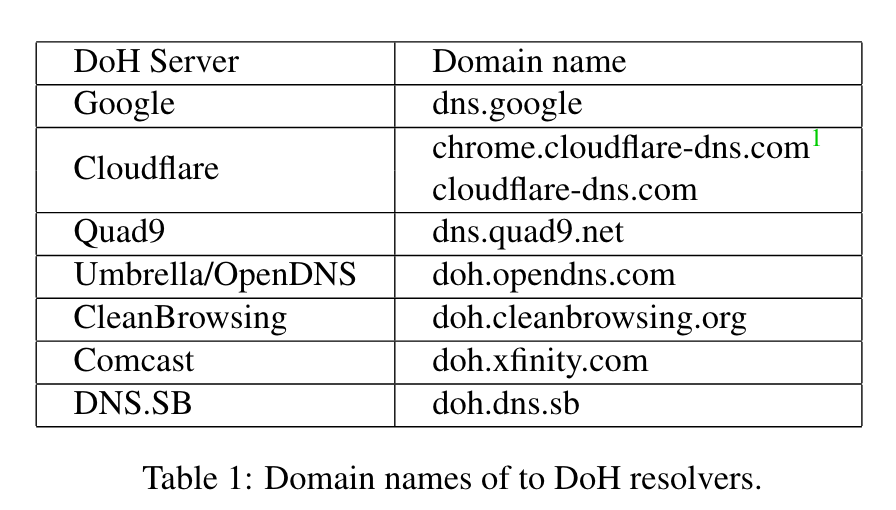

### TCP Traffic Interception

`
In-path attacker targets Phase 2
`

与DNS流量拦截相似，只是这种方法通过阻止第二阶段的TCP流量来强制DoH退回到明文DNS阶段。该方法只能被In-path attacker利用，因为其需要修改网络数据包。

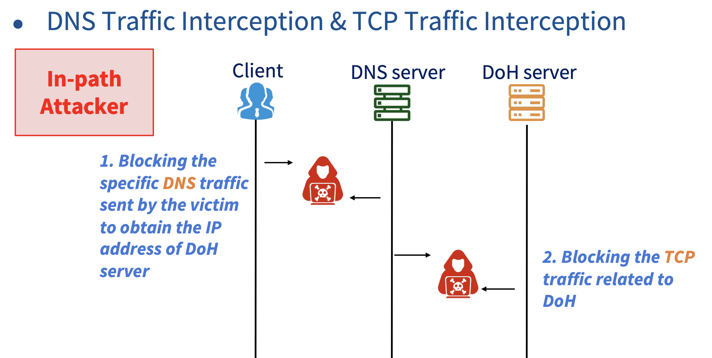

### DNS Cache Poisoning.

`
On-path attackers target Phase 1
`

DNS 缓存中毒是指通过使用虚假或无法访问的 IP 地址向受害者发送响应 DNS 数据包来欺骗 DNS 缓存。这种情况下请求连接将会重定向到错误的IP地址。因此浏览器无法建立与DoH服务器的连接，理论上会回退到明文DNS传输。

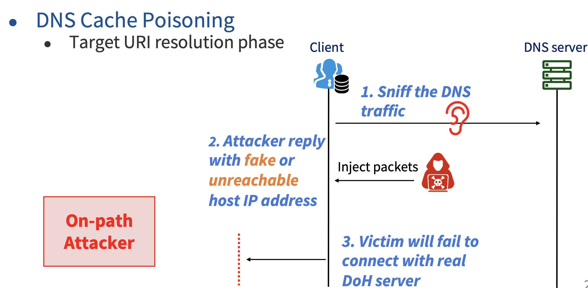

### TCP Reset Injection

`
On-path attackers target Phase 1
`

on-path attacker 能够在连接/通信阶段篡改TCP流量。攻击者嗅探受害者和 DoH 解析器之间交换的网络流量。之后攻击者获得TCP头的seq和ack，并向受害者和/或 DoH 解析器发送伪造的 TCP 重置数据包以诱使他们切断 TCP 连接。与DNS缓存中毒相似，这种攻击方式不需要拦截或者修改现有的数据包。

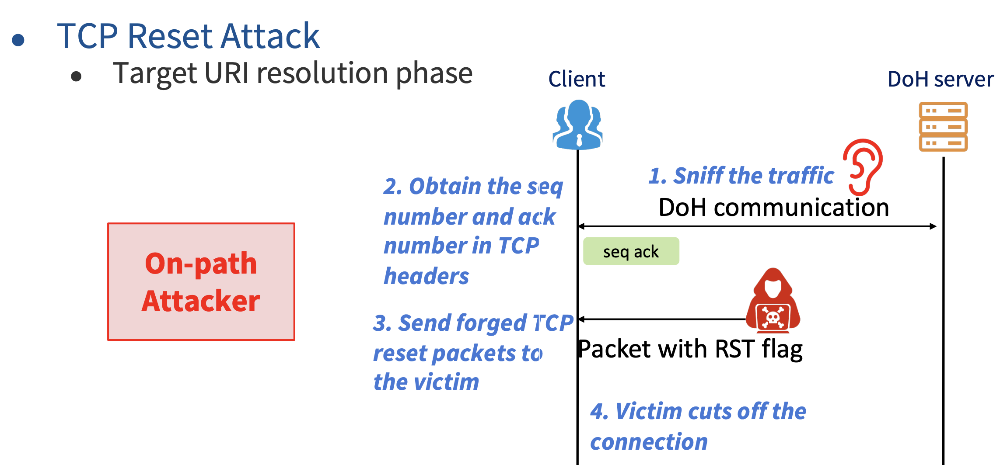

# 04 实验评估

### Experiment Setup

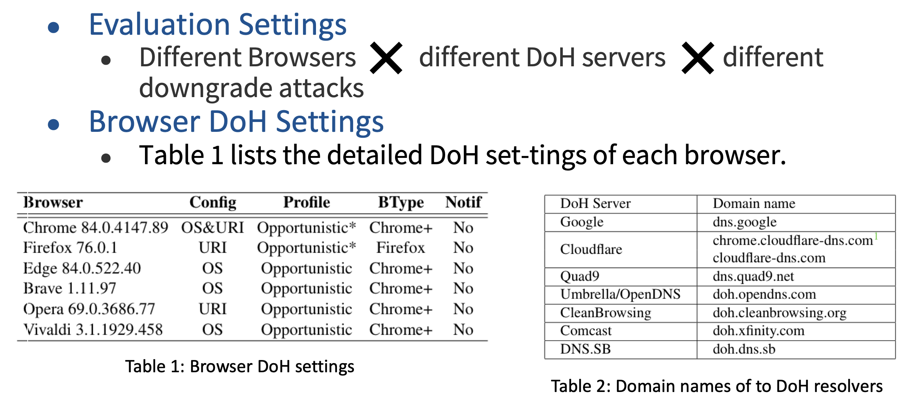

**Evaluation Settings**

所有的评估任务关注浏览器在面对不同攻击方式时的反应。作者选取了下表所列的6款浏览器，都是比较流行并且支持DoH的。测试环境设置了3台机器(Windows 和 MAC笔记本作为受害者，一台Debian Linux作为攻击者)连接至无线路由器(AT&T WiFi 网关)。攻击者使用Wireshark 3.0.3来窃听受害者流量，使用Scapy2.4.3来制作攻击数据包。对于in-path attack 场景，作者更改了路由器的防火墙策略来阻止与DoH相关的TCP/DNS流量包，或者通过 ARP 欺骗将用户的流量重定向到攻击者的机器并拦截受害者的数据包。我们让受害者先配置一个 DoH 服务器，然后访问几个随机网站。第 1 阶段（URI 解析）和第 2 阶段（DoH 连接和通信）都经过测试。虽然我们检查了表1中列出的不同 DoH 服务器，但我们发现攻击是否成功与这个因素无关。因此，我们将重点放在浏览器端进行剩余的评估。

**Browser DoH Settings**：表2列出了每个浏览器的DoH配置详情。Chrome、Firefox 和 Opera 允许用户在安全设置面板中指定 DoH 解析器的 URI，而所有其他的都执行阶段 0 来获取 URI。Chrome 默认使用操作系统中配置的 DNS provider，所有其他浏览器（Edge、Brave、Vivaldi）仅使用操作系统中配置的 DNS provider作为其 DoH provider。作者还发现浏览器对降级攻击的反应取决于默认或用户启用的使用配置文件。与 RFC 8310 中描述的 DoT 使用配置文件类似，有两个选项：严格隐私(Strict Privacy)配置文件和选择隐私(Opportunistic Privacy)配置文件。对于第一个选项，当无法建立DoH通信时，例如无法通过 DoH 连接解析器，将发生“硬故障”，客户端将不会将明文 DNS 视为备份计划。对于第二个选项，客户端将在 DoH 通信失败后尝试与 DNS 解析器建立连接并使用明文 DNS。显然，当启用 Opportunistic Privacy 配置文件时，降级攻击有可能成功。有趣的是，作者发现所有浏览器都默认启用后者。切换到严格模式是可行的，但并非在每个浏览器上都适用。

### Browser Reaction under Attack

作者使用选择隐私(Opportunistic Privacy)配置评估了6种浏览器在面对四种不同攻击向量的反应。结果发现无论浏览器面对什么样的攻击向量，只要该攻击阻碍了 DoH 服务的网络流量，浏览器的响应行为将会遵循一种模式，该模式可以用三个属性描述：连续请求周期(CRP)、间隔增长(IG)和最大间隔(MI)。这三个属性反映了浏览器在受到攻击时如何重新连接到 DoH 服务器。

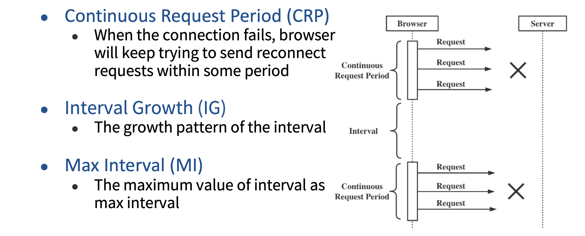

### Continuous Request Period (CRP)

当浏览器发现连接失败时，它将在一段时间内不断尝试发送多个重连请求。作者把这个时期定义为 CRP。从攻击者的角度来看，在 CRP 期间，他们必须继续攻击 DoH 流量，以确保 DoH 可以成功地降级为明文 DNS。另一方面，CRP 的时间越长，DoH的服务就越难受到攻击。

### Interval Growth (IG)

在每两个连续的 CRP 之间，存在一段时间，在此期间浏览器不会发送任何与 DoH 相关的重新连接请求。知道确切的时间间隔后，攻击者可以暂停攻击并嗅探明文 DNS 数据包。同时通过阻止明文 DNS 解析 DoH 服务器域名，攻击者能够让用户始终使用明文 DNS。对于攻击者来说，间隔时间越长，攻击就越隐秘(需要发送的降级数据包越少)。作者还发现，有些浏览器使用常数间隔，但有些浏览器使用线性增长间隔。我们用 IG 来区分这两种情况。

### Max Interval (MI)

当区间线性增加时，MI 是所有区间中的最大值。当区间一定时，MI 就是区间的值。

### Analysis of Browser Reactions

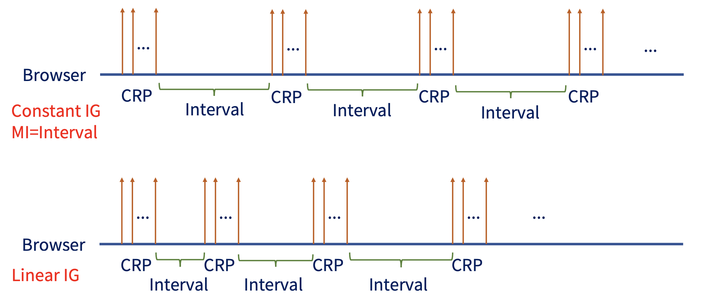

通过测试，作者发现当 DoH 降级为明文 DNS 时，没有浏览器提示用户，并且在重试 DoH 时，访问网站的额外延迟并不明显。因此，用户很难发现这些攻击。同时在关于各种时间间隔上，利用测量结果，攻击者可以根据受害者的资源和受害者的环境，灵活地决定攻击 DoH 的频率、使用哪种攻击方法。

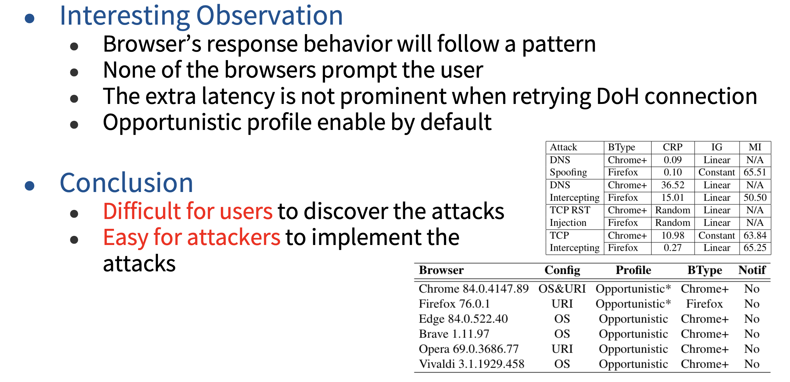

# 05 反馈

作者向浏览器厂商报告了测试结果，但回复都认为没有必要进行修复。根据 Firefox 的回复，DoH 在降级攻击下易受攻击是 Opportunistic Privacy profile 的预期特征。 Firefox 认为该设置在大多数时候仍然可以保护用户免受被动攻击。 Chrome 声称该问题是当前 Chrome DoH 的“预期、设计和记录的行为”。

虽然所有浏览器都遵循 RFC 8310，其中提到了攻击的可能性，但没有一个浏览器会采取措施来解决降级攻击。这可能是出于用户体验的考虑，但由于降级攻击门槛相对较低，作者还是呼吁互联网社区能够关注这件事情。

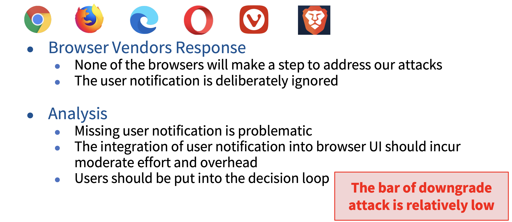

# 06 对策

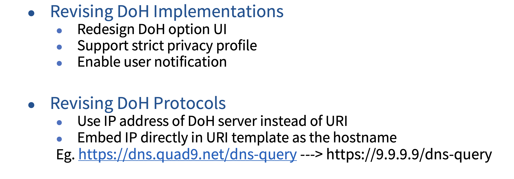

# 07 总结与建议

在本文中，作者通过对浏览器进行降级攻击的测试，发现了浏览器容易受到该类攻击的影响并且用户很难发现。虽然该问题并不是浏览器的明显问题，但鉴于浏览器遵循的RFC配置规定，作者希望厂商能够仔细评估使用配置文件的安全隐患。同时作者也提出了一些对策，例如保护DoH通信第一阶段。

本文贡献如下：

- 作者通过系统地枚举攻击面和检查攻击向量，对 DoH 降级攻击进行了首次研究。
- 作者在真实的实验室环境中评估了这些攻击，发现降级攻击不仅可行，而且对所有浏览器都有效。还发现受到攻击的浏览器的反应令人堪忧。
- 作者在实现和协议层面讨论可能的对策。