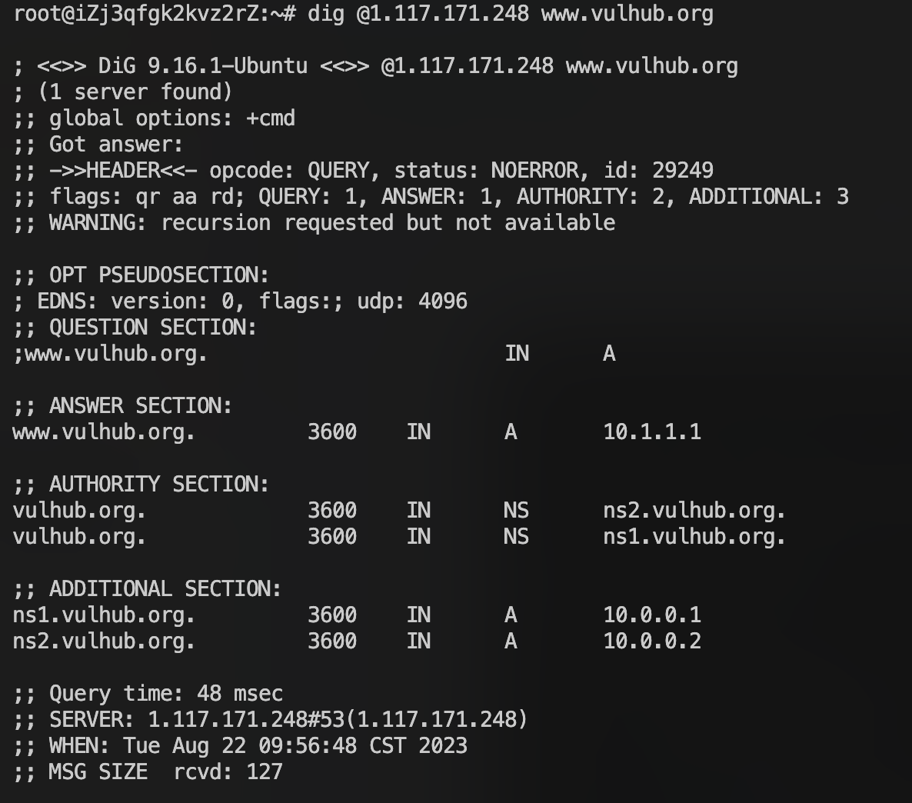
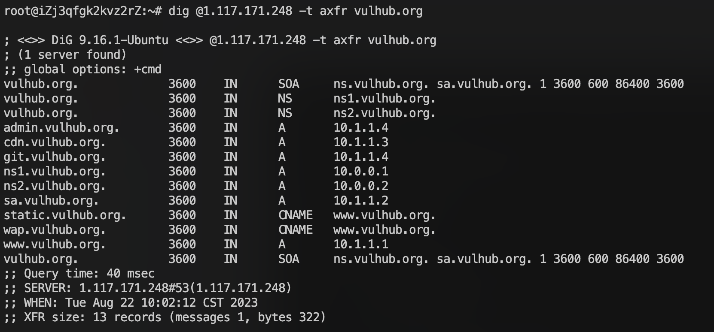
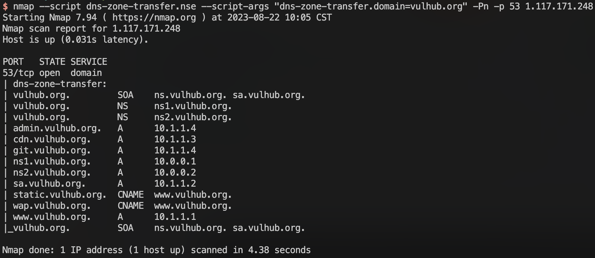

## DNS Zone Transfers (AXFR) Vulnerability

DNS zone transfers using the AXFR protocol are the simplest mechanism to replicate DNS records across DNS servers. To avoid the need to edit information on multiple DNS servers, you can edit information on one server and use AXFR to copy information to other servers. However, if you do not protect your servers, malicious parties may use AXFR to get information about all your hosts.

### Why Is DNS Zone Transfer Needed

DNS is a critical service. If a DNS server for a zone is not working and cached information has expired, the domain is inaccessible to all services (web, mail, and more). Therefore, each zone should have at least two DNS servers. For more critical zones, there may be even more.

However, a zone may be large and may require frequent changes. If you manually edit zone data on each server separately, it takes a lot of time and there is a a lot of potential for a mistake. This is why DNS zone transfer is needed.

You can use different mechanisms for DNS zone transfer but the simplest one is AXFR (technically speaking, AXFR refers to the protocol used during a DNS zone transfer). It is a client-initiated request. Therefore, you can edit information on the primary DNS server and then use AXFR from the secondary DNS server to download the entire zone.

### Vulnerable Environment

Vulhub uses [Bind9](https://wiki.debian.org/Bind9) to build the dns server, but that does not mean that only Bind9 supports AXFR records.

To run the DNS server.

```
docker compose up -d
```

Once the environment is running, it will listen on port 53 of TCP and UDP, and the DNS protocol supports data transfer from both ports.

### Attack Reproduction

Under Linux, we can use the dig command to send dns requests. For example, we can use `dig @1.117.171.248 www.vulhub.org` to get the `A` record of the domain name on the target dns server.



Then we can send AXFR record requests:`dig @1.117.171.248 -t axfr vulhub.org`



We got all the subdomain records of `vulhub.org`, and there is a DNS zone transfers vulnerability here.

### Nmap Scan 

We can also use the Nmap script to scan for this vulnerability: `nmap --script dns-zone-transfer.nse --script-args "dns-zone-transfer.domain=vulhub.org" -Pn -p 53 1.117.171.248`



### AXFR Vulnerability and Prevention

AXFR offers no authentication, so any client can ask a DNS server for a copy of the entire zone. This means that unless some kind of protection is introduced, an attacker can get a list of all hosts for a domain, which gives them a lot of potential attack vectors.

In order to prevent this vulnerability from occurring, the DNS server should be configured to only allow zone transfers from trusted IP addresses. The following is an example of how this can be accomplished in the BIND DNS server.

```conf
# /etc/named.conf 
acl trusted-nameservers {
  192.168.0.10; //ns2 
  192.168.1.20; //ns3 
}; 
zone zonetransfer.me { 
  type master; 
  file "zones/zonetransfer.me"; 
  allow-transfer { trusted-nameservers; };
};
```

Additionally, it’s also recommended to [use transaction signatures (TSIG) for zone transfers](https://www.slashroot.in/secure-zone-transfer-bind-using-tsigtransaction-signatures) to prevent IP spoofing attempts.

### Related Research

[Characterizing Vulnerability of DNS AXFR Transfers with Global-Scale Scanning](https://ieeexplore.ieee.org/document/8844634)

#### Abstract

In this paper, we consider security issues related to zone transfers by investigating the responses of DNS servers to AXFR requests. In particular, we investigate how attackers can exploit available AXFR zone transfers to obtain useful reconnaissance data. To evaluate the extent of the security flaw, we have scanned DNS servers on a global scale with a dedicated tool and transferred multi-line zone files of 3.6M domains. We have first analyzed the experimental data to evaluate the size of the DNS zones. Then, we have investigated what kind of information zone transfers may reveal to attackers. We have also studied the information on chosen services that attackers can use in further attacks and analyzed potential security problems such as enumerating open SMTP relays or domains vulnerable to DNS hijacking. Finally, we have proposed potential remediation strategies to improve the security of the DNS ecosystem.


References:

https://github.com/vulhub/vulhub/tree/master/dns/dns-zone-transfer

https://www.acunetix.com/blog/articles/dns-zone-transfers-axfr/