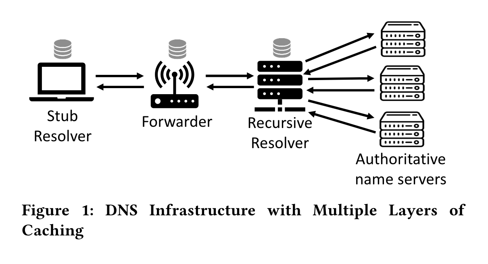
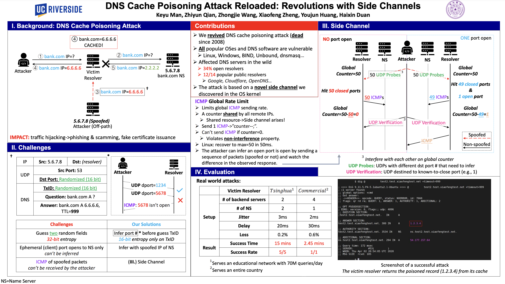
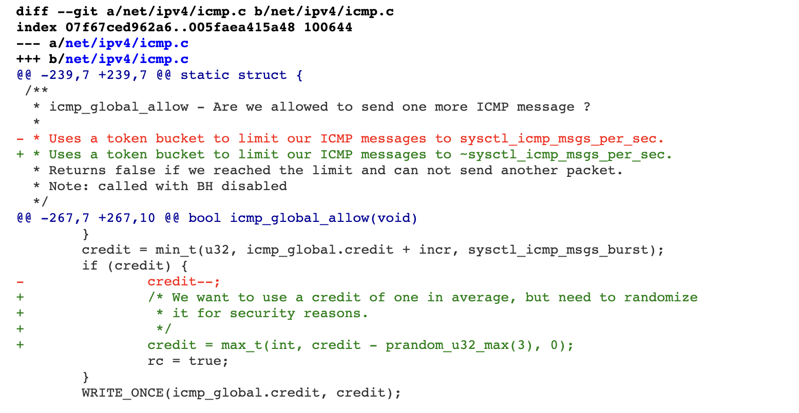
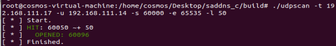
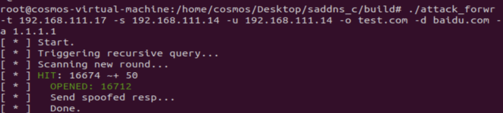
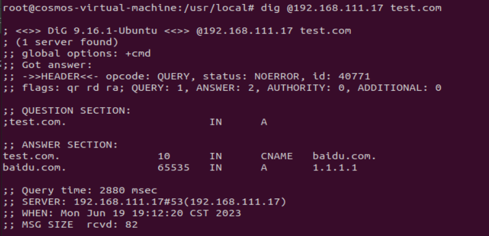
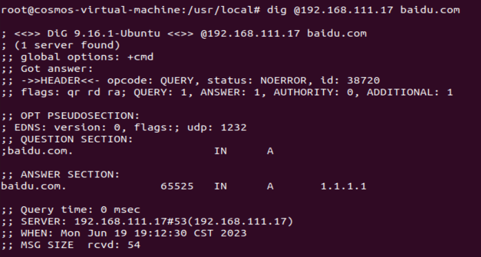

Paper address：
[**DNS Cache Poisoning Attack Reloaded: Revolutions with Side Channels**](https://dl.acm.org/doi/pdf/10.1145/3372297.3417280)
## Background Knowledge
### DNS Infrastructure

### Paper Overview


## Experiment Setup
I use three virtual machines to set the environment:
```http
            ┌──────────────────┐                        
            │                  │                      
DNS query   │   dns_forwarder  │    ubuntu18+dnsmasq(linux 4.15)                 
            │                  │                        
            └──────────────────┘                      
                 | 192.168.111.17 |                      
                 |            |                      
                 |            |                      
            ┌──────────────────┐                      
            │                  │                      
DNS query   │   dns_resolver   │     ubuntu20+dnsmasq                
            │                  │                      
            └──────────────────┘                      
                 | 192.168.111.14 |                      
                 |            |                      
                 |            |                      
           ┌──────────────────────────────┐          
           │                              │          
DNS query  │       auth_name_server       │     ubuntu20+bind9(test.com)     
           │                              │          
           └──────────────────────────────┘          
                 | 192.168.111.15 |                      
                 
```
### dns_forwarder
For the kernel version, we need to download the vulnerable one, see the patch
[https://git.kernel.org/pub/scm/linux/kernel/git/torvalds/linux.git/commit/?id=b38e7819cae946](https://git.kernel.org/pub/scm/linux/kernel/git/torvalds/linux.git/commit/?id=b38e7819cae946e2edf869e604af1e65a5d241c5)[e2edf869e604af1e65a5d241c5](https://git.kernel.org/pub/scm/linux/kernel/git/torvalds/linux.git/commit/?id=b38e7819cae946e2edf869e604af1e65a5d241c5)
We can refer to this article to replace the kernel version：
[https://juejin.cn/post/6991642139306229791](https://juejin.cn/post/6991642139306229791)
Here I set the kernel  4.15.0-76-gerneric 
`dnsmasq.conf`

```
port=53
listen-address=0.0.0.0
bind-interfaces
no-resolv
server=192.168.111.14
```
### dns_resolver
`dnsmasq.conf`
```
port=53
listen-address=0.0.0.0
bind-interfaces
cache-size=1000

server=192.168.111.15
```
### auth_name_server
`named.conf.options`
```
options {
        directory "/var/cache/bind";

        allow-query { any; };

        dnssec-validation no;

        listen-on-v6 { any; };
};
```
`named.conf.default-zones`
```
zone "test.com" {
        type master;
        file "/etc/bind/zones/db.test.com";
};
```
`db.test.com`
```
;
; BIND data file for test.com.
;
$TTL    4
@       IN      SOA     test.com. root.test.com. (
                              2         ; Serial
                              4         ; Refresh
                              4         ; Retry
                              4         ; Expire
                              4 )       ; Negative Cache TTL
;

; A records
@       IN      NS      localhost.
@       IN      A       183.169.1.12
@       IN      AAAA    2183:169:1::12
testing.test.com.       IN      A       183.169.1.12
testing.test.com.       IN      AAAA    2183:169:1::12
```
## Attack Reproduction
exp:
[https://github.com/seclab-ucr/SADDNS/tree/master/saddns_c](https://github.com/seclab-ucr/SADDNS/tree/master/saddns_c)
### ICMP side channel attack verification
In order to verify that CVE-2020-25705 in the current version of the kernel, we execute `nc -luk 60096` on the `Forwarder`, and then use udpscan to guess the port and succed.



### SADDNS Reproduction
Configure attack parameters



Close the `auth_name_server` and run it

It can be found that `baidu.com` has been successfully polluted as `1.1.1.1`


## Conclusion
The SADDNS uses ICMP side channel to break the limitation of source port randomization, and can launch attacks on caches at all levels of modern DNS. After reproducing this attack, I have a deeper understanding of the DNS architecture and its security.


References：

[https://www.saddns.net/](https://www.saddns.net/)

[https://github.com/imranur-rahman/dns-cache-poisoning-attack-reloaded](https://github.com/imranur-rahman/dns-cache-poisoning-attack-reloaded)

[https://knqyf263.hatenablog.com/entry/2020/11/19/200900](https://github.com/imranur-rahman/dns-cache-poisoning-attack-reloaded)

[https://gitlab.isc.org/isc-projects/bind9/-/issues/2950](https://gitlab.isc.org/isc-projects/bind9/-/issues/2950)

[https://blog.cloudflare.com/sad-dns-explained/](https://blog.cloudflare.com/sad-dns-explained/)
